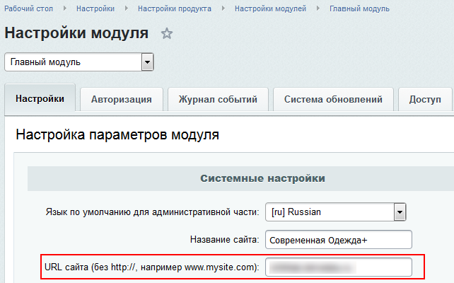

# Что может сканер безопасности

**Навигация**
- [← Оглавление курса](index.md)
- [← Предыдущий: 27172 — Монитор проактивной защиты](lesson_27172.md)
- [Следующий: 5801 — Трактовка результатов сканера безопасности →](lesson_5801.md)

Официальная страница урока: https://dev.1c-bitrix.ru/learning/course/index.php?COURSE_ID=35&LESSON_ID=6639

|  | ### Сканер безопасности |
| --- | --- |

> **Сканер безопасности** - это инструмент, который позволяет выявить потенциальные ошибки и упущения, связанные с безопасностью сайта.

- Чтобы сканер имел возможность проводить статический анализ уязвимостей, необходимо установить и включить в системе PHP расширение
  			Tokenizer.
                       Tokenizer (лексер) - интерфейс для анализа кода.
  Лексические функции предоставляют интерфейс ко встроенному в Zend Engine PHP-лексеру (tokenizer). Используя эти функции, вы можете писать собственные утилиты анализа или модификации исходного кода на PHP без необходимости иметь дело с языковой спецификацией на лексическом уровне.
  [Подробнее](http://www.php.net/manual/ru/book.tokenizer.php)...
- При статическом анализе уязвимостей сканер может "подвисать" на проверке больших скриптов (больше 100 Кб). Рекомендуется убирать такие скрипты на время проверки сканером или разбивать скрипты на части.

 

На текущий момент сканер может следующее:

 

- Выполнять внутреннее сканирование окружения проекта (к примеру, безопасно ли хранятся файлы сессий);
- Выполнять проверку настроек сайта (к примеру, включен ли *WAF*, установлен ли пароль к базе данных и т. д.);
- Выполнять поиск потенциальных уязвимостей в коде проекта с помощью статического анализа;
- Запускать внешнее сканирование.
  **Примечание:** Внешнее сканирование будет запущено, если сайт доступен снаружи (например, расположен на хостинге, а не на локальной машине) и в опции **URL сайта (без http://)**
  			настроек главного модуля
  
  		 указан правильный адрес.

 

Минимальные системные требования по сканеру безопасности:

- **Статический анализ уязвимостей** - наличие расширения **tokenizer** (см. выше), `max_execution_time` не менее 20 секунд, `memory_limit` не менее 256Мб;
- **Проверка прав доступа к файлам** - `max_execution_time` не менее 20 секунд.

 

После нажатия кнопки **Запустить сканирование** система произведет поиск угроз безопасности и выдаст рекомендации по их устранению.

 

 

**Примечание:** Для некоторых сообщений сканера доступны подробные описания обнаруженной проблемы в секции **Детали**.

 

|  | #### Документация по теме: |
| --- | --- |

- [Сканер безопасности - верный друг и помощник (блог)](http://dev.1c-bitrix.ru/community/blogs/information_security/security-scanner-in-125.php)
- [Сканер безопасности](https://dev.1c-bitrix.ru/user_help/settings/security/security_scanner.php?clear_cache=Y)
