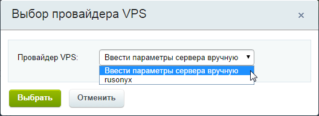
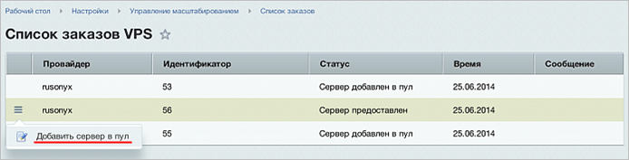

# Список заказов

**Навигация**
- [← Оглавление курса](index.md)
- [← Предыдущий: 6736 — Роли](lesson_6736.md)
- [Следующий: 12824 — Проверьте себя →](lesson_12824.md)

Официальная страница урока: https://dev.1c-bitrix.ru/learning/course/index.php?COURSE_ID=35&LESSON_ID=6665

**Внимание**. Модуль Управление масштабированием (scale) устарел и больше не поддерживается.

|  | ### Новые сервера |
| --- | --- |

**Внимание**: Выбор сервера от провайдера появится, если хостер предлагает настроенную виртуальную машину или окружение «1С-Битрикс» у себя на площадке.

В разделе **Список заказов VPS** осуществляется просмотр заказов серверов от партнеров «1С-Битрикс», присоединенных в пул.

Для заказа у провайдера нужно при

			добавлении нового сервера

                    Для добавления новых серверов в пул нужно кликнуть на область Новый сервер , указать сетевой адрес, пароль пользователя root и имя хоста добавляемого сервера:

[Подробнее ...](lesson_6723.md)

		 в пул выбрать

			из списка

                    

		 нужного провайдера. Далее уже выбрать из списка предлагаемых провайдером серверов

			машину нужной конфигурации

                    

		.

 

После отработки команды машина появится в списке со статусом

			Сервер предоставлен

                    

		. Для добавления её в пул нужно выбрать в меню действий соответствующий пункт:

 

Спустя некоторое время сервер будет добавлен в пул:

 

**Внимание!** Команды могут выполняться довольно длительное время (от одной минуты до 2-3 часов и более) в зависимости от сложности задачи, объема данных, используемых в этих задачах, мощности и загруженности сервера.
