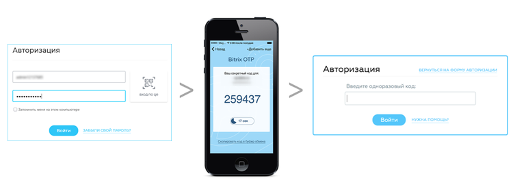

# Система одноразовых паролей

**Навигация**
- [← Оглавление курса](index.md)
- [← Предыдущий: 2674 — Повышенный уровень](lesson_2674.md)
- [Следующий: 5002 — Механизм двухэтапной авторизации →](lesson_5002.md)

Официальная страница урока: https://dev.1c-bitrix.ru/learning/course/index.php?COURSE_ID=35&LESSON_ID=6686

Система одноразовых паролей дополняет стандартную систему авторизации и позволяет значительно усилить систему безопасности продуктов *«1С-Битрикс»*.

> **Одноразовый пароль** (англ. *one time password, OTP*) — это пароль, действительный только для одного сеанса аутентификации. Действие одноразового пароля также может быть ограничено определенным промежутком времени. Преимущество одноразового пароля по сравнению со статическим в том, что пароль невозможно использовать повторно. Таким образом, злоумышленник, перехвативший данные из успешной сессии аутентификации, не может использовать скопированный пароль для получения доступа к защищаемой информационной системе.

При каждой авторизации пользователь получает новый секретный код, что исключает возможность его получения злоумышленниками. При включении системы OTP в продукте *«1C-Битрикс»* можно авторизоваться только с использованием дополнительного одноразового пароля.

В продуктах *«1C-Битрикс»* поддерживаются два алгоритма генерации одноразовых паролей:

- **по счетчику** (
  			HMAC-Based One-time Password, HOTP
  **HOTP** (англ. *HMAC-Based One-Time Password Algorithm*) — алгоритм защищённой аутентификации с использованием одноразового пароля (One Time Password, OTP). Основан на HMAC (SHA-1). Является алгоритмом односторонней аутентификации, а именно: сервер производит аутентификацию клиента.
  В качестве параметра, отвечающего за динамику генерации паролей, используется событие, то есть сам факт генерации: каждый раз при создании нового пароля счётчик событий увеличивает своё значение на единицу, и именно это монотонное возрастающее значение используется как основной параметр алгоритма.
  Вторым параметром для расчёта одноразовых паролей является симметричный ключ, который должен быть уникальным для каждого генератора (клиента) и закрытым от всех, кроме сервера и самого генератора (клиента).
  [Подробнее](https://ru.wikipedia.org/wiki/HOTP)...
  		) - код будет доступен до тех пор, пока пользователь не запросит новый;
- **по времени** (
  			Time-based One-time Password, TOTP
  **TOTP** (англ. *Time-based One-Time Password Algorithm*) — OATH-алгоритм создания одноразовых паролей для защищенной аутентификации, являющийся улучшением HOTP (HMAC-Based One-Time Password Algorithm).
  Является алгоритмом односторонней аутентификации — сервер удостоверяется в подлинности клиента.
  Главное отличие TOTP от HOTP это генерация пароля на основе времени, то есть время является параметром. При этом обычно используется не точное указание времени, а текущий интервал с установленными заранее границами (например, 30 секунд).
  [Подробнее](https://ru.wikipedia.org/wiki/Time-based_One-time_Password_Algorithm)...
  		) - код будет доступен в течение 30 секунд с момента его получения, после чего он автоматически обновится.

**Внимание!** Все коды доступа являются одноразовыми, повторное их использование для авторизации невозможно.

## Краткое описание технологии

Для расчета значения OTP принимаются два входных параметра - секретный ключ (начальное значение для генератора) и текущее значение счетчика (количество необходимых циклов генерации или текущее время, в зависимости от выбранного алгоритма). Начальное значение хранится как в самом устройстве, так и на сайте после инициализации устройства.

В случае использования алгоритма **по счетчику** (HOTP), счетчик в устройстве увеличивается при каждой генерации OTP, на сервере - при каждой удачной аутентификации по OTP.

 
В случае использования алгоритма **по времени** (TOTP), счетчик в устройстве не хранится, на сервере лишь корректируется возможное небольшое смещение времени устройства при каждой удачной аутентификации по OTP.

Партия устройств OTP поставляется с зашифрованным файлом, содержащим начальные значения (секретные ключи) для всех устройств партии, связанного с серийным номером устройства (печатается на корпусе устройства).

В случае

			нарушения синхронизации

                    
Синхронизация необходима для случаев, когда на устройстве генерации одноразовых паролей по счетчику была произведена генерация паролей несколько раз (например, случайно нажата кнопка на аппаратном устройстве), но не было выполнено ни одной удачной аутентификации. Тогда, в случае превышения числа нажатий значения, заданного в параметре Размер окна проверки паролей, произойдет нарушение синхронизации счетчика генерации, и пользователь не сможет выполнить вход на сайт.

В этом случае необходимо выполнить повторную синхронизацию пользователя с устройством – привести значение на сервере в соответствие значению, хранящемуся в устройстве. Для этого администратор системы или сам пользователь (при наличии соответствующих разрешений) должен сгенерировать два последовательных значения одноразовых паролей и ввести их в форму редактирования параметров пользователя.

[Подробнее](lesson_5008.md)...

		 счетчика генерации в устройстве и на сервере, её можно легко восстановить - привести значение на сервере в соответствие значению, хранящемуся в устройстве. Для этого администратор системы или сам пользователь (при наличии соответствующих разрешений) должен сгенерировать два последовательных значения одноразовых паролей (OTP) и ввести их в форму на сайте.

**Примечание:**

Количество действующих кодов авторизации **по счетчику** после предыдущей успешной авторизации ограничивается параметром

			Размер окна проверки паролей.

                    

Если на устройстве была нажата кнопка несколько раз (например, случайно), но не было выполнено ни одной
удачной аутентификации, то при превышении числа нажатий значения, заданного в этом параметре, произойдет
нарушение синхронизации счетчика генерации, и пользователь не сможет выполнить вход на сайт.

[Подробнее](lesson_5002.md#otp_settings)...

Количество действующих кодов авторизации **по времени** ограничивается временным интервалом **1 минута** в обе стороны (по 2 кода, которые действительны 30 секунд).

 

|  | #### Документация по теме: |
| --- | --- |

- [Как включить двухфакторную аутентификацию для входа в Битрикс24](https://helpdesk.bitrix24.ru/open/19503644/) ([helpdesk.bitrix24.ru](https://helpdesk.bitrix24.ru));
- [Одноразовый_пароль](http://ru.wikipedia.org/wiki/Одноразовый_пароль) (Wikipedia);
- [HMAC-Based One-Time Password Algorithm](http://ru.wikipedia.org/wiki/HOTP) (Wikipedia);
- [Time-based One-time Password Algorithm](http://ru.wikipedia.org/wiki/Time-based_One-time_Password_Algorithm) (Wikipedia).
