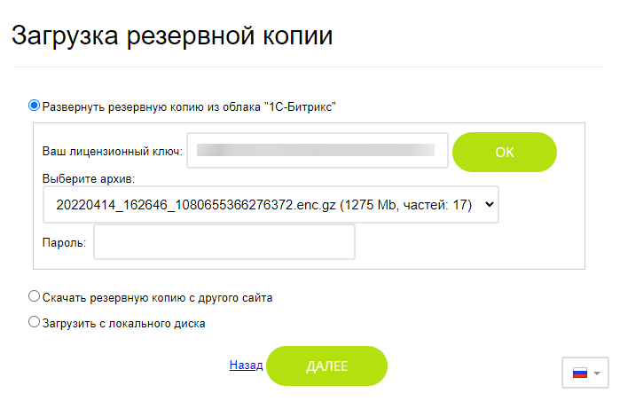
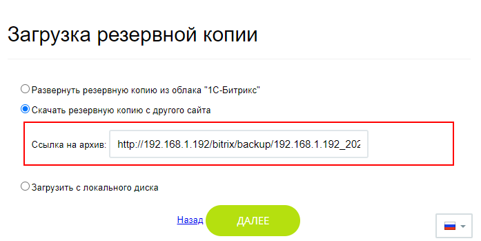
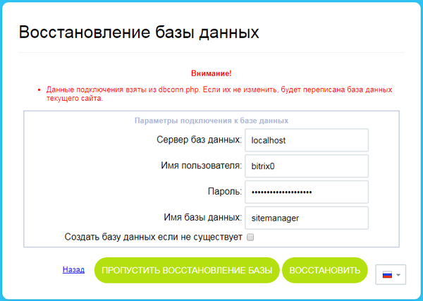
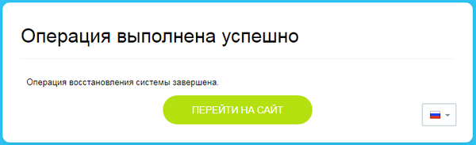

# Восстановление сайта из резервной копии

**Навигация**
- [← Оглавление курса](index.md)
- [← Предыдущий: 2563 — Резервное копирование из командной строки](lesson_2563.md)
- [Следующий: 12828 — Проверьте себя →](lesson_12828.md)

Официальная страница урока: https://dev.1c-bitrix.ru/learning/course/index.php?COURSE_ID=35&LESSON_ID=6979

Понадобилось восстановить сайт или отдельные файлы? Регулярно создавайте резервные копии, чтобы у вас всегда был под рукой свежий бекап . А как восстановить сайт, расскажем в уроке.

### Запуск восстановления

Для запуска восстановления сайта на странице **Список резервных копий** (Настройки &gt; Инструменты &gt; Резервное копирование &gt; Список резервных копий) в меню действий выберите пункт **Восстановить**.


**Примечание**: Меню действий может отличаться для разных видов архивов, в зависимости от настроек при создании, порядка сохранения и удаления копий, настройки прав доступа на папки и файлы.  Например, бекап, хранящийся в облаке 1С-Битрикс, можно только восстановить, но не скачать. Или же меню действий будет ограничено при ограничении прав на папку */backup/*.

Система запустит мастер восстановления из резервной копии.

Другой способ - использовать скрипт **restore.php**. Обычно используется при переносе сайта на другой хостинг или если у вас нет доступа к административной части сайта (из-за сбоя или ошибок).

> **Порядок действий:** Для переноса резервной копии сайта на другой хостинг используйте скрипт для восстановления **restore.php**. Скачать его можно по [ссылке](https://www.1c-bitrix.ru/download/files/scripts/restore.php). Затем поместите этот файл в корневой папке нового сайта и наберите в строке браузера [имя_вашего_сайта]/restore.php. Обратите внимание, что владельцем файла должен быть пользователь **bitrix**. Подробнее описано в уроке [Перенос продукта «1C-Битрикс» в виртуальную среду BitrixVM/BitrixEnv](https://dev.1c-bitrix.ru/learning/course/index.php?COURSE_ID=37&LESSON_ID=29246).
>
>
>
> Далее следуйте шагам мастера и инструкциям по переносу продукта (курс Установка и настройка):
>
> - [Перенос продукта «1C-Битрикс»](https://dev.1c-bitrix.ru/learning/course/index.php?COURSE_ID=135&CHAPTER_ID=02014)
> - [Перенос сайтов в многосайтовой конфигурации](https://dev.1c-bitrix.ru/learning/course/index.php?COURSE_ID=135&LESSON_ID=2559)

**Примечание**: Модули

			Маркетплейса

                    
**Маркетплейс** (MarketPlace) - это каталог готовых решений для продуктов *1С-Битрикс: Управление сайтом* или *Корпоративный портал*.

Стороннее решение из *MarketPlace* можно поставить как на этапе установки продукта *«1C-Битрикс: Управление сайтом»*, так и после запуска проекта.

[Подробнее](https://dev.1c-bitrix.ru/learning/course/?COURSE_ID=32&CHAPTER_ID=04594&LESSON_PATH=3903.4862.4888.4538.4594)...

		 привязываются к лицензионному ключу. 

Поэтому если Вы приобрели и установили на сайт модуль *Маркетплейса*, а потом восстановили сайт из резервной копии, сделанной до установки модуля, то можете заново установить этот модуль (если только не закончился оплаченный период этого модуля). 

Учтите, что некоторые модули используют базу данных сайта, поэтому лучше создавать резервную копию сайта сразу после установки нового модуля (чтобы не потерять данные).

### Мастер восстановления

Первые шаги мастера различаются в зависимости от того, восстановление какой резервной копии было выбрано:

- Для локальной копии отобразится окно с
  			именем архива
                      
  		. При нажатии кнопки **Далее** сразу начнется
  			распаковка архива
                      
  		;
  **Примечание**: если для локального архива было включено
  			шифрование
                      Для шифрования бэкапа в настройках на закладке Параметры должна быть включена опция Шифровать данные резервной копии. Если шифрование включено, то перед началом создания резервной копии появится окно для ввода пароля.
  [Подробнее](lesson_7080.md#encryption)...
  		 и установлен пароль при создании копии, то до начала распаковки понадобится ввести этот пароль.
- Для облачной копии *1С-Битрикс* откроется окно с тремя вариантами выбора:
  
  Независимо от того, какой вариант выбран, далее выполнится шаг
  			распаковки
                      
  		 архива.

  - Развернуть резервную копию из облака *1С-Битрикс*. Потребуется ввести ваш лицензионный ключ, выбрать нужный облачный архив и ввести пароль от архива (обязательно указывается при создании);
  - Скачать резервную копию с другого сайта. Вы можете указать
    			ссылку
                        
    		 на резервную копию с любого другого ресурса. Например, это может быть ссылка на локальный бекап с сайта на *1С-Битрикс*, полученная через меню в
    			списке резервных копий
                        
    		;
  - Загрузить с локального диска. Резервная копия выбирается с локального диска ПК пользователя (как обычный выбор файла).
    **Важно**: Загрузить нужно все части
    			многотомного
                        Количество частей зависит от настройки **Максимальный размер несжатых данных в одной части архива (МБ)** в форме настроек резервного копирования.
    [Подробнее](lesson_5330.md#parameters)...
    		 архива резервной копии.
    Если вы получили ошибку `413 Request Entity Too Large`, то нужно загружать порциями по несколько файлов. Например, 9-10 файлов. Если не загрузятся, то уменьшить объём партии. Определив оптимальный объём партии файлов, продолжать загрузку до тех пор, пока не будет загружен весь архив.

По завершению распаковки архива выполнится переход к следующим шагам мастера:

- **Восстановление базы данных**:
  

  - **Пропустить восстановление базы данных**. Эта кнопка используется для пропуска текущего шага, когда требуется только восстановление потерянных файлов и папок, оставив базу данных без изменений;
  - **Восстановить**. База данных будет восстановлена. Настройки подключения к MySQL по умолчанию берутся из
    			файла
                        До версии 20.900.0 данные брались из файла
    /home/bitrix/www/bitrix/php_interface/dbconn.php.
    		 `/home/bitrix/www/bitrix/.settings.php`.
  - Опция **Создать базу данных, если не существует** нужна при переносе сайта (когда база данных ещё не создана). При этом в параметрах можно указать собственные параметры подключения к MySQL.
- После успешного восстановления базы данных в целях безопасности необходимо **Удалить локальную резервную копию и служебные скрипты**, нажав на одноименную кнопку:
  
- Восстановление
  			завершено
                       
  		.

**Примечание**: Об особенностях резервного копирования и восстановления при многосайтовости можно прочитать в уроке [Создание резервной копии](lesson_5330.md#multysite).

### Восстановление конкретных файлов

Описанный ниже способ подходит только для локальной резервной копии без шифрования.

Иногда возникает потребность восстановить только конкретные файлы, а не делать полное восстановление сайта. Это возможно сделать, если у вас есть локальный архив.

Локальная резервная копия сайта без шифрования — это архив вида **backup.tar.gz**, а значит его можно распаковать и получить таким образом файловую структуру сайта.

В операционных системах семейства Linux архив **.tar.gz** распаковывается с помощью программы **tar**:

```

tar -xzvf backup.tar.gz
/* где
    -x - извлекает файлы из архива
    -z - фильтрует архив с помощью gzip
    -v - предоставляет список обрабатываемых файлов
    -f - обязательная опция, которая указывает имя файла архива
*/
```

Такой способ распакует весь архив и вы сможете взять любые файлы. Но распаковка всего архива это долго. Поэтому если вы знаете, какие файлы вам нужны из архива, сразу укажите их в команде:

```

tar -xzvf backup.tar.gz file1 dir2/file2
```

Обратите внимание, что при этом необходимо указывать путь к папке, в которой файл сохранен в архиве. Найти путь к файлу можно также с помощью **tar** (покажется содержание архива) и утилиты **grep** (фильтр содержимого) следующей командой:

```

tar -ztf backup.tar.gz | grep file2
/* где
    -t - выводит содержание архива
*/
```

Для распаковки в ОС Windows используйте программы-архиваторы.

**Важно**: Таким образом можно вытащить только физические файлы из файловой структуры сайта. Информацию, размещенную в инфоблоках (например, новости или элементы товарного каталога) так просто вытащить из архива не получится, т.к. размещена она в базе данных.

### Возможные затруднения

Бывает, что в процессе восстановления возникают ошибки, например, вида `Archive is corrupted, wrong block: 0`. Причин этому может быть много: недостаточно места или памяти на хостинге, лимиты хостинга, битый архив и т.д. При возникновении такой ситуации, убедитесь что на хостинге / сервере достаточно места и памяти для работы с бекапом. Если не удаётся найти причину такого поведения - обратитесь в [техническую поддержку](https://www.1c-bitrix.ru/support/customers/ticket.php?show_wizard=Y).

## Если сайт не отвечает и вы не можете попасть в админку после восстановления

Например, ваш сайт не отвечает или выдается сообщение

.

Такое может случиться, если во время работы мастера восстановления произошел сбой или вы самостоятельно пытались прервать его работу.

В этом случае в адресной строке браузера наберите http://ваш_сайт/restore.php. Если вы раньше не скачивали скрипт **restore.php**, то можете скачать свежую версию скрипта с сайта по [ссылке](https://www.1c-bitrix.ru/download/files/scripts/restore.php).

После запуска скрипта запустится мастер восстановления.

Дальше действуйте, как описано в уроке [Перенос продукта «1C-Битрикс»](https://dev.1c-bitrix.ru/learning/course/index.php?COURSE_ID=135&CHAPTER_ID=02014) курса Установка и настройка.

## Если LDAP-сервер недоступен или устройство с OTP утеряно, и вы не можете войти в систему

Если в вашем коробочном Битрикс24 настроена [AD/LDAP интеграция](https://dev.1c-bitrix.ru/learning/course/?COURSE_ID=48&CHAPTER_ID=04536&LESSON_PATH=3918.4635.4536) или включена [двухэтапная авторизация OTP](https://dev.1c-bitrix.ru/learning/course/index.php?COURSE_ID=34&CHAPTER_ID=06818&LESSON_PATH=3905.2339.6818), то после восстановления резервной копии могут возникнуть проблемы с авторизацией на сайте. Например, сервер LDAP недоступен, а телефон с OTP утерян. 

С помощью MySQL-запросов отключите на стороне сервера авторизацию через AD/LDAP и OTP. Прежде чем выполнять запросы, убедитесь, что у вас есть доступ к серверу базы данных MySQL. Обычно это можно сделать через SSH-подключение к серверу, использование консольного клиента MySQL или через инструменты управления базами данных, такие как phpMyAdmin или Adminer.

**Отключение авторизации через AD/LDAP**

Чтобы отключить авторизацию через AD/LDAP для конкретного пользователя, выполните SQL-запрос:

```
UPDATE b_user SET EXTERNAL_AUTH_ID = NULL WHERE LOGIN = 'admin'
```

- `UPDATE b_user` — указывает на таблицу `b_user`, где хранятся данные пользователей.
- `SET EXTERNAL_AUTH_ID = NULL` — поле отвечает за идентификатор внешней авторизации. Установка значения в NULL отключает привязку к AD/LDAP.
- `WHERE LOGIN = 'admin'` — условие того, что изменения должны быть применены только к пользователю с логином admin. Замените admin на нужный логин пользователя.

**Отключение OTP для пользователя**

Чтобы отключить OTP для всех пользователей, выполните SQL-запрос:

```
UPDATE b_option SET VALUE = 'N' WHERE MODULE_ID = 'security' AND NAME = 'otp_enabled'
```

- `UPDATE b_option` — указывает на таблицу `b_option`, где хранятся различные настройки системы.
- `SET VALUE = 'N'` — команда устанавливает значение поля VALUE в N, что означает «отключено».
- `WHERE MODULE_ID = 'security' AND NAME = 'otp_enabled'` — условие того, что изменения должны быть применены только к настройке с идентификатором модуля security и именем otp_enabled. Это соответствует настройке OTP.

Далее сбросьте пароль согласно уроку [Как восстановить доступ администратора на сайт](lesson_2161.md).
