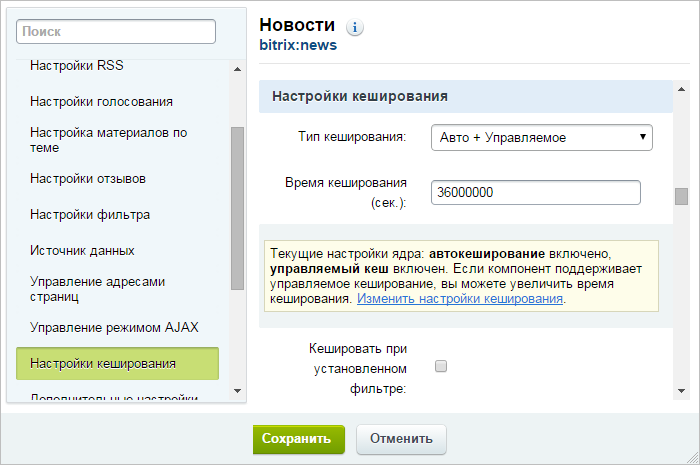
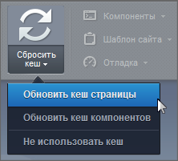
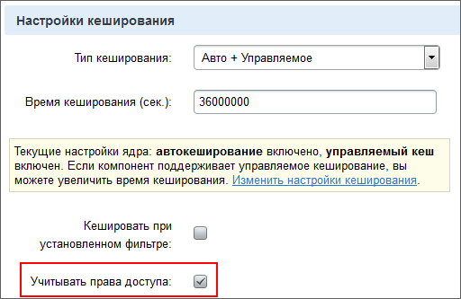
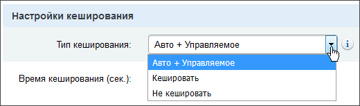

# Кеширование компонентов и меню

**Навигация**
- [← Оглавление курса](index.md)
- [← Предыдущий: 3377 — Пример нахождения мелких ошибок в производительности](lesson_3377.md)
- [Следующий: 7078 — Управляемое и неуправляемое кеширование →](lesson_7078.md)

Официальная страница урока: https://dev.1c-bitrix.ru/learning/course/index.php?COURSE_ID=35&LESSON_ID=7077

### Автокеширование

Управление автокешированием располагается на закладке **Кеширование компонентов**:

 

Использование технологии **Автокеширования** позволяет быстро подготовить сайт и компоненты проекта к работе в условиях стрессовых нагрузок или адаптировать сайт к работе. Для использования технологии достаточно

			включить её одной кнопкой

                    Это удобно использовать на этапе разработки, когда автокеширование можно выключить, что облегчит работу, а перед сдачей проекта снова включить.

		 в административном разделе. При этом все компоненты, у которых был включен режим автокеширования (Тип кеширования

			Авто + Управляемое

                    

Подсказка, расположенная ниже настроек времени кеширования в параметрах компонента, отображает состояние
 текущих настроек ядра. Ссылка Изменить настройки кеширования позволяет перейти на страницу
**Настройки кеширования** в административном разделе сайта.

		), создадут кеши и полностью перейдут в режим работы без запросов к базе данных.

 

**Внимание!** При использовании режима **Автокеширования**, обновление информации, выводимой компонентами, происходит в соответствии с параметрами отдельных компонентов.

### Обновление кеша

Обновить содержимое закешированных объектов на странице вы можете:

 

1. Перейдя на нужную страницу и воспользуясь кнопкой
  			Сбросить кеш
                       Пункт меню **Обновить кеш компонентов** кнопки **Сбросить кеш**
  заставляет все компоненты,расположенные на странице, сбросить свой кеш.
   Кнопка (пункт) **Обновить кеш страницы** сбрасывает кеш всей страницы.
  
  		 на панели инструментов.
  Когда сбрасываете кеш кнопкой **Обновить кеш страницы**, имейте в виду, что компонент может использовать привязку к группам для хранения кеша (опция **Учитывать права доступа**). При установленной опции кеш будет разный для разных групп пользователей. И тогда кеш сбросится только у тех пользователей, которые входят в те же группы, что и вы.
       **Пример:** Незарегистрированные пользователи будут по-прежнему видеть не актуальную страницу после нажатия кнопки **Обновить кеш страницы** при установленной опции
  			Учитывать права доступа
                      
  		.
2. В режиме **Правки сайта** используя кнопки для очистки кеша в панели отдельных компонентов.
  
3. Используя автоматический сброс кеша по истечении времени кеширования или при изменении данных, для чего в настройках компонента выберите
  			режим кеширования
                      
  		 **Кешировать** или **Авто + Управляемое**.
4. Перейдя к настройкам выбранных компонентов и переведя их в режим работы без кеширования. (Значение **Не кешировать** в поле **Тип кеширования**)

 

> **Резюме:**
>
>
> В зависимости от настроек кеширования компоненты ведут себя по-разному:
>
>
>
> - При выборе опции **Авто + Управляемое** - автоматически обновляют кеш по истечении заданного времени или при изменении данных.
> - Если выбрана опция **Кешировать** и время кеширования больше нуля, то обновление кеша производится только по истечении указанного времени.
> - Если выбрана опция **Не кешировать** и время кеширования равно нулю, то компоненты всегда работают без кеширования.

 

### Кеширование меню

Для кеширования меню применяется специальный алгоритм, который учитывает тот факт, что большая часть посетителей - это незарегистрированные пользователи. Кеш меню управляемый и обновляется при редактировании меню или изменении прав доступа к файлам и папкам через административный интерфейс и API. Обычные пользователи вообще не заметят, что существует какой-то алгоритм кеширования.

 

 

### Документация по теме

- [Автокеширование](https://dev.1c-bitrix.ru/user_help/settings/settings/cache.php)
