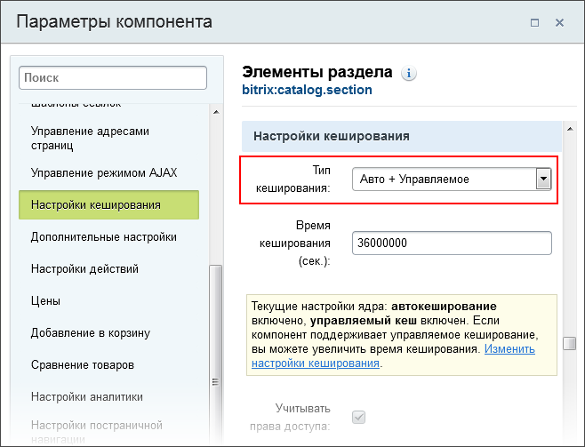
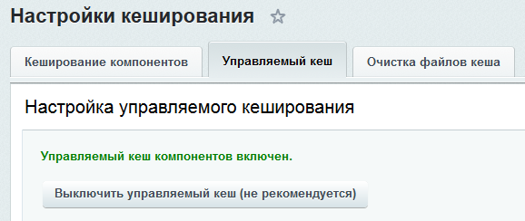
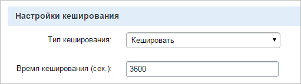

# Управляемое и неуправляемое кеширование

**Навигация**
- [← Оглавление курса](index.md)
- [← Предыдущий: 7077 — Кеширование компонентов и меню](lesson_7077.md)
- [Следующий: 7079 — HTML кеш →](lesson_7079.md)

Официальная страница урока: https://dev.1c-bitrix.ru/learning/course/index.php?COURSE_ID=35&LESSON_ID=7078

### Управляемое кеширование

Технология управляемого кеширования или тегированный кеш (**Сache Dependencies**) автоматически обновляет кеш компонентов при изменении данных. Если управляемое кеширование включено, вам не потребуется вручную обновлять кеш компонентов, например, при изменении новостей или товаров, изменения сразу станут видны посетителям сайта. Управляемый кеш хранится в файлах каталога `/bitrix/managed_cache/`.

 

Это сильно упрощает работу контент-менеджера и ускоряет работу сайта за счет того, что измененный редактором контент уже отдается из кеша.

 

**Внимание!** Не все компоненты могут поддерживать управляемое кеширование. Поддерживает ли конкретный компонент управляемое кеширование проверяйте в

			настройках компонента

                    

		.

 

Включение управляемого кеширования производится на закладке

			Управляемый кеш

                    

		страницы **Автокеширование**.

**Примечание:** Технология **Сache Dependencies**, как и весь продукт, может хранить кеш как в файлах, так и используя **Memcached**, **APC**,

			eAccelerator

                    eAccelerator не совместим с PHP v5.3+ и больше не поддерживается в продуктах «1C-Битрикс» с версии ядра 15.0.13. Подробнее см. в [блоге разработчиков](https://dev.1c-bitrix.ru/community/blogs/vad/the-end-of-support-for-eaccelerator.php)

		. Для этого достаточно изменить один из

			конфигурационных параметров

                    Закладки

 

						[Описание компонента «Панель производительности» в пользовательской документации.](http://dev.1c-bitrix.ru/user_help/detail.php?ID=175988)

		.

 

Для часто обновляемого большого массива данных использование тегированного кеша неоправданно, лучше использовать неуправляемое кеширование.

Тегированный кеш на инфоблок сбрасывается при операциях добавления/обновления/удаления элемента, раздела, свойства инфоблока и операциях с самим инфоблоком и правами на инфоблок.

Кроме этого, для каталожных компонентов происходит сброс тегированного кеша при изменении валюты и ее курсов (если выводились товары, имеющие цены в этой валюте в Базе Данных), а также при изменении валюты показа (если включен режим показа в одной валюте).

Поясним на примере. В системе есть 3 валюты: RUB, EUR, BYN. У товаров цены в карточке указаны в EUR (т.е. сохранены в БД в такой валюте). Компонент выводит товары в евро. Если изменить валюту  EUR, то кеш сбросится. Изменение других валют (BYN или RUB) на кеше не скажется.

Если компонент выводит товар в валюте, которой нет в карточке товара, например RUB, то кеш будет также сбрасываться и при изменении RUB.

### Неуправляемое кеширование

 

Фактически это возможность задать правила кеширования ресурсоемких частей страниц. Результаты кеширования сохраняются в виде файлов в каталоге `/bitrix/cache/` или в произвольной папке

			root_directory

                    По умолчанию корневая папка файлового кеша — /bitrix/cache/. С версии 24.100.0 главного модуля ее можно заменить на произвольную папку 'root_directory'.
[Настройка параметров ядра](https://dev.1c-bitrix.ru/learning/course/index.php?COURSE_ID=43&CHAPTER_ID=02795#cache)

		. Если время кеширования не истекло, то вместо ресурсоемкого кода будет подключен предварительно созданный файл кеша. Кеширование называется неуправляемым, поскольку кеш не перестраивается автоматически после модификации исходных данных, а действует указанное время после создания, которое задается в диалоге **Параметры компонента**.

 

**Примечание**: Для работы этого типа кеширования необходимо отключать Управляемое кеширование на всём проекте в целом. В противном случае неуправляемый кеш будет сбрасываться по параметрам Управляемого кеширования.

Если необходимо чтобы часть кеша была управляемым, часть - неуправляемым, то следует кастомизировать необходимые для неуправляемого кеширования компоненты.
