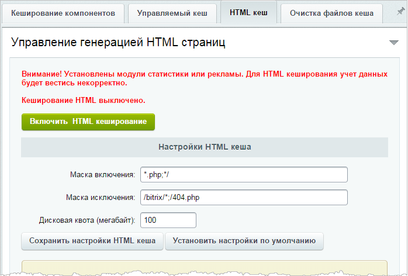

# HTML кеш

**Навигация**
- [← Оглавление курса](index.md)
- [← Предыдущий: 7078 — Управляемое и неуправляемое кеширование](lesson_7078.md)
- [Следующий: 2164 — Очистка файлов кеша →](lesson_2164.md)

Официальная страница урока: https://dev.1c-bitrix.ru/learning/course/index.php?COURSE_ID=35&LESSON_ID=7079

**Внимание!** С версии 16.0.14 главного модуля данный вид кеширования устарел и заменён технологией

			Композитный сайт

                    Технология Композитный сайт позволяет соединить достоинства быстрой выдачи страницы пользователю с гибкостью отображения информации в зависимости от различных условий запроса страницы. Это некий надуровень, который может быть записан в статику и отдаваться всем, вместе с результатом работы всех остальных способов кеширования. Технология является дальнейшим развитием и одним из видов кеширования, используемых в Bitrix Framework.

[Подробнее ...](http://dev.1c-bitrix.ru/learning/course/index.php?COURSE_ID=39)

		.

С версии 18.0.5 Композитный сайт недоступен для "Битрикс24 в коробке".

### HTML кеш

 

**Примечание:** **HTML кеширование** не поддерживается на

			многосайтовости на разных доменах

                    Для работы многосайтовости на разных доменах нам потребуется произвести настройку программного продукта. Настройку веб-сервера Apache, как и в случае с многосайтовостью на одном домене, должна произвести хостинговая компания.

[Подробнее ...](/learning/course/index.php?COURSE_ID=103&LESSON_ID=287)

		.

 

Существует категория проектов, которые редко меняют содержание своих страниц. Однажды созданные на таких сайтах разделы или материалы могут не обновляться месяцами.

 

Для таких проектов рекомендуется использовать режим **HTML кеширование** вместо **Автокеширования**. В этом случае не происходит подключения PHP и дисковые подсистемы менее нагружены. Технология проста в эксплуатации, не требует от пользователя отслеживать изменения, защищена дисковой квотой от накрутки данных и самостоятельно восстанавливает работоспособность при превышении квоты или изменении данных. **HTML кеширование** работает в автоматическом режиме AJAX с компонентами 2.0.

 

**Ограничения в использовании:** Не рекомендуется включать HTML кеш (или включать обдуманно, по разделам) для проектов, которые используют модули

			Веб-аналитика

                    Модуль Веб-аналитика является для владельца сайта эффективной обратной связью с посетителями и помогает проанализировать готовность структуры и материалов для достижения целей рекламных кампаний. Вы сможете проанализировать поведение посетителей сайта, изучив данные статистики, а затем вернуться в публичный раздел, чтобы внести необходимые изменения в структуру, тексты и ссылки, изменить ключевые моменты текстов, чтобы обратить на них внимание.

[Подробнее ...](https://dev.1c-bitrix.ru/learning/course/index.php?COURSE_ID=139&CHAPTER_ID=04544&LESSON_PATH=11427.4544)

		 и модуль

			Реклама

                    Модуль Реклама, баннеры позволяет организовать на сайте показ рекламных баннеров. Реализованный в системе механизм управления рекламой дает возможность...

[Подробнее ...](https://dev.1c-bitrix.ru/learning/course/index.php?COURSE_ID=139&CHAPTER_ID=011829&LESSON_PATH=11427.7361.11829)

		.

 

При включенном HTML-кешировании происходят следующие процессы:

 

- Обрабатываются только страницы, не указанные в маске исключения и указанные в маске включения.
- Если на такие страницы заходит не авторизованный пользователь, то выполняется проверка существования файла кеша. И если файл найден, то выдается страница из кеша. В этом случае не будет работать модуль статистики (не засчитаются хиты этого пользователя), модуль рекламы, главный и другие модули.
- Если страница в кеше не найдена, то код исполняется в обычном режиме. Когда страница полностью сформирована, ее копия сохраняется в HTML-кеш;
- Если на момент включения кеша был установлен модуль
  			Компрессии
                      Модуль Компрессия осуществляет сжатие страниц для ускорения вывода содержания сайта пользователям. Модуль в несколько раз уменьшает объем передаваемых HTML-данных между сайтом и браузером клиента, что существенно увеличивает скорость работы как для посетителей, так и для администраторов сайта.
  [Подробнее ...](https://dev.1c-bitrix.ru/user_help/settings/compression/index.php)
  		, то страница будет отдаваться в сжатом виде.

 

Очистка кеша происходит:

 

- Автоматически, если сохраняемый объем приводит к превышению дисковой квоты кеша.
- При любом изменении данных в административной части системы происходит полная очистка кеша.
- Если в публичной части сайта происходит POST данных (например, добавление комментария или голосование). В этом случае сбрасывается соответствующая часть кеша.

 

Для неавторизованных пользователей происходит удаление сессии при переходе на закешированные страницы. В результате этого:

 

- Не ведется учет статистики.
- Модуль **Реклама** будет работать только в момент создания кеша. (Это не относится к внешней динамической рекламе (Begun и пр.).)
- Для неавторизованных пользователей результаты сравнения товаров не будут сохранены.

Рекомендуется обязательно задать дисковую квоту в настройках HTML-кеширования во избежание

			DOS-атаки

                    DoS (аббр. англ. Denial of Service «отказ в обслуживании») - хакерская атака на вычислительную систему с целью довести её до отказа. Если атака выполняется одновременно с большого числа компьютеров, говорят о DDoS-атаке

[Подробнее ...](https://ru.wikipedia.org/wiki/DoS-%D0%B0%D1%82%D0%B0%D0%BA%D0%B0)

		 по дисковому пространству.

 

После включения механизма HTML-кеширования необходимо проверить весь функционал раздела, к которому применен кеш: например, может не сработать публикация комментариев со старыми шаблонами блогов.

### Управление HTML-кешированием

Управление HTML кешем располагается на закладке

			HTML кеш

                    Вкладка существует на системах версий 16.0.14 и ранее.

		:

 

 

- **Маска включения** - указываются файлы и типы файлов, которые будут обрабатываться html кешем.
- **Маска исключения** - указываются файлы и типы файлов, которые **не** будут обрабатываться html кешем.
- **Дисковая квота (мегабайт)** - указывается дисковая квота кеша (задается в мегабайтах).

 

Файлы настроек и сами файлы кеша хранятся в папке

			`/bitrix/html_pages/`

                    Удаление этой папки и её содержимого не приведёт к сбою в работе системы, просто сбросятся настройки и сбросится сам кеш.

		.

 

**Почему может не работать HTML кеш?**

 

HTML работает только для пользователя "впервые" зашедшего на сайт, у которого нет ID сессии. То есть например, если администратор вышел из системы, то HTML кеш работать не будет. Следовательно, если на странице есть функционал, который не может работать без старта сессии, то на таких страницах не будет работать этот вид кеширования. Пример такого функционала -

			CAPTCHA

                    Если компонент CAPTCHA размещён в шаблоне сайта, то кеширование не будет работать для всего сайта.

		.

 
 

Проверить работает или нет HTML-кеширование на какой-то конкретной странице можно добавив в URL страницы параметр `?show_page_exec_time=Y`. Если внизу страницы появится надпись типа **Время создания страницы: 0.****сек.**, то значит кеширование не работает. (Рекомендуется делать проверку в режиме инкогнито.)
