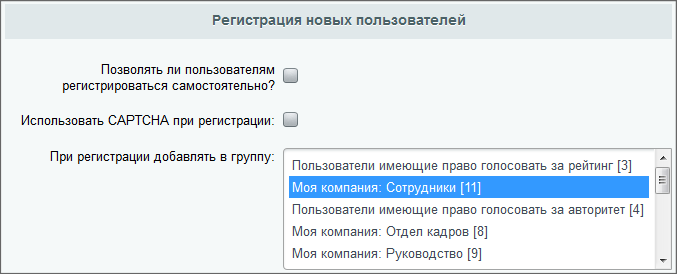

# Регистрация и разграничение прав

**Навигация**
- [← Оглавление курса](index.md)
- [← Предыдущий: 12814 — Практические задания](lesson_12814.md)
- [Следующий: 7175 — Управление группами пользователей →](lesson_7175.md)

Официальная страница урока: https://dev.1c-bitrix.ru/learning/course/index.php?COURSE_ID=35&LESSON_ID=7173

Тему урока можно изучить в новом формате — [в документации по Bitrix Framework](https://docs.1c-bitrix.ru/pages/cms-basics/users.html). В ней улучшена структура, описание, примеры.

### От чего зависят права пользователей

Каждый посетитель сайта относится к одной или нескольким группам пользователей сайта. Какой уровень прав есть у группы, такой же уровень прав есть и у пользователя. Если пользователь приписан к нескольким группам, то он обладает максимальным уровнем прав из доступных для него в рамках этих групп.

> **Важно понимать:** пользователь всегда принадлежит хотя бы к одной группе пользователей. Даже если исключить пользователя из всех доступных групп пользователей, он останется в системной группе **Все пользователи (в том числе неавторизованные)**, которую нельзя удалить из системы, и его уровень прав будет определяться правами этой группы.

## Примеры прав пользователя, состоящего в нескольких группах

1. **Предположим**, что в системе зарегистрирован пользователь, приписанный к двум группам, например:
  Пользователи группы **Редакторы сайта** обладают правом на редактирование страниц сайта, однако им запрещен доступ к страницам партнерского раздела.
  Пользователи группы **Партнеры** обладают правом на просмотр публичных страниц сайта, а также на доступ к закрытому партнерскому разделу.
  В результате пользователь, относящийся к этим двум группам, будет обладать следующими правами:

  - **Редакторы сайта**;
  - **Партнеры**.

  - правом на **редактирование** всех страниц сайта, **кроме** страниц партнерского раздела;
  - правом на **просмотр** страниц партнерского раздела.
2. **Либо**: в системе зарегистрирован пользователь, приписанный к двум группам, например:
  Пользователи группы **Сотрудники** обладают правом на просмотр страниц сайта, однако им запрещен доступ к некоторым страницам сайта (например, к разделу **Документы** - **Маркетинг и продажи**). По умолчанию, пользователи, не состоящие в этой группе, не будут иметь доступа к порталу.
  Пользователи группы **Маркетинг и продажи** обладают правом на доступ к соответствующему разделу на странице **Документы**.
  В результате пользователь, относящийся к этим двум группам, будет обладать следующими правами:

  - **Сотрудники**;
  - **Маркетинг и продажи**.

  - правом на доступ к порталу;
  - правом на доступ к документам **Маркетинг и продажи**.

 
 

Система разграничения прав доступа на сайтах 1С-Битрикс — двухуровневая:

- **уровень 1**: доступ к каталогам и файлам;
- **уровень 2**: доступ к модулям системы и логическим операциям в модулях.

Управление этими уровнями прав выполняется отдельно друг от друга.

## Дополнительная информация. Видеоролик о взаимосвязях Посетитель - Пользователь - Покупатель

### Регистрация пользователя в системе

 

При регистрации в системе пользователь получает личные регистрационные данные (логин и пароль) и приписывается к одной или нескольким группам.

 

Если в системе разрешена

			самостоятельная регистрация

                    Самостоятельную регистрацию пользователей можно включить при установке портала с помощью соответствующей опции или же после установки в настройках **Главного модуля**.

При использовании этой опции необходимо удалять файл `/bitrix/wizards/bitrix/demo/public_files/ru/auth/index.php`. Если этого не сделать, то по этому пути стороннему пользователю будет доступна форма авторизации. Возможно несанкционированное добавление пользователя.

		, то при регистрации пользователя ему создаётся учётная запись с добавлением в группу по умолчанию,

			указанную в настройках

                    

		 **Главного модуля** (Настройки &gt; Настройки продукта &gt; Настройки модулей
 &gt; Главный модуль). В дальнейшем администратор может изменить приписку пользователя к группе.

 

После того, как пользователь авторизуется в системе, вверху страницы в публичном разделе сайта будет показана

			административная панель

                    На Панели управления собраны все команды, которые доступны контент-менеджеру при работе с сайтом. [Подробнее](/learning/course/index.php?COURSE_ID=34&LESSON_ID=1831)...

		, содержащая набор команд для управления сайтом, если доступ к ней разрешен.

Набор кнопок, отображаемый пользователю, зависит от уровня прав доступа группы, к которой он относится. Например, для пользователей, обладающих правом только на чтение публичных страниц сайта, данная панель отображаться не будет. Полный набор кнопок отображается администратору сайта.

### Документация по теме

- [Типовые роли пользователей сайта](lesson_5336.md)
- [Управление пользователями](http://dev.1c-bitrix.ru/user_help/settings/users/index.php)
- [Уровни доступа](http://dev.1c-bitrix.ru/user_help/settings/users/task_admin.php)
- [Настройки главного модуля](http://dev.1c-bitrix.ru/user_help/settings/settings/settings.php#author)
- [урок "Регистрация по номеру телефона"](lesson_12575.md)
- [Назначение прав доступа в интернет-магазине](lesson_23422.md)
