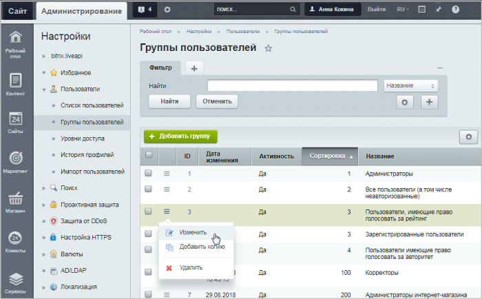
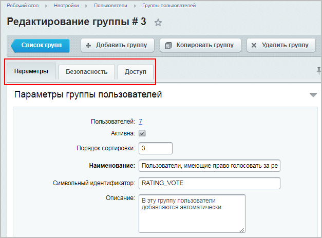
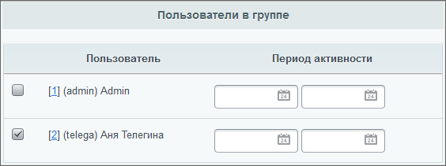
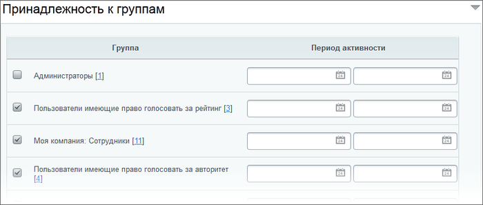
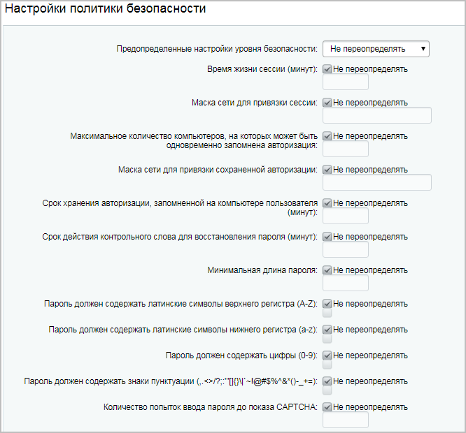
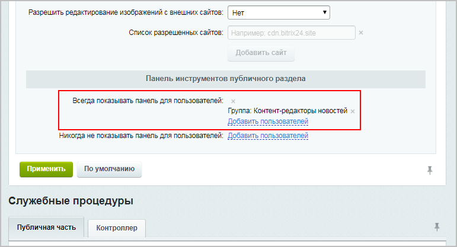

# Управление группами пользователей

**Навигация**
- [← Оглавление курса](index.md)
- [← Предыдущий: 7173 — Регистрация и разграничение прав](lesson_7173.md)
- [Следующий: 6767 — Уровни доступа для стандартных групп пользователей →](lesson_6767.md)

Официальная страница урока: https://dev.1c-bitrix.ru/learning/course/index.php?COURSE_ID=35&LESSON_ID=7175

Тему урока можно изучить в новом формате — [в документации по Bitrix Framework](https://docs.1c-bitrix.ru/pages/cms-basics/user-groups.html). В ней улучшена структура, описание, примеры.

### Добавление новой группы. Видеоурок

Создание и управление группами пользователей выполняется на странице

			Группы пользователей

                     

		 (Настройки &gt; Пользователи &gt; Группы пользователей):

## Текстовое содержание видео

Управление группами пользователей выполняется на странице **Группы пользователей** (Настройки &gt; Пользователи &gt; Группы пользователей):

В системе существует две обязательные группы пользователей: **Все пользователи** и **Администраторы**: 

- по умолчанию к группе **Все пользователи** относятся все незарегистрированные посетители сайта с правом только на просмотр публичных страниц сайта (кроме страниц закрытых разделов);
- к группе **Администраторы** относятся администраторы сайта, обладающие полным набором прав на доступ к управлению системой (в том числе, доступом к управлению правами других пользователей).

 Параметры данных групп пользователей могут быть изменены (название, описание, уровень прав для группы **Все пользователи**), но сами группы не могут быть удалены из системы. В зависимости от редакции продукта могут быть установлены по умолчанию и другие группы.

Для добавления новой группы служит кнопка **Добавить группу**, расположенная на контекстной панели. Перейти к редактированию параметров группы можно либо кликнув левой кнопкой мыши по соответствующей записи, либо с помощью пункта **Изменить** в контекстном меню.

Подробное описание

			формы создания и редактирования группы

                     

		 приведено в [пользовательской документации](http://dev.1c-bitrix.ru/user_help/settings/users/group_edit.php) продукта.

|  |
| --- |

|  | ### Вкладка Параметры |
| --- | --- |

В этой вкладке производится

			быстрая приписка

                     

		 пользователей к той или иной группе

Однако быстрая приписка пользователей к той или иной группе возможна, только если на сервере зарегистрировано не более 25 пользователей. Если число пользователей в группе планируется очень большим, то добавление пользователей удобнее будет делать через страницу списка пользователей (Настройки &gt; Пользователи &gt; Список пользователей), так как на ней есть форма поиска, которая позволяет

			найти всех пользователей

                    

		 выбранной группы. Принадлежность пользователя к группе определяется в

			форме редактирования пользователя

                     

		.

С помощью полей **Период активности** можно указать период привязки пользователя к той или иной группе. По истечении указанного периода пользователь будет отписан от соответствующей группы, однако аккаунт (профиль) пользователя сохраняется в системе.

Значения остальных полей этой вкладки понятны интуитивно.

|  |
| --- |

|  | ### Вкладка Безопасность |
| --- | --- |

На вкладке

			Безопасность

                     

		 не рекомендуется изменять настройки без четкого понимания того, что вы делаете. Особенно на действующем сайте, так как она определяет политику безопасности для текущей группы.

Чаще всего подвергаются перенастройке поля **Время жизни сессии** и **Максимальное количество компьютеров, на которых может быть одновременно запомнена авторизация**.

При изменении параметра **Время жизни сессии** нужно найти баланс между потребностью в постоянном доступе авторизованных пользователей на сайте и производительностью. Не нужно устанавливать большое время сессии. Папка сессий (определяется настройками PHP) будет очень большая, следовательно, будет медленный старт сессии. Рекомендуется ставить значение в диапазоне 20-30 минут.

Поле **Максимальное количество компьютеров, на которых может быть одновременно запомнена авторизация** имеет смысл менять в том случае, если ваш контент-менеджер может работать одновременно на нескольких компьютерах. Скажем, по роду своей деятельности в организации ему приходится ходить по помещениям и работать с разных компьютеров. В этом случае можно либо уменьшить время жизни сессии, либо добавить число компьютеров в указанном поле. Первое предпочтительнее с точки зрения безопасности.

Пример настройки вкладки

			Безопасность

                    
Одна из задач, которую приходится решать администратору - это сочетание безопасности работы сайта и удобства работы пользователя. Например, снять с пользователя необходимость частой авторизации.

Неопытный администратор долгую авторизацию пользователя пытается решить через параметр **Время жизни сессии**, что не правильно.  Долгая жизнь сессии (более 20-30 минут) у множества пользователей неизбежно приведёт к замедлению работы сайта из-за увеличения количества сессий на активных сайтах.

Гораздо лучше для этого использовать сочетание параметров закладки **Безопасность** (Настройки &gt; Пользователи &gt; Группы пользователей &gt; {группа_пользователей}).

[Подробнее](lesson_3799.md)...

		 группы пользователей.

|  |
| --- |

|  | ### Вкладка Доступ |
| --- | --- |

На этой вкладке можно задать права доступа к модулям системы. Допустим, вам необходимо, чтобы контент-менеджер не имел возможности управлять блогами и форумами, так как для этого предусматривается создание отдельных администраторов. Запретим доступ созданной группе на управление, оставив за ними право на чтение, создание блогов (как обычным пользователям) и просмотр административной части (вдруг из редактора "вырастет" администратор).

Примечание. Некоторые модули предусматривают дополнительную настройку прав доступа к контенту (Инфоблоки и Веб-формы). Ознакомиться с настройками доступа к этим модулям вы можете в

			этом уроке.

                    
Настройка прав доступа выполняется в форме редактирования свойств инфоблока на закладке **Доступ** (Контент &gt; Информ. блоки &gt; Типы информ. блоков &gt; &lt;название_типа_инфоблока&gt; &lt;название_инфоблока&gt;).

В модуле **Веб-формы** предусмотрено управление доступом к результатам заполнения веб-формы на уровне **Статусов результатов**(результатов заполнения веб-формы).

[Подробнее](lesson_2017.md)...

### Пример создания группы Контент-редактор новостей. Видеоурок

Допустим, нам нужно создать группу пользователей, которая будет заниматься исключительно новостями сайта (добавлять/редактировать/удалять).

В видео описано, как настроить такие права, а также как вывести административную панель для таких пользователей (чтобы можно было работать с новостями сайта не только из административного, но и из публичного раздела).

Чтобы корректно настроить права на пользователя в группе "Контент-редакторы новостей", надо выполнить следующие действия:

1. Создать группу пользователей.
2. В настройках доступа модуля **Управление структурой** установить уровень доступа **Редактирование файлов и папок**;
3. Для этой группы пользователей
  			установить право
  С помощью поля со списком **Показать права на доступ для**, расположенного на контекстной панели, можно показать текущее право определенной группы пользователей на доступ к папкам и файлам системы.
  Настройка прав доступа к управлению структурой сайта выполняется в **Менеджере файлов** (Контент &gt; Структура сайта).
  [Подробнее](lesson_2019.md)...
  		 **Чтение** на папку `/bitrix/admin/`;
4. В настройках доступа инфоблока "Новости" дать право **Изменение**.

**Примечание**: при текущих настройках пользователи созданной группы смогут работать только через административную часть сайта, потому что в публичной части сайта им недоступна

			административная панель.

                     
Административная панель отображается только в том случае, когда у пользователя есть права настроить хотя бы одну из функций, которые выполняются через панель (например, создание страницы или сброс кеша).

		 

Чтобы панель всё-таки отображалась, в настройках **Главного модуля** (Настройки &gt; Настройки продукта &gt; Настройки модулей &gt; Главный модуль) добавьте нужную группу в список групп, для которых нужно

			Всегда показывать панель для пользователей,

                     

		 и тогда пользователи смогут работать с новостями из 

 публичного раздела, включив режим **Правки**.

### Документация по теме

- [Группы пользователей](https://dev.1c-bitrix.ru/user_help/settings/users/group_admin.php)
- [Создание и редактирование группы пользователей](https://dev.1c-bitrix.ru/user_help/settings/users/group_edit.php)
- [Назначение прав доступа в интернет-магазине](lesson_23422.md)
