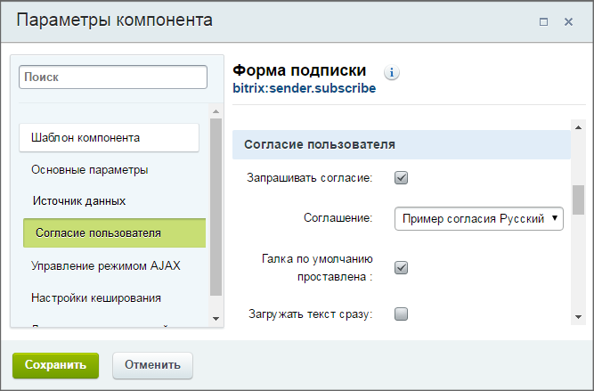
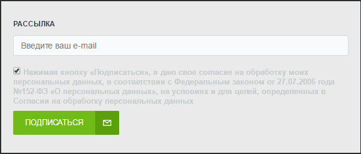
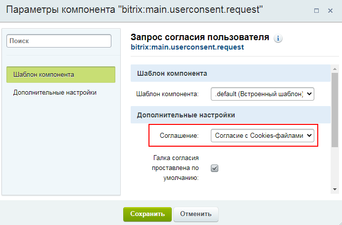

# Согласие в собственных компонентах

**Навигация**
- [← Оглавление курса](index.md)
- [← Предыдущий: 6636 — Согласие на обработку персональных данных](lesson_6636.md)
- [Следующий: 21538 — Cookies в Битрикс →](lesson_21538.md)

Официальная страница урока: https://dev.1c-bitrix.ru/learning/course/index.php?COURSE_ID=35&LESSON_ID=8407

**Как добавить согласие в собственные компоненты**

	 Включение поддержки соглашений в собственных компонентах рассмотрим на примере компонента подписки на рассылку

			sender.subscribe

                     Компонент включается в дизайн сайта и служит формой для подписки на рассылки. Компонент стандартный и входит в дистрибутив модуля.

 

						[Описание компонента «Форма подписки» в пользовательской документации.](http://dev.1c-bitrix.ru/user_help/detail.php?ID=1324487)

		.

### Добавление секции в настройки компонента

В файле параметров вашего компонента

			.parameters.php

                    В файле .parameters.php содержится описание входных параметров компонента...

[Подробнее ...](https://dev.1c-bitrix.ru/learning/course/index.php?COURSE_ID=43&LESSON_ID=2132)

		 достаточно объявить параметр `"USER_CONSENT" => array()`:

```
<?
if (!defined("B_PROLOG_INCLUDED") || B_PROLOG_INCLUDED!==true) die();
$arComponentParameters = array(
    "GROUPS" => array(
    ),
    "PARAMETERS" => array(
     "AJAX_MODE" => array(),
     "USER_CONSENT" => array(),
    )
);
```

и в настройках компонента появится секция

			Согласие пользователя

                    

		.

**Примечание**: Перечень всех штатных компонентов, где можно активировать секцию **Согласие пользователя**, вы можете увидеть, задав поиск по параметру `USER_CONSENT` в [Пользовательской документации](https://dev.1c-bitrix.ru/user_help/). Если же вам нужна собственная логика работы компонентов (например, вы хотите подключить стороннюю

			CAPTCHA

                    О настройке и подключении штатной CAPTCHA есть отдельная [глава](https://dev.1c-bitrix.ru/learning/course/?COURSE_ID=35&CHAPTER_ID=02128).

		), используйте

			API

                    Пространство имен **UserConsent** для работы с соглашениями пользователей относится к Главному модулю.
[Подробнее...](https://dev.1c-bitrix.ru/api_d7/bitrix/main/userconsent/index.php)

		.

### Вывод в форме

Для вывода

			созданных соглашений

                    
Соглашение - текст, который должен прочитать пользователь и согласиться с ним. В дистрибутиве есть стандартный вариант соглашения, но у администратора всегда есть возможность создать свой текст соглашения. Для этого на странице **Соглашения** воспользуйтесь кнопкой **Добавить** и заполните открывшуюся форму .

[Подробнее](lesson_6636.md)...

		 используется компонент

			main.userconsent.request

                     Компонент позволяет выполнить требования ФЗ-152. Может использоваться как самостоятельно, так и [включённым в другие компоненты](lesson_8407.md).

 

						[Описание компонента «Запрос согласия пользователя» в пользовательской документации.](http://dev.1c-bitrix.ru/user_help/detail.php?ID=6465485)

		 . Компонент умеет сохранять полученное согласие. Он выводит чекбокс с подписью, по нажатию на которую выводится окно с текстом соглашения. Окно с текстом адаптивное и уже сделано и под мобильные устройства:



Этот компонент нужно подключить в шаблоне вашего компонента перед кнопкой отправки формы.

**Примечание**: На текущий момент можно выбрать только одно

			соглашение

                     


		. Если вам нужно вывести несколько соглашений, используйте компонент **main.userconsent.request** несколько раз.

Есть два вида форм, в которых компонент используется по-разному.

**Простая форма с событием submit** (стандартная get/post отправка формы с событием submit).

В этом случае подключаем компонент перед кнопкой отправки формы:

```
<form method="POST">
    <input name="EMAIL" placeholder="Email">
    <input name="PHONE" placeholder="Телефон">
    <input name="NAME" placeholder="Имя">
    <br>
    <?if ($arParams['USER_CONSENT'] == 'Y'):?>
     <?$APPLICATION->IncludeComponent(
      "bitrix:main.userconsent.request",
      "",
      array(
          "ID" => $arParams["USER_CONSENT_ID"],
          "IS_CHECKED" => $arParams["USER_CONSENT_IS_CHECKED"],
          "AUTO_SAVE" => "Y",
          "IS_LOADED" => $arParams["USER_CONSENT_IS_LOADED"],
          "REPLACE" => array(
           'button_caption' => 'Подписаться!',
           'fields' => array('Email', 'Телефон', 'Имя')
          ),
      )
     );?>
    <?endif;?>
    <input type="submit" name="subscribe" value="Подписаться!">
</form>
```

Указанные в примере параметры `$arParams` появятся в шаблоне вашего компонента при наличии в **.parameters.php** блока `"USER_CONSENT" => array()`.

   

В параметре REPLACE передается:

- button_caption - название кнопки отправки формы;
- fields - массив названий полей, которые попадут в текст соглашения.

**Форма без события submit** (отправка через ajax и иные механизмы, реализованные в js, то есть без события submit у формы).

 

В компонент в параметре `SUBMIT_EVENT_NAME` передаётся название события, при котором появится окно запроса согласия.

Далее, добавляется обработчик события принятия соглашения. Если обработчик поймает событие - значит, согласие получено и можно отправлять форму/данные или выполнять какое-то действие.

```
<div id="my_container">
    <input type="text" placeholder="Электронный адрес" name="EMAIL">
    <input type="submit" id="fire_event" value="Отправить">
    <br>
    <?if ($arParams['USER_CONSENT'] == 'Y'):?>
        <?$APPLICATION->IncludeComponent(
            "bitrix:main.userconsent.request",
            "",
            array(
                'ID' => $arParams["USER_CONSENT_ID"],
                "IS_CHECKED" => $arParams["USER_CONSENT_IS_CHECKED"],
                "IS_LOADED" => "Y",
                "AUTO_SAVE" => "N",
                'SUBMIT_EVENT_NAME' => 'my-event-name',
                'REPLACE' => array(
                    'button_caption' => 'Отправить',
                    'fields' => array('Электронный адрес')
                ),
            )
        );?>
    <?endif;?>
</div>
    
<script type="text/javascript">
BX.ready(function () {

    var submitBtn = BX('fire_event');
    BX.bind(submitBtn, 'click', function(){
        BX.onCustomEvent('my-event-name', []);
    });

    if (!BX.UserConsent)
    {
        return;
    }
    var control = BX.UserConsent.load(BX('my_container'));
    if (!control)
    {
        return;
    }
    
    BX.addCustomEvent(
        control,
        BX.UserConsent.events.save,
        function (data) {
            console.log('js event:', 'save', data);
            // успешно!
            // отправляем ajax 
            // или другие действия
        }
    );
    
});
</script>
```

### Внешнее сканирование

В параметрах компонента есть параметр **AUTO_SAVE**. Если его значение равно `Y`, то согласие автоматически сохраняется компонентом. Если вам нужно сохранить согласие самим, то передайте значение `N`. А для ручного добавления согласия вызовите следующий код:

```
\Bitrix\Main\UserConsent\Consent::addByContext( 
       $arParams["USER_CONSENT_ID"]
   );
```
