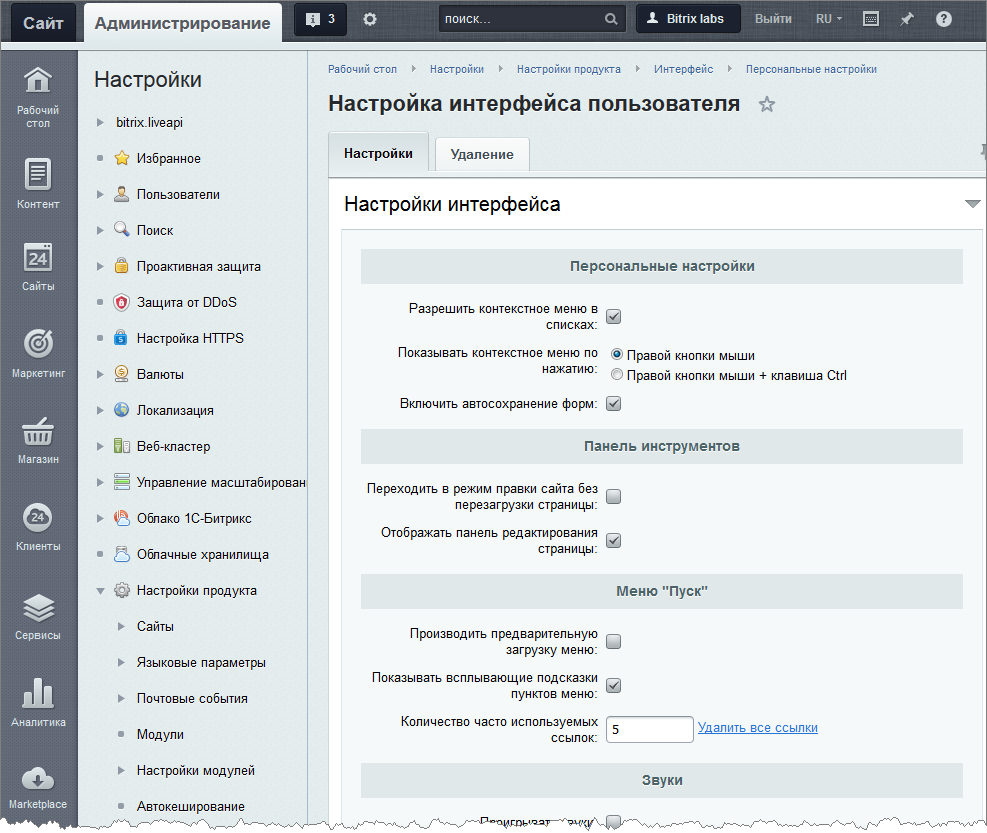
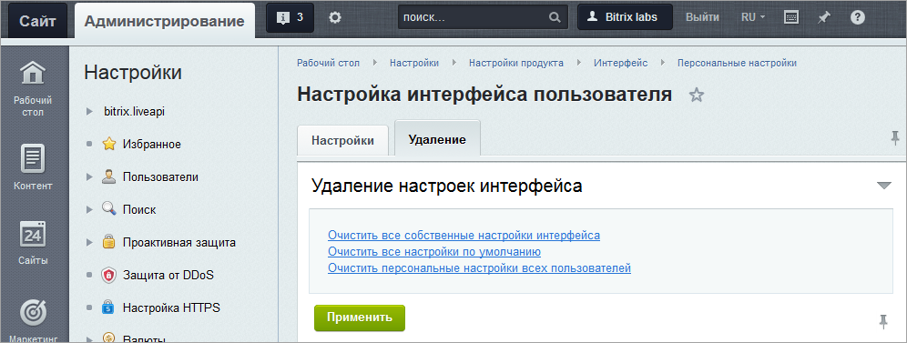

# Административные настройки

**Навигация**
- [← Оглавление курса](index.md)
- [← Предыдущий: 2074 — Пользовательские настройки](lesson_2074.md)
- [Следующий: 11795 — Горячие клавиши →](lesson_11795.md)

Официальная страница урока: https://dev.1c-bitrix.ru/learning/course/index.php?COURSE_ID=35&LESSON_ID=8587

### Где задаются по умолчанию?

Административный уровень настроек по умолчанию задается:

- в общем случае на странице **Настройка интерфейса пользователя** (Настройки &gt; Настройки продукта &gt; Интерфейс &gt; Персональные настройки);
- в частном случае для каждой формы в диалоге **Настройка списка** каждой конкретной формы.

 

В свою очередь административные настройки по умолчанию имеют два уровня:

- первый уровень - тот, который идёт с поставкой системы (системный уровень);
- второй уровень - тот, который может задать администратор (административный уровень).

Административные настройки  для каждой формы выполняются таким же образом, как и [пользовательская настройка](/learning/course/index.php?COURSE_ID=35&LESSON_ID=02074), но с установкой флажка **Установить данные настройки по умолчанию для всех пользователей**.

### Как задать общий административный уровень настроек

Для задания общего административного уровня настроек по умолчанию откройте страницу **Настройка интерфейса пользователя** (Настройки &gt; Настройки продукта &gt; Интерфейс &gt; Персональные настройки):

## Описание закладки Настройки

Закладка **Настройки** позволяет задать настройки интерфейса пользователя, используя следующие разделы:

- Раздел **Персональные настройки** позволяет:

  - разрешить/запретить контекстное меню в списках (таблицах отчетов);
  - задать способ отображения контекстного меню: по клику **Правой кнопки мыши** или по клику **Правой кнопки мыши + клавиша Ctrl**.
  - Включить или выключить автосохранение форм.
- Раздел **Панель инструментов** позволяет настроить внешний вид Панели инструментов.
- Раздел **Меню "Пуск"** позволяет:

  - разрешить/запретить предварительную подгрузку пунктов меню в фоновом режиме;
  - разрешить/запретить отображение всплывающих подсказок при наведении указателя мыши на пункты меню;
  - определить количество часто используемых ссылок, которое будет выведено в **Меню** под **Избранным**:
    
- Раздел **Звуки** позволяет разрешить/запретить проигрывание звуков и указать звук, который будет проигрываться при начале работы системы.
- В разделе **Сообщения** можно указать, какие сообщения будут выводиться: о сроке окончания техподдержки, о состоянии модулей **Проактивная защита** и **Монитор производительности**.
- Раздел **Общие настройки** позволяет назначить параметры, которые будут использоваться как настройки по умолчанию для всех зарегистрированных пользователей, имеющих доступ в административный раздел.

### Ссылки на закладке Удаление

- **Очистить все собственные настройки интерфейса** - удалить все настройки, установленные со снятой опцией **Установить данные настройки по умолчанию для всех пользователей** и установить заново все настройки административного уровня "по умолчанию";
- **Очистить все настройки по умолчанию** - установить все настройки на системном уровне по умолчанию;
- **Очистить персональные настройки всех пользователей** - установить все настройки на административном уровне по умолчанию.
