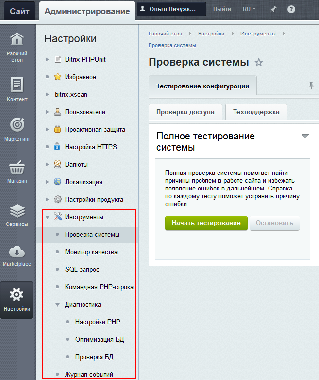

# Раздел Инструменты

**Навигация**
- [← Оглавление курса](index.md)
- [← Предыдущий: 1980 — Установка решения с помощью мастера](lesson_1980.md)
- [Следующий: 14020 — Проверка системы →](lesson_14020.md)

Официальная страница урока: https://dev.1c-bitrix.ru/learning/course/index.php?COURSE_ID=35&LESSON_ID=8607

Чтобы вы могли проверить ваш сайт на соответствие техническим требованиям 1С-Битрикс, в административном меню имеется набор специальных инструментов. Они служат для обнаружения проблем в работе сайта и помогают избежать появления ошибок в дальнейшем.

Средства для выполнения PHP-кода, SQL запросов к базе данных, оптимизации БД и т.п. также расположены в разделе Настройки &gt; Инструменты.

В этой главе содержится описание возможностей данных инструментов и способов их использования.

|  | #### Документация по теме: |
| --- | --- |

- [Инструменты (документация)](http://dev.1c-bitrix.ru/user_help/settings/utilities/index.php)
