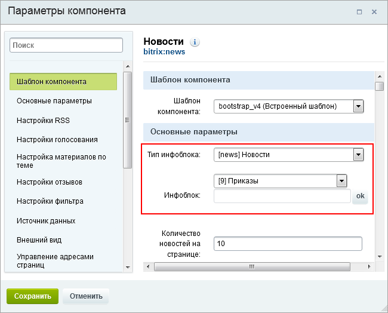
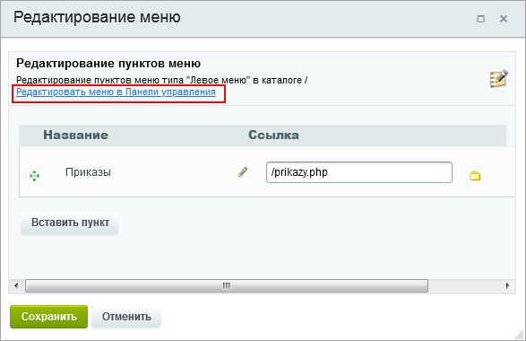
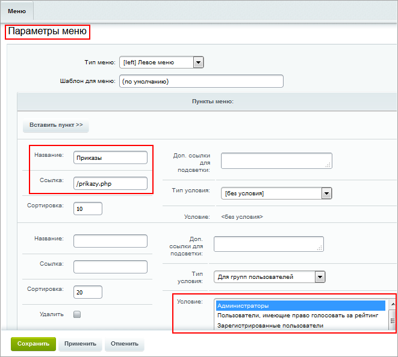
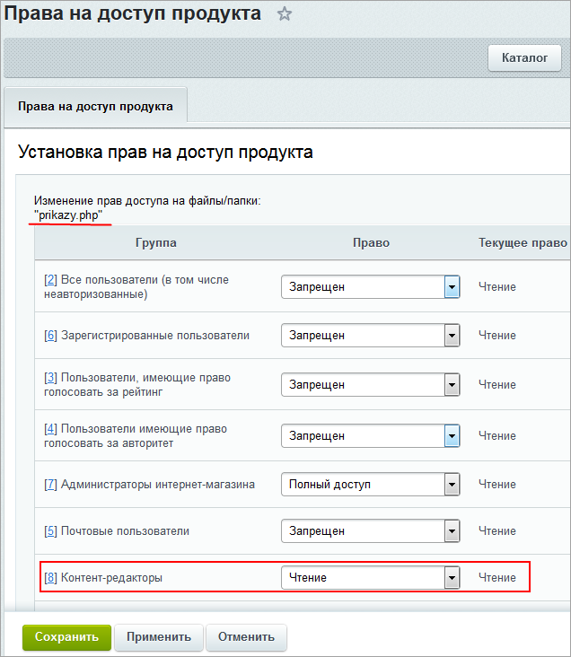

# Несколько примеров работы

**Навигация**
- [← Оглавление курса](index.md)
- [← Предыдущий: 23422 — Назначение прав доступа в интернет-магазине](lesson_23422.md)
- [Следующий: 2074 — Пользовательские настройки →](lesson_2074.md)

Официальная страница урока: https://dev.1c-bitrix.ru/learning/course/index.php?COURSE_ID=35&LESSON_ID=8617

### Как сделать страницу, видимую для сотрудников, но не для пользователей (видеоурок)

Это делается с помощью настройки прав доступа.

Мы уже умеем [управлять правами доступа](lesson_2023.md). А [создать страницу](https://dev.1c-bitrix.ru/learning/course/index.php?COURSE_ID=34&LESSON_ID=1911) может даже контент-менеджер.

Давайте совместим это. То есть сделаем страницу - например, будем там размещать приказы руководства - и дадим на неё права только сотрудникам, то есть администраторам и контент-менеджерам. Пункт перехода на страницу должен быть виден в основном меню сотрудникам и не виден пользователям, даже авторизованным.

1. Информацию будем размещать в специально
  			созданном инфоблоке
                      Как создать инфоблок определенного типа см. в уроке [Создание и редактирование инфоблока](https://dev.1c-bitrix.ru/learning/course/index.php?COURSE_ID=34&LESSON_ID=4534)
  		 Приказы. Тип инфоблока - Новости.
2. Создадим специальную
  			страницу
                      Пошаговое создание страницы описано в уроке [Создание физических страниц](https://dev.1c-bitrix.ru/learning/course/index.php?COURSE_ID=34&LESSON_ID=1911).
  		 для размещения приказов, при её создании отметим опцию "Добавить пункт меню".
3. В публичной части компонент
  			Новости
                      Комплексный компонент позволяет создать новостной раздел на сайте. Доступен просмотр детальной информации, списка элементов, настройка экспорта в rss, организация голосования за новости (или другие элементы инфоблоков), настройка отзывов, вывода материалов по темам, настройки ЧПУ и многое другое.
  						[Описание компонента «Новости (комплексный компонент)» в пользовательской документации.](http://dev.1c-bitrix.ru/user_help/detail.php?ID=62967)
  		 разместим на этой странице.
4. Настроим компонент
                      
  		 – зададим тип инфоблока и сам инфоблок.
5. Настроим доступ:

  - Отредактируем
                        
    		 для пункта Приказы
    			параметры меню
                        
    		 - зададим Тип условия *Для групп пользователей*, а в группах выберем *Администраторов* и *Контент-редакторов*. Таким образом пользователи других групп видеть этот пункт меню не смогут.
  - Поскольку для группы *Контент-редакторы* наследуется запрет доступа на
    			управление структурой
                        Подробно Уровни доступа для стандартных групп пользователей описаны в соответствующем [уроке](lesson_6767.md).
    		, в т.ч. на файлы страниц, нам нужно изменить это, чтобы Контент-менеджеры могли не только видеть пункт меню, но и просматривать содержимое страницы *Приказы*. В административной части, в разделе Контент &gt; Файлы и папки найдем файл **prikazy.php** и отредактируем
    			права доступа
                        
    		 - установим права доступа
    			Чтение
                        
    		.

Таким образом мы сделали страницу, невидимую для пользователей. Сотрудники, состоящие в группах Администраторы, могут наполнять её, а остальные сотрудники - только читать.

### Как быстро закрыть доступ к публичной части

Если возникла необходимость экстренного закрытия публичной части сайта, воспользуйтесь служебной процедурой на странице Настройки &gt; Настройки продукта &gt; Настройки модулей &gt; Главный модуль:

