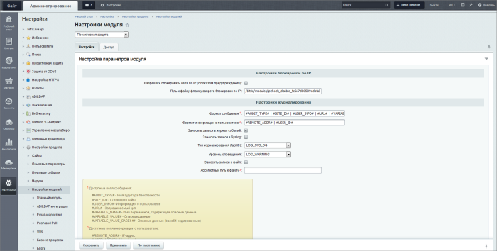

# Настройки модуля Проактивная защита

**Навигация**
- [← Оглавление курса](index.md)
- [← Предыдущий: 2668 — Немного теории: уровни Проактивной защиты](lesson_2668.md)
- [Следующий: 27172 — Монитор проактивной защиты →](lesson_27172.md)

Официальная страница урока: https://dev.1c-bitrix.ru/learning/course/index.php?COURSE_ID=35&LESSON_ID=9113

|  | ### Настройки модуля |
| --- | --- |

Модуль **Проактивная защита** настраивается в Административной части на странице Настройки &gt; Настройки продукта &gt; Настройки модулей &gt; Проактивная защита

На вкладке **Настройки** предлагается настроить параметры блокировки по IP-адресу и журналирования событий в системе.

#### Настройки блокировки по IP

- **Разрешать блокировать себя по IP (с показом предупреждения)** – при отмеченной опции станет доступна блокировка самого себя по IP-адресу. При попытке заблокировать свой IP появится предупреждение, а после второй попытки сохранения – выполнится блокировка.
- **Путь к файлу-флажку запрета блокировки по IP** – Укажите путь к файлу-флажку, с помощью которого можно снять установленные ограничения IP-адресов, в поле **Путь к файлу-флажку**. Создание такого файла-флажка выполняется вручную и помогает получить доступ в случае блокировки себя по IP. Название файла можно оставить
  			по умолчанию
                      По умолчанию файл имеет имя следующего формата:
  **ipcheck_disable_&lt;случайный_набор_из_32_символов&gt;**.
  		, либо указать своё.
  ## Пример работы с файлом-флажком
  Рассмотрим работу с файлом-флажком на примере ситуации случайной блокировки самого себя по IP-адресу:
  - Пусть в настройках модуля указан такой путь к файлу-флажку: `/bitrix/modules/ipcheck_disable_ourproject267`. Название файла придумано своё: **ipcheck_disable_ourproject267**;
  - Выполним блокировку своего IP. Сразу же после блокировки появляется ошибка **403 Forbidden**, т.е. доступ с указанного IP к ресурсу запрещен;
  - Для возвращения доступа подключаемся к серверу по FTP и в файловой структуре переходим по пути `/bitrix/modules/`;
  - Создаем пустой файл с названием **ipcheck_disable_ourproject267**;
  - Как только файл создан, все блокировки по IP снимаются и ресурс становится доступен;
  - Заходим в административный раздел, удаляем IP из стоп-листа, после чего удаляем файл флажок, чтобы вернуть существующие ограничения по остальным IP (если они имеются).
  **Внимание**! Удалите файл-флажок сразу как будут решены проблемы с доступом. В настройках модуля **Проактивная защита** и в
  			Стоп-листе
                      На странице **Стоп-лист** (Настройки &gt; Проактивная защита &gt; Стоп-лист) представлена информация о правилах блокировки доступа определенных IP-адресов к Вашему сайту или некоторым его разделам.
  [Подробнее](lesson_2675.md)...
  		 появится соответствующее
  			предупреждение
                      
  		.

#### Настройки журналирования

В нижней части формы расположены подсказки по заполнению параметров журналирования. Укажите формат, в котором будет вестись журналирование, путь к файлу журнала, а также при необходимости – параметры системного журналирования.

#### Доступ

На закладке **Доступ** распределяются права доступа к модулю для групп пользователей.

 

|  | #### Документация по теме: |
| --- | --- |

- [Настройки модуля](https://dev.1c-bitrix.ru/user_help/settings/security/settings.php)
