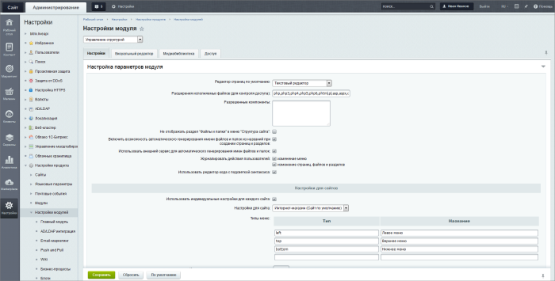

# Настройки модуля Управление структурой

**Навигация**
- [← Оглавление курса](index.md)
- [← Предыдущий: 22376 — Активный шаблон](lesson_22376.md)
- [Следующий: 2530 — Постановка задачи →](lesson_2530.md)

Официальная страница урока: https://dev.1c-bitrix.ru/learning/course/index.php?COURSE_ID=35&LESSON_ID=9115

|  | ### Настраиваем работу с файловой структурой |
| --- | --- |

Модуль **Управление структурой** настраивается в Административной части на странице Настройки &gt; Настройки продукта &gt; Настройки модулей &gt; Управление структурой

Детальнее о настройке модуля читайте в [пользовательской документации](https://dev.1c-bitrix.ru/user_help/content/fileman/settings.php), здесь опишем основные поля.

На вкладке **Настройки** предлагается указать редактор для страниц, который будет использоваться по умолчанию, выбрать расширения файлов, которые могут быть обработаны системой, а также составить список разрешенных для использования компонентов (подробнее про настройки отображения компонентов читайте в уроке

			Настройки отображения компонентов

                    По умолчанию пользователю предоставляется полный список компонентов , которые он может размещать на редактируемой странице. Эту возможность администратор сайта может ограничить. Для этого...

[Подробнее ...](lesson_1902.md)

		).

Выбрав опцию **Не отображать раздел Файлы и папки** Вы можете ограничить доступ к физической структуре сайта, оставив доступ только к логической структуре.

Далее задаются параметры генерации имен файлов и папок, названия могут генерироваться автоматически или вручную. Опция **Журналировать действия пользователей** определяет операции, которые будут заноситься в журнал.

Группа параметров **Настройки для сайта** определяет использование индивидуальных настроек для каждого из сайтов. Чуть ниже расположены параметры поиска и архивации. Задайте размер файлов для поиска, количество файлов в результатах поиска, а также маску поиска по умолчанию. В соответствующих полях задается время одного шага для поиска и архивации.

Вкладка **Визуальный редактор** определяет поведение и внешний вид визуального редактора. Подробнее о настройке визуального редактора читайте в уроке

			Настройка визуального редактора

                    Первой опцией в настройках визуального редактора является выбор самого редактора. Вы можете пользоваться новой версией редактора, либо вернуться к старой (до версии 9.5). Здесь и далее мы будем иметь в виду и описывать новую версию.

[Подробнее ...](lesson_2026.md)

		.

Вкладка **Медиабиблиотека** определяет параметры медиабиблиотеки, такие как размеры изображений и допустимые расширения файлов для каждого типа медиа. Подробнее о

			настройке медиабиблиотеки

                    Для использования широких возможностей медиабиблиотеки нам необходимо предварительно настроить систему должным образом.

[Подробнее ...](https://dev.1c-bitrix.ru/learning/course/index.php?COURSE_ID=34&LESSON_ID=1854)

		.

На вкладке **Доступ** распределяются права

			доступа к модулю

                    Настройка прав доступа к модулям системы позволяет определить диапазон допустимых действий пользователя над модулем и его контентом. Управление правами доступа к модулям выполняется...

[Подробнее ...](lesson_2016.md)

		 для групп пользователей.
