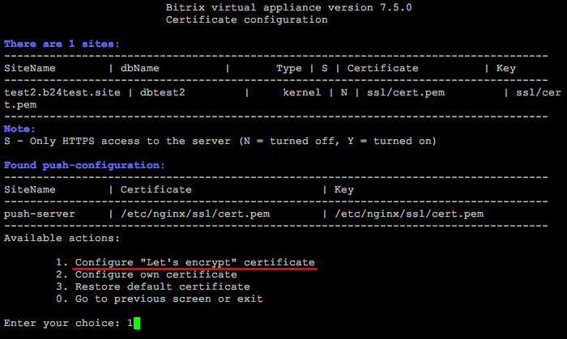
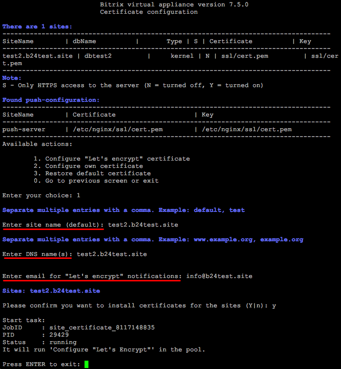
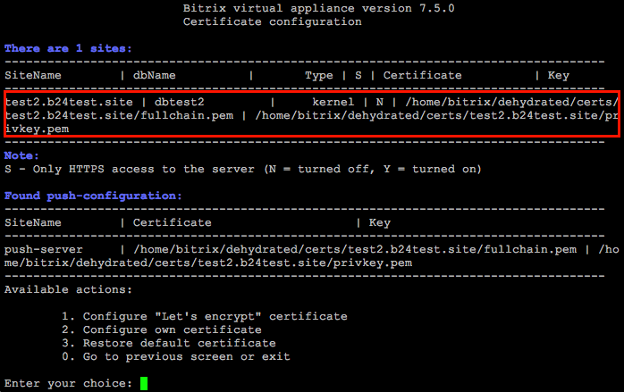
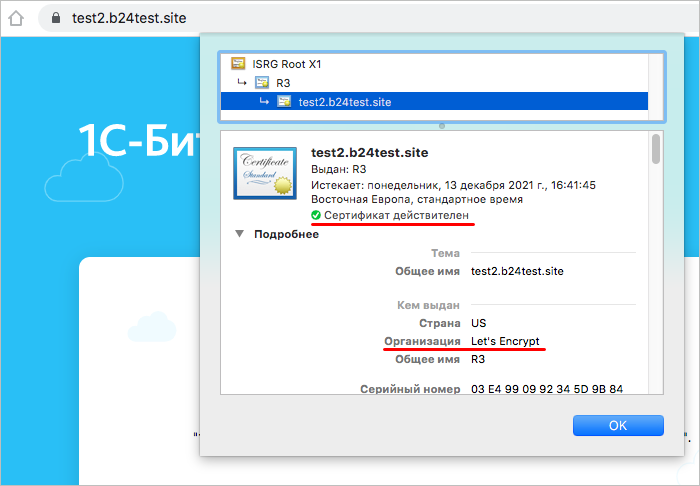

# 1. Настройка сертификата Let's encrypt (1. Configure "Let's encrypt" certificate)

**Навигация**
- [← Оглавление курса](index.md)
- [← Предыдущий: 9375 — 2. Настроить модули PHP (2. Manage PHP extensions)](lesson_9375.md)
- [Следующий: 11453 — 2. Настройка собственного сертификата (2. Configure own certificate) →](lesson_11453.md)

Официальная страница урока: https://dev.1c-bitrix.ru/learning/course/index.php?COURSE_ID=37&LESSON_ID=11451

Перед выпуском сертификата Let’s Encrypt:

- убедитесь, что сайт на целевом хосте уже [создан](lesson_29320.md) и доступен из интернета,
- проверьте, что у вашего регистратора или DNS-хостера указаны правильные настройки DNS для этого домена,
- отключите поддержку IPv6.


Несоблюдение условий приведет к ошибке выпуска. Лимит на ошибки — 5 в час на аккаунт для одного домена.


Для создания SSL-сертификата Let’s Encrypt нужно:


- Перейти в меню 8. Manage pool web servers &gt; 3. Configure certificates:
  
- Выбрать пункт меню 1. Configure "Let's encrypt" certificate и ввести:
  и подтвердить ввод:
  

  - **site name** – имя сайта или несколько имен сайтов, для которых нужно выпустить сертификат(ы) Let's encrypt (в данном примере: **test2.b24test.site**)
  - **dns name(s)** – все домены данного сайта, для которых должен быть выпущен сертификат, включая домен с www и без, вводить несколько доменов через запятую
  - **email for LE notifications** – почтовый адрес для уведомлений сервиса Lets Encrypt
- Мастер самостоятельно запросит и установит его в течение нескольких минут. Пути SSL-сертификатов будут указаны в этом же разделе:
  
- Проверить выпущенный сертификат можно легко – перейти на ваш сайт по протоколу https, у валидного сертификата будет замочек:
  


Срок действия – 90 дней. Перевыпуск происходит автоматически за 20 дней до окончания срока действия.


### Ручное обновление


С версии *BitrixVM* 7.4.0 проверка сертификатов автоматически производится еженедельно в субботу в 2 часа ночи по cron-у.


Если вам нужно вручную обновить сертификат, запустите его получение для существующего домена. Система проверит и при необходимости обновит сертификаты.


Также вы можете вручную командой:


```

/home/bitrix/dehydrated/dehydrated -c
```


Система проверит сроки действия и при необходимости запустит обновление.


Лог обновления можно посмотреть по пути: **/home/bitrix/dehydrated_update.log**.


**Важно!** У сервиса Lets Encrypt есть свои ограничения на выпуск сертификатов. Основные из них:

- Выпуск 50 штук в неделю на домены (на зарегистрированные домены у регистратора, поддомены не входят в этот счет).
- Если у вас много поддоменов, то можно все поддомены указать в одном сертификате, но здесь есть лимит в 100 поддоменов на одну штуку.
- 5 ошибок в час выпуска сертификата на аккаунт для одного домена (не доступен хост, не прописаны записи в DNS домена и т.д).
- Проверка HTTP-01 выполняется только с использованием порта 80. Если этот порт закрыт (провайдером, например), то [сертификат не перевыпустится](https://letsencrypt.org/ru/docs/challenge-types/).


Подробнее о лимитах Let’s Encrypt читайте в статье [Rate Limits](https://letsencrypt.org/docs/rate-limits/).
