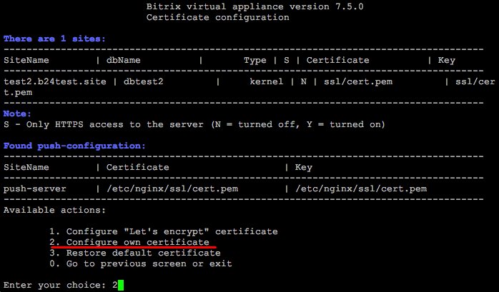
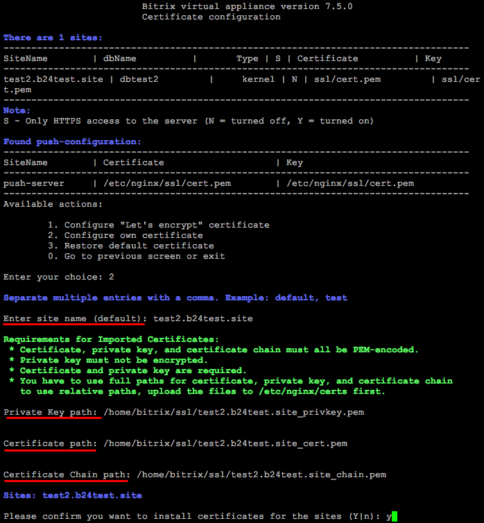
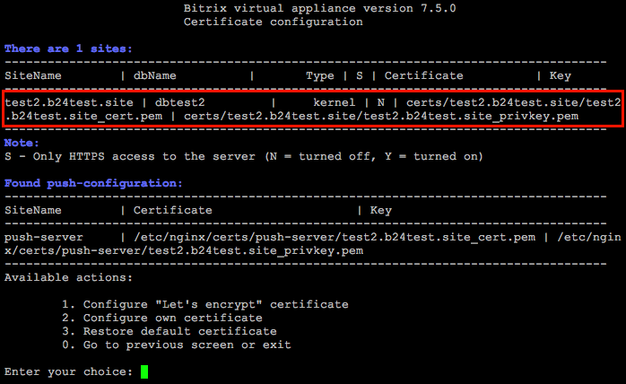
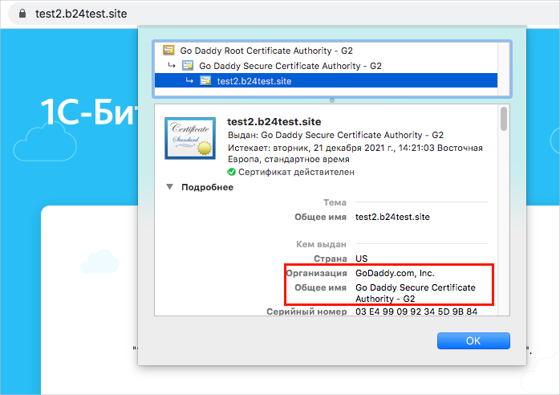

# 2. Настройка собственного сертификата (2. Configure own certificate)

**Навигация**
- [← Оглавление курса](index.md)
- [← Предыдущий: 11451 — 1. Настройка сертификата Let's encrypt (1. Configure "Let's encrypt" certificate)](lesson_11451.md)
- [Следующий: 11455 — 3. Восстановление сертификата по умолчанию (3. Restore default certificate) →](lesson_11455.md)

Официальная страница урока: https://dev.1c-bitrix.ru/learning/course/index.php?COURSE_ID=37&LESSON_ID=11453

### Свой SSL-сертификат

Если у вас есть свой сертификат, выпущенный любым [авторизованным центром](https://ru.wikipedia.org/wiki/Центр_сертификации), то можно также его подключить к сайту в *BitrixVM*.

**Важно!** Прежде, чем подключать его, убедитесь, что у вас [создан сайт](lesson_8849.md) на тот хост (и он доступен из интернета), на который у вас выпущен сертификат, а также указаны правильные DNS-настройки у регистратора или хостера DNS для этого домена.

У вас должны быть следующие файлы: **приватный ключ (private key)**, **цепочка сертификатов (certificate chain)** и **сам сертификат (certificate)**.

**Требования к импортируемым сертификатам:**

- Все перечисленные файлы должны быть в **PEM-кодировке**.
- Приватный ключ не должен быть зашифрован.
- Обязательны файлы сертификата и приватного ключа, файл с цепочкой можно не указывать.
- Если вы используете свои пути для загрузки, то нужно указывать при импорте полные пути. Если хотите использовать относительные пути, то файлы сертификатов должны быть загружены в директорию **/etc/nginx/certs**.

### Подключение

Для подключения своего SSL-сертификата нужно:

- Скопировать файлы сертификата в любую директорию на сервере с помощью любого клиента SFTP. В нашем примере мы создали директорию **/home/bitrix/ssl/** и скопировали файлы в неё.
  Пути получились такие:
  1. **приватный ключ** – `/home/bitrix/ssl/test2.b24test.site_privkey.pem`
  2. **сам сертификат** – `/home/bitrix/ssl/test2.b24test.site_cert.pem`
  3. **цепочка сертификатов** – `/home/bitrix/ssl/test2.b24test.site_chain.pem`
- Далее перейти в меню 8. Manage pool web servers &gt; 3. Configure certificates:
  
- Выбрать пункт меню 2. Configure own certificate и ввести **имя домена** (Sitename) или несколько доменов, для которых нужно импортировать сертификат(ы) (в данном примере: **test2.b24test.site**), **путь для приватного ключа (Private Key path)**, **путь для сертификата (Certificate path)**, **путь для цепочки сертификатов (Certificate Chain path)** и подтвердить установку для этого домена:
  
- Мастер самостоятельно установит сертификат. Пути будут указаны в этом же разделе:
  
- Проверку результата можно выполнить легко – перейти на ваш сайт по протоколу https, у валидного сертификата будет зеленый замочек:
  

Поддерживается ввод нескольких сайтов, через запятую. Следить за сроком действия своего сертификата вы должны сами. Перевыпуск осуществляется также владельцем сайта. После перевыпуска нового сертификата нужно будет заново его импортировать.

**Примечание**: Если вы использовали свою директорию сервера для копирования исходных файлов, то после импорта сертификата в целях безопасности эти файлы желательно удалить (в примере - **/home/bitrix/ssl/**). Если вы копировали файлы в **/etc/nginx/certs**, то удалять их не нужно.
