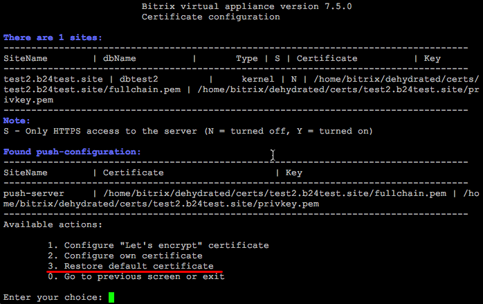
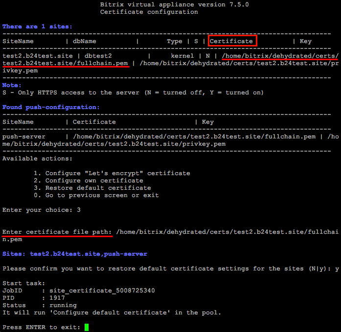
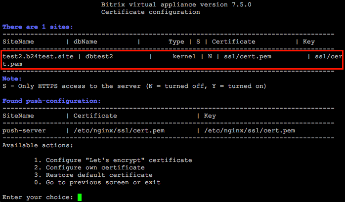

# 3. Восстановление сертификата по умолчанию (3. Restore default certificate)

**Навигация**
- [← Оглавление курса](index.md)
- [← Предыдущий: 11453 — 2. Настройка собственного сертификата (2. Configure own certificate)](lesson_11453.md)
- [Следующий: 9361 — 4. Удаление роли web c сервера (4. Remove web role from server) →](lesson_9361.md)

Официальная страница урока: https://dev.1c-bitrix.ru/learning/course/index.php?COURSE_ID=37&LESSON_ID=11455

Если что-то пошло не так или вы хотите восстановить самоподписанный сертификат, который создается при первом запуске *BitrixVM*, то для этого нужно:

- Перейти в меню 8. Manage pool web servers &gt; 3. Configure certificates:
  
- Выбрать пункт меню 3. Restore default certificate и ввести **certificate file path** – это путь к сертификату, который указан в таблице в поле **Certificate** (в данном примере: `/home/bitrix/dehydrated/certs/test2.b24test.site/fullchain.pem`) и подтвердить действие:
  
- Мастер самостоятельно восстановит SSL-сертификат по умолчанию в **/etc/nginx/ssl/cert.pem**:
  
