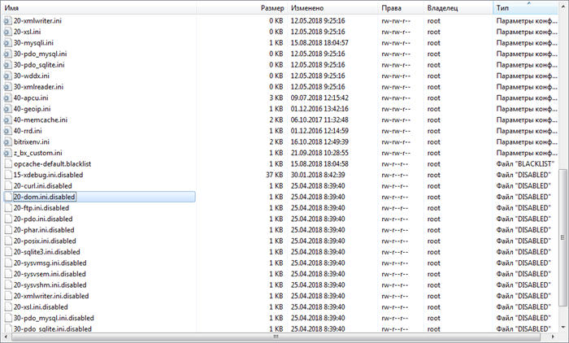
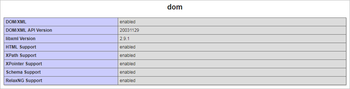

# Ручное включение php-расширений

**Навигация**
- [← Оглавление курса](index.md)
- [← Предыдущий: 11161 — Исходные коды пакетов (начиная с версии 7.3.0!)](lesson_11161.md)
- [Следующий: 13680 — Настройка сервера →](lesson_13680.md)

Официальная страница урока: https://dev.1c-bitrix.ru/learning/course/index.php?COURSE_ID=37&LESSON_ID=11783

**Внимание!**

1. Для операций, описанных в данной главе, необходимы знания администрирования *nix-систем. Перед началом проведения данных операций рекомендуется сделать полный бекап *«Виртуальной машины»*.
2. Приведённые настройки выходят за рамки меню Виртуальной машины. Это означает, что информация - ознакомительная и применять её следует с чётким пониманием того что вы делаете и с собственной ответственностью за совершаемые действия. В нашей техподдержке рассматриваются только вопросы по работе пунктов меню ВМ.

### Ручное включение

Помимо

			включения некоторых php-расширений из меню BitrixEnv

                    В разделе 8. Manage web nodes in the pool &gt; 2. Manage PHP extensions можно включить дополнительные модули PHP, которые могут понадобится в продуктах «1C-Битрикс».

[Подробнее ...](lesson_9375.md)

		 можно включать нужные расширения **вручную**.

Конфигурационные ini-файлы доступных php-расширений находятся в директории `/etc/php.d/`:




Чтобы вручную включить нужное расширение, нужно файл **{имя_расширения}.ini.disabled** переименовать в **{имя_расширения}.ini** и перезапустить сервис Apache – **httpd**.

### Пример

Например, нам нужно включить расширение **dom**.

1. Переходим в директорию сервера `/etc/php.d/`:
  ```
  cd /etc/php.d/
  ```
2. Выводим список файлов в директории:
  ```
  ls
  ```
3. Находим  в списке файл **20-dom.ini.disabled**, переименуем его в **20-dom.ini** и сохраним с заменой текущего:
  ```
  mv 20-dom.ini.disabled 20-dom.ini
  ```
  **Внимание!** Если скопировать содержимое **20-dom.ini.disabled** в **20-dom.ini** и оставить эти два файла в директории `/etc/php.d/`, то при обновлении PHP или виртуальной машины dom-расширение будет деактивировано. Чтобы этого не произошло, нужно оставлять только один файл **20-dom.ini** с активированным расширением.
4. Далее перезапустим сервис Apache – **httpd**:
  Все готово, расширение **dom** работает:
  

  - **CentOS 6**:
    ```
    service httpd restart
    ```
  - **CentOS 7**:
    ```
    systemctl restart httpd.service
    ```

### Установка php-расширения, которого нет в BitrixVM

Также вы можете установить любое php-расширение  самостоятельно.

Например установим расширение **php-imap**.

Сначала нужно найти его имя с помощью команды:

```

yum list php-imap*
```

Далее установить командой:

```

yum install php-imap
```

При установке будет создан файл **/etc/php.d/20-imap.ini**.

Затем нужно перезапустить сервис **httpd**.


Все готово, php-расширение **imap** работает:


**Примечание**: Некоторые php-расширения могут автоматически сами включаться после установки. Если **ini**-файл не был создан во время установки расширения, нужно создать его самостоятельно.
