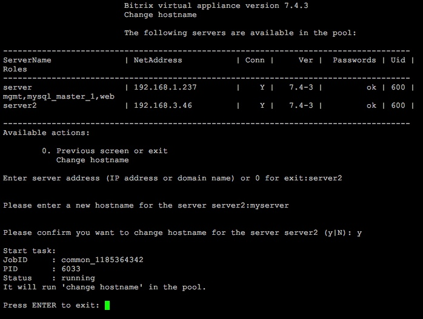
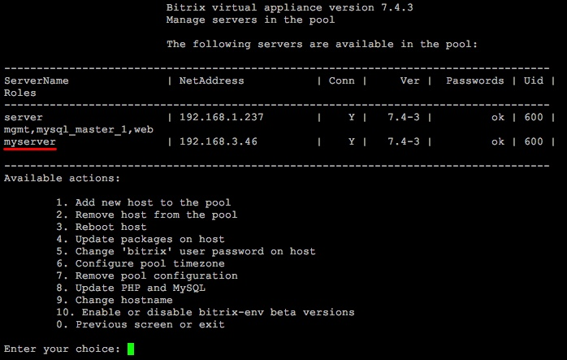

# 9. Изменить имя хоста (9. Change hostname)

**Навигация**
- [← Оглавление курса](index.md)
- [← Предыдущий: 8831 — 8. Обновление PHP и MySQL (8. Update PHP and MySQL)](lesson_8831.md)
- [Следующий: 12862 — 10. Использование бета-версии BitrixEnv (10. Enable or disable bitrix-env beta versions) →](lesson_12862.md)

Официальная страница урока: https://dev.1c-bitrix.ru/learning/course/index.php?COURSE_ID=37&LESSON_ID=12860

Смена имени хоста в пуле осуществляется через пункт меню 1. Manage servers in the pool &gt; 9. Change hostname.

Будет выдан запрос имени хоста, на котором нужно сменить его старое имя, указать новое и дать согласие на смену:

После успешного выполнения задачи, будет сохранено новое название:

