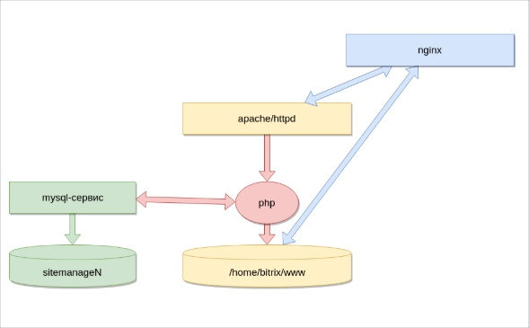

# Что нужно для работы Bitrix-сайта?

**Навигация**
- [← Оглавление курса](index.md)
- [← Предыдущий: 29438 — Как сделать образ BitrixVM для клонирования](lesson_29438.md)
- [Следующий: 13206 — Варианты поставки BitrixVM →](lesson_13206.md)

Официальная страница урока: https://dev.1c-bitrix.ru/learning/course/index.php?COURSE_ID=37&LESSON_ID=13194

Для работы *«1С-Битрикс: Управление сайтом»* и *«Битрикс24 в коробке»* необходимо:

- Сервер — виртуальный или железный. Количество серверов и их мощность зависит от потребностей.
- Web-службы — в BitrixVM используется схема из двух сервисов frontend-backend:

  - frontend — nginx. К нему обращается браузер и через него отдается статика, js/css/картинки и тому подобное, а также используется для организации различных пользовательских сценариев — отдача файлов из облака (X-Accel-Redirect), работа с сервером мгновенных сообщений (push-server) и многое другое.
  - backend — apache/httpd. Служба обрабатывает весь динамический контент.
- База данных — в BitrixVM используется Percona Server 8.0.
- Кеширование данных — в BitrixVM для организации быстрого хранилища в памяти используются Memcached и Redis.
- Cервис обмена мгновенными сообщениями — в BitrixVM используется сервер на NodeJS.

