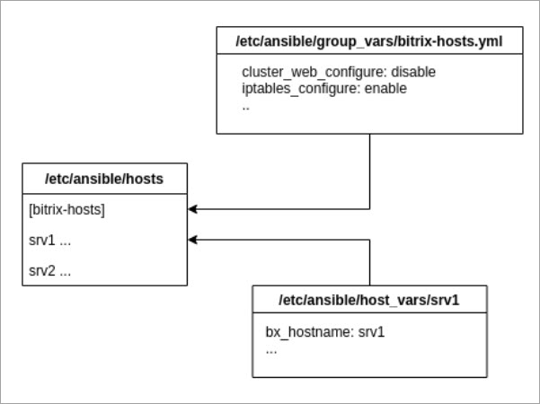

# Инвентарь Ansible

**Навигация**
- [← Оглавление курса](index.md)
- [← Предыдущий: 13292 — Интерфейсы управления](lesson_13292.md)
- [Следующий: 13290 — Сценарии, роли, API →](lesson_13290.md)

Официальная страница урока: https://dev.1c-bitrix.ru/learning/course/index.php?COURSE_ID=37&LESSON_ID=13288

Все конфигурационные файлы, сценарии и прочее для работы *ansible* хранятся в директории `/etc/ansible/`.


Самое главное – это описание хостов, которыми управляет виртуальная машина. В самом простом случае – это локальный сервер, на котором установлено Bitrix-окружение.





В инвентарь входят:


- файл **/etc/ansible/hosts** или файл инвентаря (описание конфигурации) – содержит описание хостов, которыми можно управлять.
  В случае виртуальной машины *BitrixVM* мы храним только группы и хосты, которые входят в эти группы.
  Внутри этого файла есть разделение по группам. Группам соответствуют роли, которые выполняют серверы. Один и тот же сервер может находится в нескольких группах.
  **Пример**:
  ```
  # Bitrix VM default configuration group
  [bitrix-hosts]
  vm03 ansible_ssh_host=192.168.1.215
  vm04 ansible_connection=local ansible_ssh_host=192.168.1.227
  ..
  [bitrix-push]
  vm03 ansible_ssh_host=192.168.1.215
  ```
  Группа `[bitrix-hosts]` содержит все хосты, которыми можно управлять.
  Группа `[bitrix-push]` содержит хосты, которые выполняют роль push-сервера. В данном примере: сервер *vm03* выполняет роль сервера мгновенных сообщений.
  **Внимание!** Не добавляйте один и тот же хост через разные [интерфейсы](lesson_13292.md) в инвентарь!
- файлы в каталогах **/etc/ansible/host_vars/** и **/etc/ansible/group_vars/** – персональные настройки серверов и групп соответственно.
  **Пример**:
  ```
  bx_connect: ipv4
  bx_host: vm04
  bx_hostname: vm04
  bx_netaddr: 192.168.1.227
  ```
