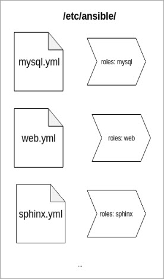
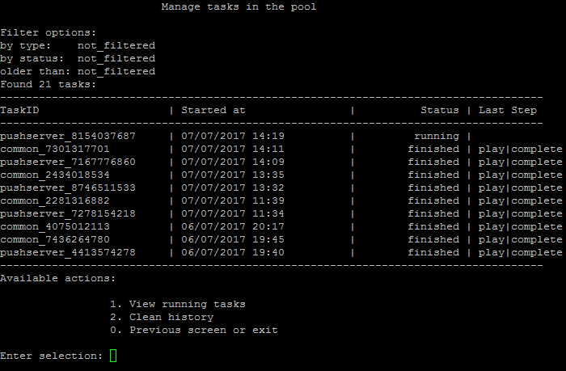

# Сценарии, роли, API

**Навигация**
- [← Оглавление курса](index.md)
- [← Предыдущий: 13288 — Инвентарь Ansible](lesson_13288.md)
- [Следующий: 13302 — Конфигурация nginx →](lesson_13302.md)

Официальная страница урока: https://dev.1c-bitrix.ru/learning/course/index.php?COURSE_ID=37&LESSON_ID=13290

### Сценарии и роли


Cервер настраивается с помощью сценариев.


**Сценарий** – набор действий, который нужно выполнить на сервере или группе. Сценарии сгруппированы по ролям.


**Роль** – это способ организации хранения сценариев. Позволяет хранить все необходимые файлы в отдельном каталоге.





**Основные роли**:


- **monitor** – настройка сервера мониторинга;
- **web** – настройка веб-серверов: организация нескольких нод, создание нового сайта, конфигурация сертификата;
- **mysql** – конфигурация mysql-серверов: создание master-slave конфигурации, переезд mysql-сервера на отдельный хост;
- **sphinx** – настройка и удаления сервиса *sphinx*;
- **memcached** – настройка и удаления сервиса *memcached*;
- **push-server** – настройка и удаления сервиса *push-server*.


**Дополнительные роли**:


- **common** – общая конфигурация серверов: межсетевой экран, синхронизация времени, установка дополнительного ПО;
- **clean** – очистка кеша.


### API ansible-сценариев


API ansible-сценариев используется для запуска сценариев, получения их статуса и возврата его в удобном формате (json, txt).


Сценарии запускаются через API в фоновом режиме, чтобы любая текущея веб-сессия или ssh-сессия не влияла на процесс настройки. Также при этом сохраняется статус запущенного задания, а в случае ошибки есть возможность получить ее лог.


### Запуск сценария ansible


Запускается сценарий командой:


```

ansible-playbook /etc/ansible/<PLAY>.yml -e ansible_playbook_file=/opt/webdir/temp/<TASK_ID>/opts.yml
```


Команда `ansible-playbook` запускает yml-сценарий, а дополнительные опции собираются из меню и передаются через файл **opts.yml** в параметре `ansible_playbook_file`.


Перед запуском ansible-сценария API создает директорию задания `/opt/webdir/temp/<TASK_ID>` и затем в нее помещаются файлы:

- **opts.yml** – опции запуска (если они есть).
- **status** – после запуска будет содержать лог запуска
- **pid** – PID фонового процесса, таким образом, можно узнать выполняется процесс или нет.


После отработки успешного или неуспешного задания файл **opts.yml** удаляется, т.к он может содержать конфиденциальные данные (например, пароли).


Просмотреть статусы задач можно с помощью пункта меню виртуальной машины 8. Background pool tasks:



