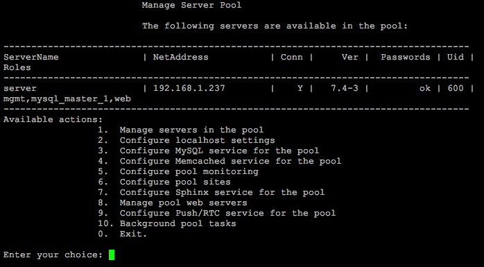

# Интерфейсы управления

**Навигация**
- [← Оглавление курса](index.md)
- [← Предыдущий: 13286 — MySQL Percona Server](lesson_13286.md)
- [Следующий: 13288 — Инвентарь Ansible →](lesson_13288.md)

Официальная страница урока: https://dev.1c-bitrix.ru/learning/course/index.php?COURSE_ID=37&LESSON_ID=13292

<!-- &lt;p&gt;Есть два варианта работы с виртуальной машиной &lt;i&gt;BitrixVM&lt;/i&gt; -  получение текущего статуса и запрос на изменение. &lt;/p&gt;

&lt;div class="tab"&gt;
&lt;h3 class="tab-title"&gt;Web-интерфейс&lt;/h3&gt;

&lt;p&gt;Через web-интерфейс в административной части продуктов «1С-Битрикс»: &lt;span class="path"&gt;Настройки > Управление масштабированием > Панель управления&lt;/span&gt;:

&lt;p&gt;&lt;a href="javascript:ShowImg('/images/bitrixvm/vmbitrix_adv/start/ansible/scale_new_server1.png',1191,691,'Создан новый сервер')"&gt;&lt;img style="cursor: pointer;" alt="Нажмите на рисунок, чтобы увеличить" src="/images/bitrixvm/vmbitrix_adv/start/ansible/scale_new_server1_sm.png"&gt;&lt;/a&gt; &lt;/p&gt;

&lt;p&gt;Данный вариант управления масштабированием сервера в основном направлен на управление ролями одного или нескольких серверов, входящих в пул для отказоустойчивой системы в условиях возрастающей нагрузки. Урезан по функционалу, по сравнению со вторым вариантом. &lt;/p&gt;
&lt;p&gt;

&lt;p&gt;
&lt;div class="hint"&gt;&lt;b&gt;Примечание&lt;/b&gt;: Подробную документация по модулю &lt;b&gt;Масштабирование&lt;/b&gt;  можно найти &lt;a href="https://dev.1c-bitrix.ru/learning/course/index.php?COURSE_ID=35&LESSON_ID=1943" target="_blank"&gt;в курсе Администратор. Базовый&lt;/a&gt;. &lt;/div&gt;
&lt;/p&gt;

&lt;/p&gt;

 
 
&lt;/div&gt; -->

<!-- &lt;div class="tab"&gt;
&lt;h3 class="tab-title"&gt;Консольное меню&lt;/h3&gt; -->

Через интерфейс **консольного меню** командной строки.

Наиболее полный и рекомендуемый интерфейс управления виртуальной машиной *BitrixVM*. Все новинки функционала отражаются именно в этом варианте.

**Примечание**: Документация по виртуальной машине *BitrixVM* можно найти [в одноименном курсе](https://dev.1c-bitrix.ru/learning/course/index.php?COURSE_ID=37).

<!-- &lt;/div&gt; -->
