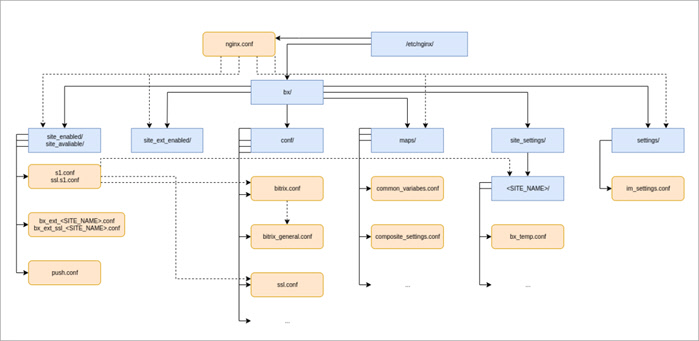

# Конфигурация nginx

**Навигация**
- [← Оглавление курса](index.md)
- [← Предыдущий: 13290 — Сценарии, роли, API](lesson_13290.md)
- [Следующий: 13304 — Конфигурация apache/httpd →](lesson_13304.md)

Официальная страница урока: https://dev.1c-bitrix.ru/learning/course/index.php?COURSE_ID=37&LESSON_ID=13302

### Конфигурация

Конфигурация *nginx* в виртуальной машине:

Конфигурационные файлы сайта настраиваются в момент его создания и могут изменяться в зависимости от выбранного действия.

- **/etc/nginx/nginx.conf** – основной конфигурационный файл (**заменяется при обновлении**).
- **/etc/nginx/bx/** – основной каталог для хранения конфигурационных файлов виртуальной машины.
- **/etc/nginx/bx/conf/** – каталог с общими конфигурационными файлами, чаще всего подключенных непосредственно в конфиг сайта.

  - **bitrix.conf** – для сайтов, у которых не включен композит (**меняется при обновлении**).
  - **bitrix_general.conf** – используется для любого сайта (**меняется при обновлении**).
  - **ssl.conf** – настройки сертификата по умолчанию (**меняется при обновлении**).
- **/etc/nginx/bx/maps/** – каталог хранения общих и персональных переменных сайта, представленный в виде карт *nginx*.
- **/etc/nginx/bx/settings/** – каталог с персональными конфигами под сайт. По умолчанию (если установлено соответствующее обновление) будет содержать настройки для хранения временных файлов сайта (`BX_TEMPORARY_FILES_DIRECTORY`) и отдачи этих файлов через *nginx*.
- **/etc/nginx/bx/site_available/** – каталог с существующими сайтами (или виртуальными хостами).

  - **s1.conf** и **ssl.s1.conf** – конфиги сайта по умолчанию для http и https соответственно.
  - **bx_ext_&lt;SITE_NAME&gt;.conf** и &gt;**bx_ext_ssl_&lt;SITE_NAME&gt;.conf** – конфиги сайтов для http и https соответственно.
- **/etc/nginx/bx/site_enabled/** – каталог с подключенными сайтами (в большинстве случаев, симлинки на **site_available**).
- **/etc/nginx/bx/site_ext_enabled/** – каталог с конфигами сайтов, не связанных с Bitrix-окружением.

### Персональные настройки

Все изменения стандартных конфигурационных файлов *nginx* могут быть утрачены во время обновления или изменения настроек виртуальной машины *BitrixVM*. Поэтому, чтобы этого не произошло, для персональных настроек есть свои файлы и места их хранения.

Изменить глобальные настройки *nginx* всего сервера – в файле **/etc/nginx/bx/settings/z_bx_custom.conf**, а также в **/etc/nginx/bx/site_ext_enabled/**.

Персональные настройки конкретного сайта – в директории **/etc/nginx/bx/site_settings/&lt;SITE_NAME&gt;/**.
