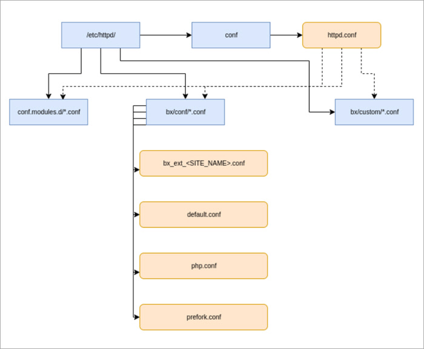

# Конфигурация apache/httpd

**Навигация**
- [← Оглавление курса](index.md)
- [← Предыдущий: 13302 — Конфигурация nginx](lesson_13302.md)
- [Следующий: 13306 — Конфигурация mysql →](lesson_13306.md)

Официальная страница урока: https://dev.1c-bitrix.ru/learning/course/index.php?COURSE_ID=37&LESSON_ID=13304

### Конфигурация

Конфигурация *Apache* в виртуальной машине:

Настройки для сайтов хранятся в файлах:

- **/etc/httpd/conf/httpd.conf** – основной конфигурационный файл *apache* (заменяется при обновлении).
- **/etc/httpd/bx/conf/** – каталог с настройками существующих сайтов.

  - **default.conf** – конфиг сайта по умолчанию.
  - **bx_ext_&lt;SITE_NAME&gt;.conf** – конфиг дополнительных сайтов.
- **/etc/httpd/bx/custom/** – каталог для персональных настроек.
- **php.conf** – конфиг *php*.
- **prefork.conf** – зависит от типа сервера и количества установленной памяти на нем (меняется при запуске ОС).

### Персональные настройки

Все изменения стандартных конфигурационных файлов *apache* могут быть утрачены во время обновления или изменения настроек виртуальной машины *BitrixVM*. Поэтому, чтобы этого не произошло, для персональных настроек есть свои файлы и места их хранения.

Изменить глобальные настройки *apache* всего сервера – в файлах **/etc/httpd/bx/custom/*.conf**.
