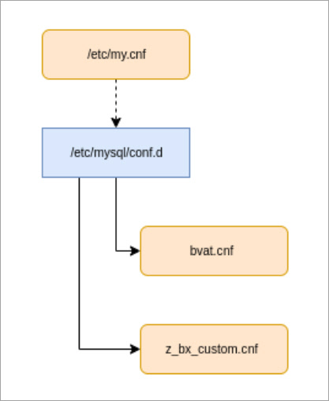

# Конфигурация mysql

**Навигация**
- [← Оглавление курса](index.md)
- [← Предыдущий: 13304 — Конфигурация apache/httpd](lesson_13304.md)
- [Следующий: 13308 — Создание и удаление пула →](lesson_13308.md)

Официальная страница урока: https://dev.1c-bitrix.ru/learning/course/index.php?COURSE_ID=37&LESSON_ID=13306

### Конфигурация

Конфигурация *MySQL* в виртуальной машине:

Настройки для сайтов хранятся в файлах:

- **/etc/my.cnf** – основной конфигурационный файл (**заменяется при обновлении**).
- **/etc/mysql/conf.d/** – каталог с подключаемыми конфигурационными файлами.

  - **bvat.cnf** – параметры, зависящие от типа сервера и объема оперативной памяти сервера.
  - **z_bx_custom.cnf** – персональные настройки.

**Внимание!** Для работы виртуальной машины *BitrixVM* используется клиентский файл **$HOME/.my.cnf**. Удалять его не рекомендуется, т.к в нём содержатся данные для подключения к базе данных под root-пользователем.

### Персональные настройки

Все изменения стандартных конфигурационных файлов *mysql* могут быть утрачены во время обновления или изменения настроек виртуальной машины *BitrixVM*. Поэтому, чтобы этого не произошло, для персональных настроек есть свои файлы и места их хранения.

Изменить глобальные настройки *mysql* всего сервера можно здесь: **/etc/mysql/conf.d/z_bx_custom.cnf**.
