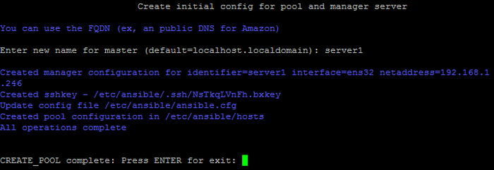

# Создание и удаление пула

**Навигация**
- [← Оглавление курса](index.md)
- [← Предыдущий: 13306 — Конфигурация mysql](lesson_13306.md)
- [Следующий: 13310 — Добавление и удаление сервера в пуле →](lesson_13310.md)

Официальная страница урока: https://dev.1c-bitrix.ru/learning/course/index.php?COURSE_ID=37&LESSON_ID=13308

### Создание пула

После установки **bitrix-env** рекомендуется настроить пул:

- для настройки правил межсетевого экрана.
- для управления локальными службами и конфигурацией через существующее меню или web-интерфейс: настройка сертификатов, создание дополнительных сайтов, обновление mysql сервера и т.п.
- для настройки дополнительных служб (sphinx, memcached, push-server).
- для включения мониторинга и многое другое.

Без создания пула вы не сможете осуществлять управление сайтами и серверами через меню, будут доступны только сетевые настройки локального хоста (настройка имени и IP-адреса, обновление сервера).

При создании пула для сервера:

1. Создаются файлы инвентаря для ansible с его данными.
2. Создается ssh-ключ.
3. Запускается роль **common** для дополнительной настройки.

**Обратите внимание**:

- **имя сетевого интерфейса** – если их больше одного, то лучше использовать внутреннюю сеть, особенно, если планируется подключать дополнительные сервера. Желательно, чтобы адрес не был динамическим. Сменить интерфейс после создания пула нельзя без пересоздания пула.
- **имя сервера** – название должно быть уникальным в рамках пула/инвентаря.
- нельзя добавлять один и тот же сервер в один пул несколькими способами (через разные IP-адреса с использованием разных имен) – это может разрушить данные этого сервера.

### Удаление пула

Данная операция нужна в редких случаях ручного вмешательства в файлы инвентаря.

Особенности удаления пула:

- удаляется конфигурация ansible: файлы инвентаря, ssh-ключ доступа.
- не влияет на конфигурацию веб-серверов и других запущенных служб.
- может быть выполнена, только в случае если сервер один в пуле.

