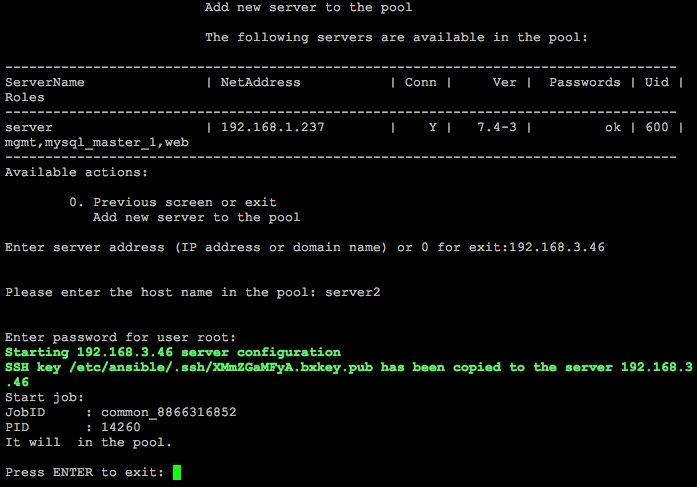

# Добавление и удаление сервера в пуле

**Навигация**
- [← Оглавление курса](index.md)
- [← Предыдущий: 13308 — Создание и удаление пула](lesson_13308.md)
- [Следующий: 11677 — Архив изменений →](lesson_11677.md)

Официальная страница урока: https://dev.1c-bitrix.ru/learning/course/index.php?COURSE_ID=37&LESSON_ID=13310

**Внимание**: добавление серверов в пул недоступно в BitrixVM v9.x.

### Добавление в пул

Для подключения сервера в пул нужно знать следующие данные:

- **IP-адрес** или **DNS-имя**.
- уникальное **имя сервера** в пуле – это может быть его DNS-имя, но не IP-адрес!
- **Пароль** для входа root-пользователя – пароль нужен только для первого входа, в дальнейшем используется авторизация по ssh-ключу.

Подключение разбито на два этапа:

1. Копирование ssh-ключа на сервер.
2. Запуск роли **common** для него.

### Удаление из пула

Если дополнительный сервер больше не нужен, его можно удалить из пула.

При удалении сервера из пула происходит:

- удаление настроек на нём (фаерволл, ssh-ключ доступа).
- удаление его конфигурации на управляющем хосте (инвентарь ansible).
- удаление правил доступа на всех оставшихся серверах группы (iptables).

**Примечание**: Если удаляемый сервер имеет какую-либо роль, то перед удалением необходимо сначала снять с него роль.
