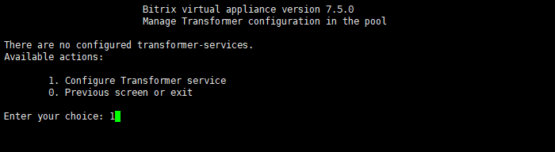
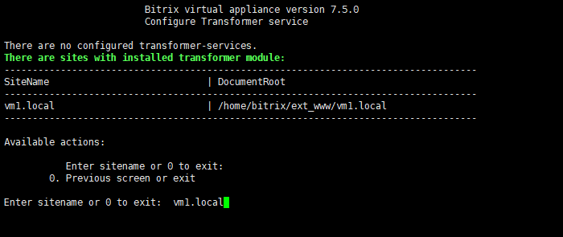
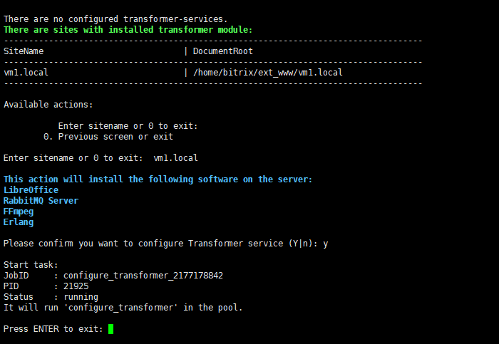
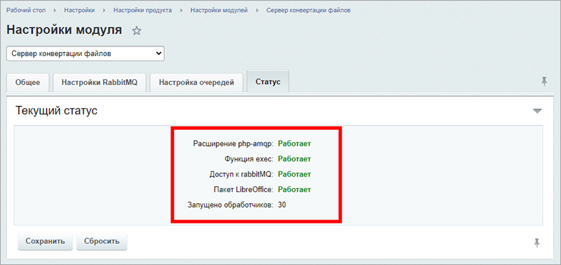
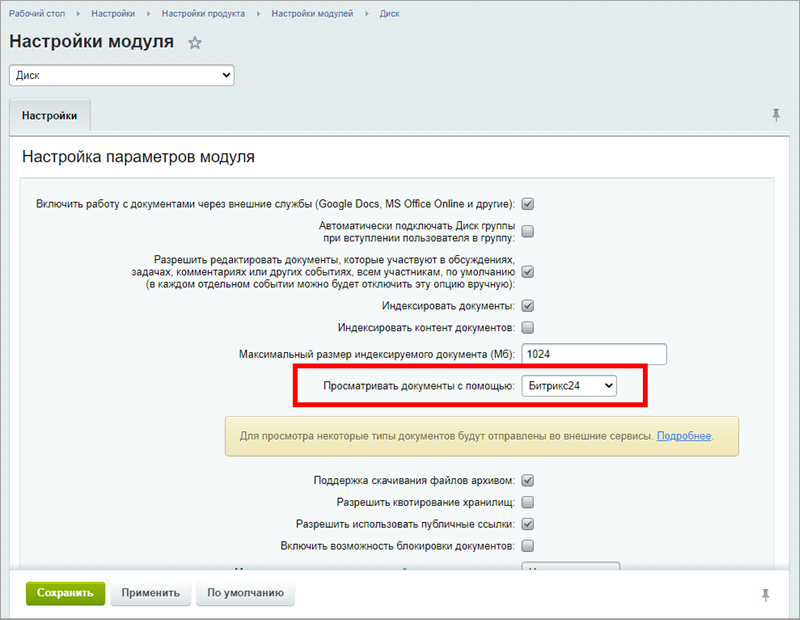

# 1. Настроить сервис «Конвертер файлов» (1. Configure Transformer service)

**Навигация**
- [← Оглавление курса](index.md)
- [← Предыдущий: 8845 — 10. Фоновые задачи (10. Background pool tasks)](lesson_8845.md)
- [Следующий: 21880 — 2. Удалить сервис «Конвертер файлов» (2. Remove Transformer service) →](lesson_21880.md)

Официальная страница урока: https://dev.1c-bitrix.ru/learning/course/index.php?COURSE_ID=37&LESSON_ID=21872

**Ограничения роли**:

1. Требуется модуль *«Сервер конвертации файлов» (transformercontroller)*, который доступен только в редакции [«1С-Битрикс24: Энтерпрайз»](https://enterprise.1c-bitrix.ru/products/b24/).
2. Нельзя удалить сайт, если для него настроена роль – сначала нужно удалить её, потом уже можно удалить сайт.
3. Вынос на отдельный сервер в пуле (кластере) не предусмотрен.
4. Возможна установка только одной роли на машину.

Для настройки роли выполните следующие шаги:

1. В главном меню виртуальной машины выберите пункт 11. Configure Transformer service – 1. Configure Transformer service:
  
2. Введите имя сайта (в примере `vm1.local`):
  
3. Перед запуском роли будет выдано оповещение об устанавливаемом ПО. После этого запустится задача `configure_transformer_**********`, которая:

- установит пакеты *erlang*, *rabbitmq*, *libreoffice6.4*, *ffmpeg* и их связи;
- настроит модули **Конвертер файлов** (transformer) и **Сервер конвертации файлов** (transformercontroller) для указанного сайта.

После завершения задачи в указанных выше модулях будут прописаны все необходимые настройки:

Далее убедитесь, что в **Настройках Битрикс24** публичной части или в административном интерфейсе в настройках модуля **Диск** (Настройки – Настройки продукта – Настройки модулей – Диск) установлена опция **Просматривать документы с помощью Битрикс24**:

Все готово.

#### Уроки по теме

Для дальнейшей эксплуатации могут понадобиться другие учебные материалы:

- [Установка и настройка сервера конвертации файлов](https://dev.1c-bitrix.ru/learning/course/index.php?COURSE_ID=48&LESSON_ID=21876)
- [Нагрузка и логирование](https://dev.1c-bitrix.ru/learning/course/index.php?COURSE_ID=48&LESSON_ID=21878)
- [Использование сервера конвертации файлов другими сайтами](https://dev.1c-bitrix.ru/learning/course/index.php?COURSE_ID=48&LESSON_ID=21882)

**Внимание!** Задачи могут выполняться довольно длительное время (до 2-3 часов и более) в зависимости от сложности задачи, объема данных, используемых в этих задачах, мощности и загруженности сервера. Проверить текущие выполняемые задачи можно с помощью меню 10. Background pool tasks &gt; 1. View running tasks. Если по каким-либо причинам нужно посмотреть лог-файлы выполнения задач, то они находятся в директории `/opt/webdir/temp`.
