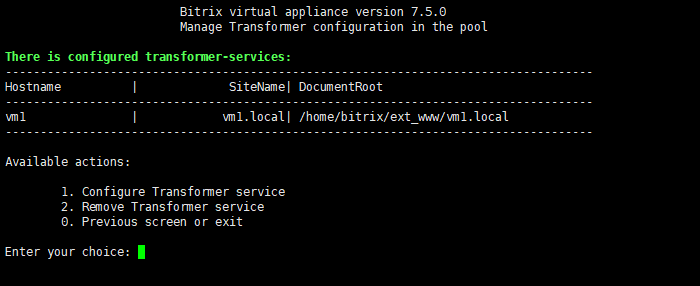
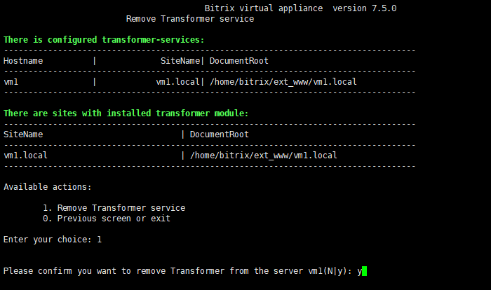

# 2. Удалить сервис «Конвертер файлов» (2. Remove Transformer service)

**Навигация**
- [← Оглавление курса](index.md)
- [← Предыдущий: 21872 — 1. Настроить сервис «Конвертер файлов» (1. Configure Transformer service)](lesson_21872.md)
- [Следующий: 8879 — Изменение стандартных настроек BitrixVM без отключения автоподстройки →](lesson_8879.md)

Официальная страница урока: https://dev.1c-bitrix.ru/learning/course/index.php?COURSE_ID=37&LESSON_ID=21880

Чтобы удалить роль **Конвертер файлов**, нужно:

- В главном меню виртуальной машины выбрать пункт 11. Configure Transformer service – 2. Remove Transformer service:
  
- Выбрать пункт 1. Remove Transformer service и согласиться на удаление роли:
  
- Запустится задача, которая деактивирует запущенные раннее сервисы, удалит их данные и сбросит настройки модулей «Конвертер файлов» (transformer) и «Сервер конвертации файлов» (transformercontroller).

**Внимание!** Задачи могут выполняться довольно длительное время (до 2-3 часов и более) в зависимости от сложности задачи, объема данных, используемых в этих задачах, мощности и загруженности сервера. Проверить текущие выполняемые задачи можно с помощью меню 10. Background pool tasks &gt; 1. View running tasks. Если по каким-либо причинам нужно посмотреть лог-файлы выполнения задач, то они находятся в директории `/opt/webdir/temp`.
