# Типовые ошибки при установке

**Навигация**
- [← Оглавление курса](index.md)
- [← Предыдущий: 8815 — Перенос продукта «1C-Битрикс» в виртуальную среду BitrixVM/BitrixEnv](lesson_8815.md)
- [Следующий: 8819 — 1. Добавление нового хоста в пул (1. Add new host to the pool) →](lesson_8819.md)

Официальная страница урока: https://dev.1c-bitrix.ru/learning/course/index.php?COURSE_ID=37&LESSON_ID=26338

|  | ### Возможные проблемы и их решение |
| --- | --- |

При установке BitrixVM могут возникать ошибки, связанные с особенностями вашего ПК или с дистрибутивом.

Ниже список типовых проблем и способы их решения:

- [Программа не поддерживает оборудование компьютера](#equipment)
- [Виртуализация выключена или отсутствует](#virtualization)
- [Не открывается сайт или показывается ошибка с сетевым адаптером](#net)
- [Нет IP-адреса после запуска BitrixVM](#ip)
- [502 ошибка или время ожидания истекло](#bad_gateway)
- [Дистрибутив не скачивается или загрузка стоит на месте (0%)](#download)
- [Странные символы и ошибки в мастере установки](#master)
- [Версия PHP или MySQL не соответствует требованиям (устарела)](#old)

Не нашли свою проблему в списке? Переустановка часто помогает: удалите виртуальную машину, затем снова ее [установите](https://dev.1c-bitrix.ru/learning/course/index.php?COURSE_ID=34&LESSON_ID=26638) и скачайте дистрибутив продукта.

#### Программа не поддерживает оборудование компьютера

Программа для виртуальных машин (например, VMWare или VirtualBox) не поддерживает оборудование компьютера и выдает ошибку о несовместимости с процессором «Unsupported CPU detected. The host CPU does not support the necessary hardware requirements».

Как решить:

- Используйте альтернативное программное обеспечение для запуска виртуальных машин. Например, если ошибка возникает в VMWare, попробуйте VirtualBox
- Установите более старую версию выбранной программы, которую можно найти на официальном сайте производителя [VMWare](https://customerconnect.vmware.com/downloads/info/slug/desktop_end_user_computing/vmware_workstation_player/17_0) или [VirtualBox](https://www.virtualbox.org/wiki/Download_Old_Builds)

#### Выключена или отсутствует виртуализация

При запуске виртуальной машины появляется черный экран и сразу пропадает, а BitrixVM не стартует. Или появляется ошибка включающая слова

			VT-x, AMD-V, virtualization

                    Формулировка может быть вида «This host does not support "Intel EPT" hardware assisted MMU virtualization» или «This host supports Intel VT-x, but Intel VT-x is disabled».

		.

Как решить:

- Проверьте, поддерживает ли ваш процессор аппаратную виртуализацию (VT-x/VT-d/AMD-V)
- Если поддерживает, активируйте эту функцию в BIOS компьютера. Как это сделать — индивидуально и зависит от вашего оборудования. Инструкцию по активации для вашего случая вы можете найти в интернете

#### Не открывается сайт или показывается ошибка с сетевым адаптером

Вы запускаете виртуальную машину и появляются ошибки, связанные с адаптером (adapter). Или сайт не открывается по IP и отображает сообщение «Не удается получить доступ к сайту».

Как решить:

- Для WMVare:

  - Выключите виртуальную машину
  - Перейдите в настройки сетевого адаптера
  - Измените
    			режим работы
                        
    		  адаптера с NAT на Bridged или наоборот
  - Запустите BitrixVM снова
- Для VirtualBox:

  - Убедитесь, что режим работы сетевого адаптера установлен на Bridged
- Если проблема сохраняется, возможно, потребуется обновление сетевого драйвера на вашем компьютере. Обновление драйвера зависит от операционной системы вашего ПК. Инструкции по обновлению драйверов для любой операционной системы вы найдете в интернете

#### Нет IP-адреса после запуска BitrixVM

Поле

			bitrix url

                    

		 отсутствует и IP4 имеет статус undefined.

Как решить:

- Перезапустите виртуальную машину. Иногда для корректного получения IP-адреса требуется несколько попыток запуска. Если проблема остается, переходите к следующему шагу
- Проверьте настройки сетевого оборудования. Если перезапуск не помог, возможно, проблема связана с настройками сети. Попробуйте вручную [настроить IP-адрес](lesson_9315.md) через меню BitrixVM или обратитесь за помощью к системному администратору

#### 502 ошибка или время ожидания истекло

При попытке открыть сайт по

			bitrix url

                    

		 после установки BitrixVM появляется ошибка «

			502 Bad Gateway/Bitrix Environment

                    

		» или сообщение о том, что «Время ожидания ответа истекло».

Как решить:

- Перезагрузите виртуальную машину, чтобы исключить временные сбои
- Если ошибка сохраняется, удалите виртуальную машину и вновь [установите](https://dev.1c-bitrix.ru/learning/course/index.php?COURSE_ID=34&LESSON_ID=26638) её. Возможно в процессе первоначальной установки что-то пошло не так и переустановка может решить проблему

#### Дистрибутив не скачивается или загрузка стоит на месте

Во время скачивания дистрибутива с сервера:

- процент загрузки не меняется (0%) в течение длительного времени
- загрузка частично выполняется и затем отображается ошибка

Как решить:

- Сбросьте
  			кеш браузера
                      Откройте страницу в браузере по IP и нажмите Ctrl + F5 — на компьютере с Windows или Command + Option + R — на компьютере с MacOS. Либо очистите историю в настройках браузера.
  		 или попробуйте скачать дистрибутив, используя
  			режим инкогнито
                      Как открыть окно в режиме инкогнито в Google Chrome:
  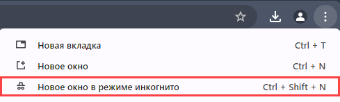
  		. Это может помочь, если проблема связана с временными файлами
- Проверьте скачивание продукта через другой интернет-провайдер, например, используя мобильный интернет. Это позволит исключить проблемы, связанные с вашим основным подключением к интернету
- Если способы выше не помогли, удалите виртуальную машину и вновь [установите](https://dev.1c-bitrix.ru/learning/course/index.php?COURSE_ID=34&LESSON_ID=26638) её. Возможно в процессе первоначальной установки что-то пошло не так и переустановка может решить проблему

#### Странные символы и ошибки в мастере установки

Процесс скачивания дистрибутива не быстрый и иногда файл скачивается с ошибками. Это может проявиться по-разному: ошибками в мастере установки или символами �. Пример пользователя:

**Цитата**: «Я нажимаю принять соглашение, после этого на кнопку Далее и у меня появляются

			непонятные символы

                    

		»

Как решить: удалите виртуальную машину, вновь [установите](https://dev.1c-bitrix.ru/learning/course/index.php?COURSE_ID=34&LESSON_ID=26638) её и скачайте дистрибутив продукта.

#### Версия PHP или MySQL не соответствует требованиям (устарела)

Разработка виртуальной машины — процесс долгий и возможны ситуации, когда версии PHP или MySQL отстают от требований дистрибутива. В этом случае мастер установки обязательно подскажет вам, что их нужно обновить:

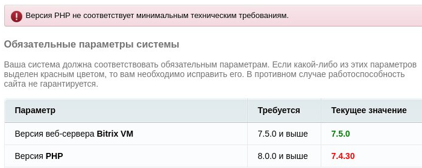

Как решить: обновите PHP и MySQL через меню BitrixVM.

Сначала необходимо выполнить подготовительные работы:

- В поле
  			localhost login
                      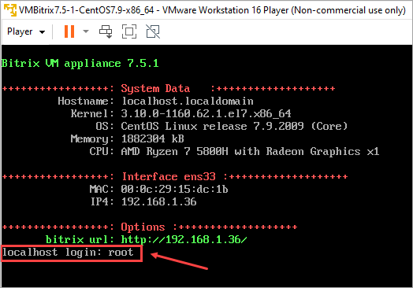
  		 введите **root** и нажмите клавишу **Enter** (Ввод)
- При первом запуске виртуальной машины *BitrixVM* в появившемся поле
  			Password
                      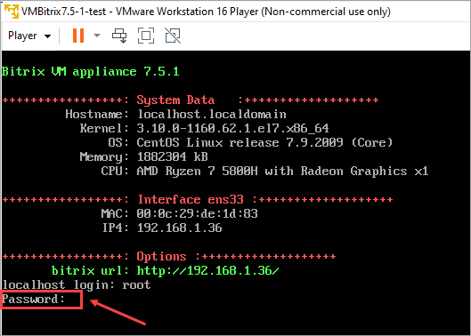
  		 введите **bitrix** и нажмите **Enter**
  **Обратите внимание, что** все пароли вводятся скрытым образом, на экране символы не отображаются
- Вам будет предложено сменить пароль для пользователя **root**:

  - В поле
    			(current) UNIX password
                        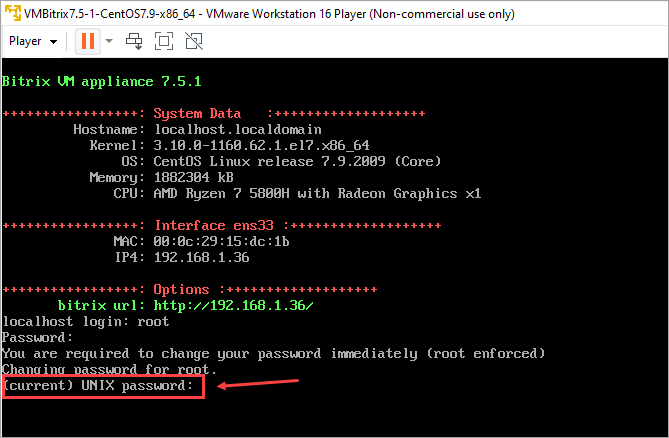
    		 введите старый пароль **bitrix** и нажмите **Enter**
  - Придумайте новый пароль для пользователя **root** и введите его в поле
    			New password
                        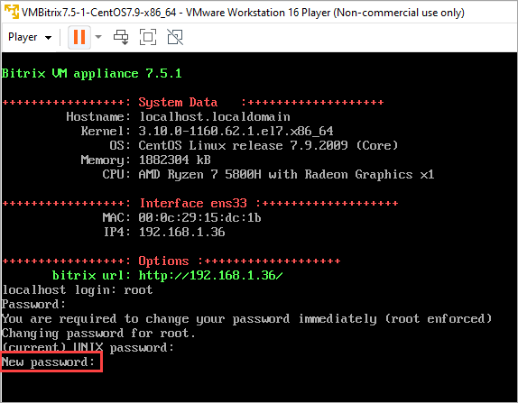
    		, затем нажмите кнопку **Enter**
  - Повторите ввод нового пароля в строке
    			Retype new password
                        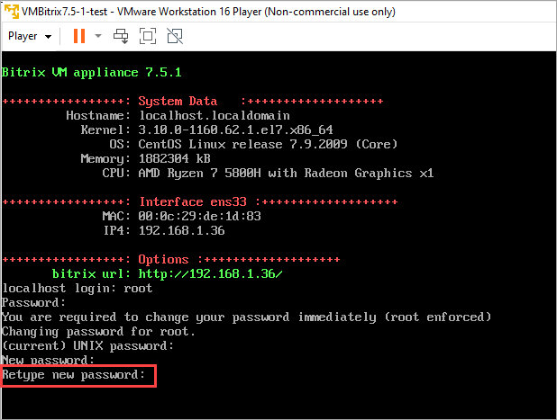
    		 и нажмите **Enter**
- Теперь придумайте новый пароль для пользователя
  			bitrix
                      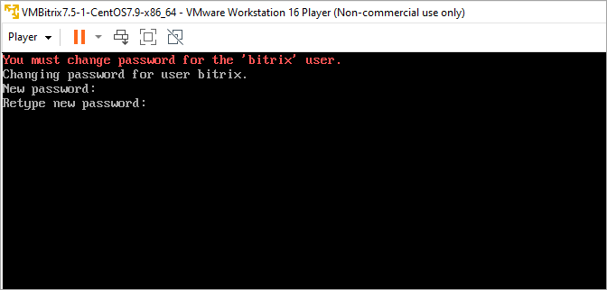
  		: введите его в поле **New password**, нажмите **Enter**. Затем повторите его в поле **Retype new password** и вновь нажмите **Enter**
- Появится информация о необходимости создать
  			пул управления сервером
                      **Пул** – это набор серверов управления или серверов шлюзов, которые распределяют между собой рабочие нагрузки и принимают на себя рабочие нагрузки в случае сбоя одного из членов.
  В самом простом случае в пуле будет единственный сервер, на котором настроено Bitrix-окружение.
  		:

  - Введите
                        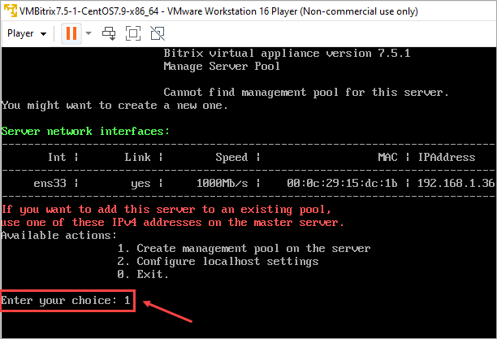
    		 цифру **1** в строке **Enter your choice** и нажмите **Enter**
  - Задайте произвольное
    			название сервера
                        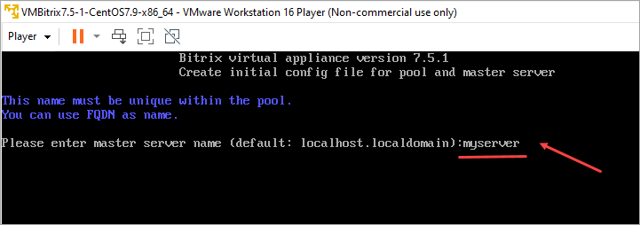
    		, например, **myserver** и нажмите **Enter**
  - Отобразится
    			сообщение
                        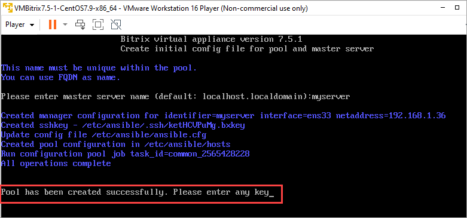
    		 об успешном создании пула. Нажмите кнопку **Enter**
- Виртуальный сервер готов для использования. Если забыли его IP-адрес, то он отображается в поле
  			NetAddress
                      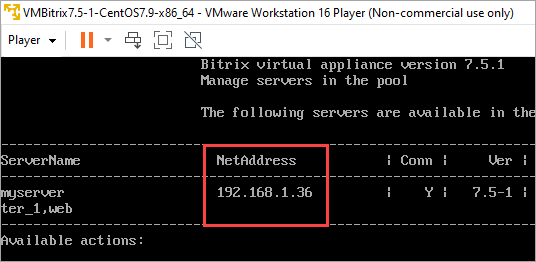

Подготовительные работы по настройке сервера выполнены и стало доступно

			меню виртуальной машины

                    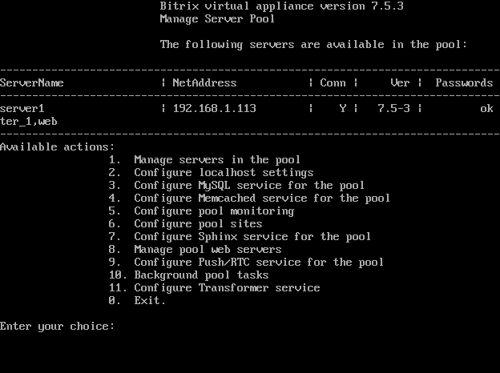

		. Теперь можно обновить PHP и MySQL. Подробно об этом написано в уроке [8. Обновление PHP и MySQL (8. Update PHP and MySQL)](lesson_8831.md) отдельного курса по виртуальной машине.

**Примечание.** Обновлять версии PHP и MySQL может только пользователь **root**

После окончания всех настроек, в целях безопасности рекомендуется выйти из учетной записи **root**:

- Введите цифру **0** в строке **Enter your choice** и нажмите **Enter**
- Введите в консоли команду **exit** и нажмите **Enter**
