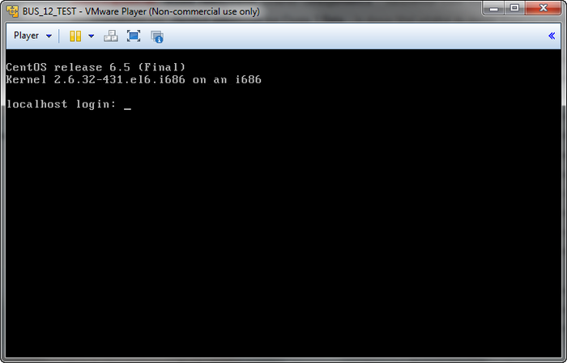
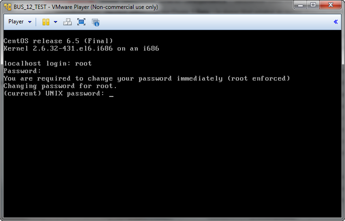
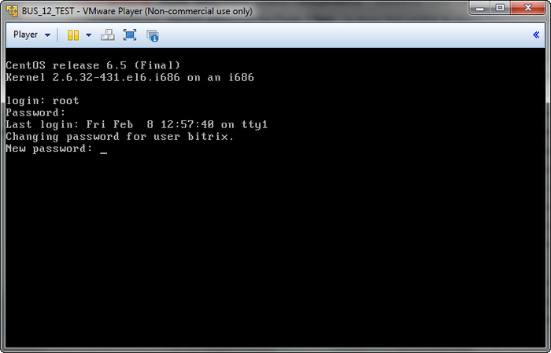
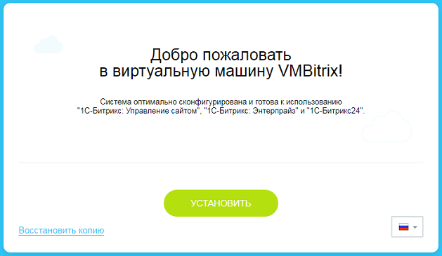

# Запуск виртуальной машины BitrixVM

**Навигация**
- [← Оглавление курса](index.md)
- [← Предыдущий: 2713 — Введение](lesson_2713.md)
- [Следующий: 2716 — Настройка почтового сервера →](lesson_2716.md)

Официальная страница урока: https://dev.1c-bitrix.ru/learning/course/index.php?COURSE_ID=37&LESSON_ID=2715

- Скачайте и установите [VMWare Player](http://www.vmware.com/products/player/) - бесплатный продукт, работающий под ОС Windows или Linux.
  **Примечание:**Описание установки **VMWare Player** не входит в данное руководство. По всем вопросам установки этой программы обращайтесь к документации [VMWare](http://www.vmware.com/ru/).
- Загрузите дистрибутив [настроенной виртуальной машины BitrixVM](http://www.1c-bitrix.ru/products/vmbitrix/).
- Скачанный архив распакуйте в любую папку, например, `С:\VMBitrix\BitrixVM\`.
- Запустите **VMWare Player**. Нажмите кнопку **Open a Virtual Machine** и укажите путь к файлу **BitrixVM.vmx**, который был распакован в каталог `С:\VMBitrix\BitrixVM\`. Виртуальная машина появится в списке добавленных.
- Выберите в списке нужную виртуальную машину и нажмите кнопку **Play Virtual Machine**:
  
- Начнется процесс загрузки операционной системы, установленной на виртуальной машине. В конце загрузки откроется окно:
  
- **Примечание:**Для суперпользователя **root** по умолчанию задан пароль **bitrix**.
  При первом запуске виртуальной машины будет предложено сменить пароли суперпользователя **root** и пользователя **bitrix**:
  
  Аналогично происходит смена пароля пользователя **bitrix**:
  
  **Примечание:**Cменить пароли пользователей **root** и **bitrix** также можно в панели управления виртуальным сервером с помощью команды **Change root password** и **Change bitrix password** соответственно.

  - В строках **localhost login** укажите текущий логин (**root**), а в поле **Password** пароль (по умолчанию **bitrix**).
  - В строке **(current) UNIX password** укажите текущий пароль (**bitrix**) и нажмите **Enter**.
  - Введите новый пароль в строке **Enter new UNIX password** и нажмите **Enter**.
  - Повторите ввод нового пароля в строке **Retype new UNIX password** и нажмите **Enter**.


В результате виртуальный сервер готов для использования:


Основные функции администрирования перечислены в списке **Available actions**:


- **0. Virtual appliance information** - выводит информацию о текущих настройках виртуальной машины;
- [**1. Mail sending system parameters**](lesson_2716.md) - настройка параметров интегрированного почтового сервера;
- **2. Disable/Enable HTTP access (HTTPS only)** - выключение/включение доступа к сайту только через HTTPS;
- **3. Change root password** - смена пароля суперпользователя;
- **4. Change bitrix password** - смена пароля пользователя bitrix;
- **5. Virtual server reboot** - перезагрузка виртуального сервера;
- **6. Virtual server shutdown** - выключение виртуального сервера;
- **7. Get a new IP address via DHCP** - получение нового IP-адреса автоматически с помощью DHCP-сервера;
- **8. Asign a new IP address (manual)** - установка нового IP-адреса вручную;
- **9. Set PHP timezone from Operating System setting** - установка часового пояса в виртуальной машине из настроек операционной системы;
- [**10. Create master node**](lesson_5233.md) - создание мастера для веб-кластера;
- [**11. Add slave node**](lesson_5233.md#slave) - добавление слэйва к мастеру веб-кластера (***доступно при заходе на машину-мастер);
- [**12. Make slave node a master node**](lesson_5233.md#error) - переключение слейва в режим мастера (***доступно при заходе на машину-слэйв);
- [**13. Add additional site**](lesson_5232.md) - добавление сайта в режиме многосайтовости на разных доменах;
- [**14. Delete additional site**](lesson_5232.md#delete) - удаление сайта в режиме многосайтовости на разных доменах;
- **15. NTLM authentication** - включение NTLM-авторизации;
- **16. Start/Stop server monitoring** - включение/выключение мониторинга сервера;
- [**17. Start/Stop site backup**](lesson_3459.md) - включение/выключение резервного копирования данных сайта;
- [**18. Sphinx search server**](lesson_5838.md) - настройка поискового сервера Sphinx.
- [**19. Update System**](lesson_5262.md) - обновление виртуальной машины.


Для перехода к выполнению любого действия введите число (от 0 до 19) и нажмите **Enter**. Например, для выключения виртуального сервера в строке наберите **6** (**Virtual server shutdown**) и нажмите **Enter**.


Чтобы вернуться в вашу ОС, нажмите **Ctrl**+**Alt**.


Чтобы вернуться из shell в меню виртуальной машины, введите команду:


```

/root/menu.sh
```


**Примечание:**При возникновении проблем с сетевым адаптером **VMWare Player** необходимо перейти в настройки сетевого адаптера (Virtual Machine &gt; Removable Devices &gt; Network Adapter &gt; Settings...), выбрать один из режимов (**Bridged**, **NAT**, **Host-only**):


и перезапустить виртуальный сервер, указав команду **5** и нажав **Enter**.


Далее необходимо набрать полученный IP-адрес в браузере (в нашем примере это http://192.168.1.170 или https://192.168.1.170). Откроется страница с выбором варианта работы:





Для продолжения необходимо выбрать один из вариантов:


1. **Новая установка** - в этом случае будет запущен мастер, который позволяет скачать, установить и создать новый сайт средствами продуктов компании «1C-Битрикс». Шаги этого варианта аналогичны шагам, рассмотренным в главе **Установка продукта с помощью BitrixSetup**.
2. **Восстановить проект** - в этом случае будет запущен мастер, с помощью которого можно будет перенести существующий проект (восстановить проект из резервной копии). Шаги этого варианта аналогичны шагам, рассмотренным в главе **Перенос продукта**.
