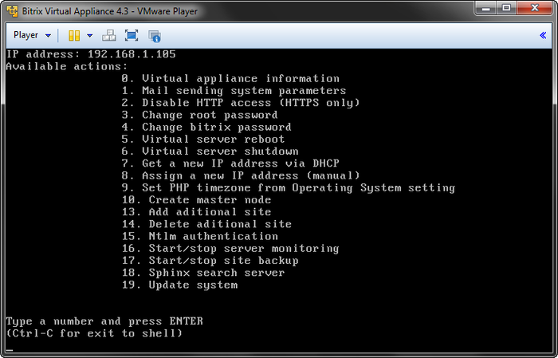
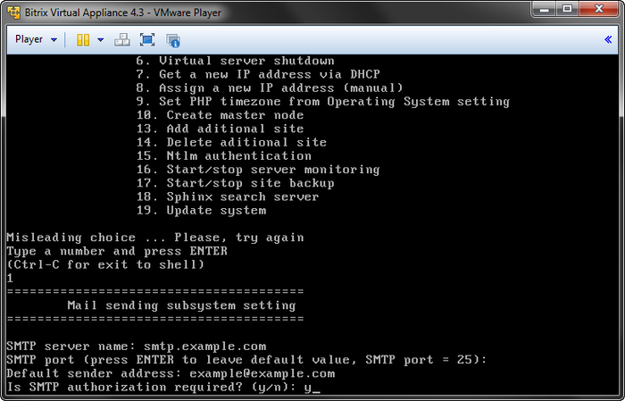
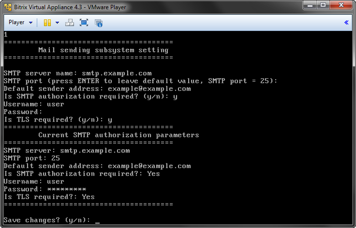

# Настройка почтового сервера

**Навигация**
- [← Оглавление курса](index.md)
- [← Предыдущий: 2715 — Запуск виртуальной машины BitrixVM](lesson_2715.md)
- [Следующий: 5233 — Создание кластера master-slave →](lesson_5233.md)

Официальная страница урока: https://dev.1c-bitrix.ru/learning/course/index.php?COURSE_ID=37&LESSON_ID=2716

Для настройки интегрированного почтового сервера выполните следующее:

- В строке **Type a number and press ENTER** наберите команду **1** (**Mail sending system parameters**) и нажмите **Enter**:
  
- В строке ниже отобразится диалог **Mail sending subsystem settings**, в котором укажите следующее:
  
  После завершения настройки все указанные параметры будут отображены в списке ниже:
  

  - **SMTP server name** - имя почтового сервера.
  - **SMTP port** - порт сервера. Порт зависит от типа соединения, 25 - для обычного и 465 - для зашифрованного (с использованием SSL). Если нажать Enter, то будет использован порт по умолчанию (25).
  - **Default sender address** - адрес отправителя, от которого будет осуществляться пересылка писем.
  - Если необходима SMTP-авторизация, то в строке **SMTP authorization required** наберите **y**, в противном случае - **n**.
  - Если необходим TLS-протокол защищенной передачи данных, то в строке **Is TLS required?** наберите **y**, в противном случае - **n**.

- Для сохранения параметров в строке **Save changes** укажите **y**.

**Примечание:** Адреса e-mail и smtp-сервера указаны в качестве примера, вместо них нужно указывать свои значения.

<!-- :D -->
