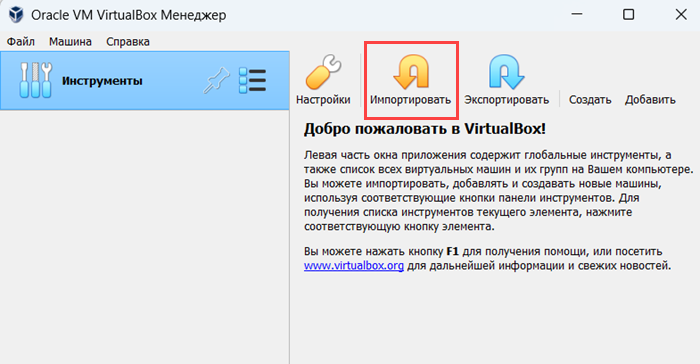
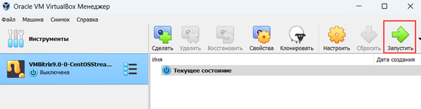
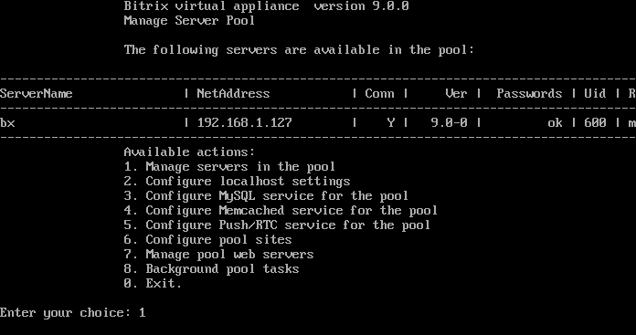
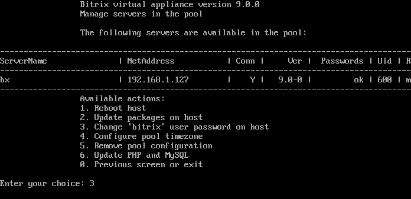
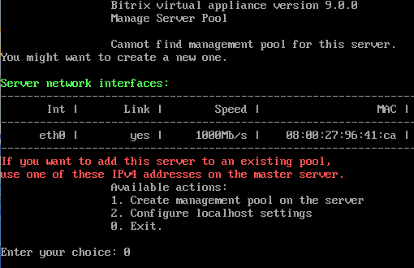
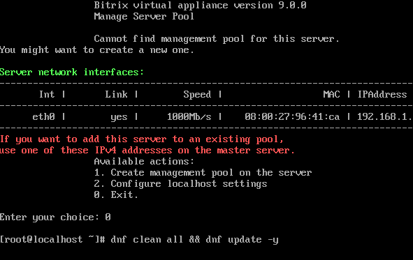
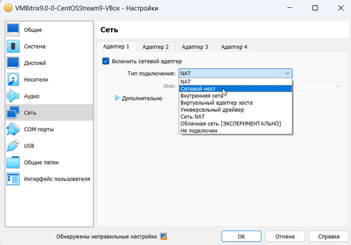

# Запуск виртуальной машины BitrixVM

**Навигация**
- [← Оглавление курса](index.md)
- [← Предыдущий: 29234 — Установка «1С-Битрикс: Веб-окружение» — Linux (BitrixEnv)](lesson_29234.md)
- [Следующий: 29244 — Установка дистрибутива сайта в BitrixVM/BitrixEnv →](lesson_29244.md)

Официальная страница урока: https://dev.1c-bitrix.ru/learning/course/index.php?COURSE_ID=37&LESSON_ID=29238

### Как запустить виртуальную машину BitrixVM

**Внимание!** Если у вас при старте образа виртуальной машины появляется черный экран и сразу пропадает, а BitrixVM не стартует, проверьте поддержку аппаратной виртуализации VT-x/VT-d вашим процессором. Включить виртуализацию VT-x/VT-d можно в BIOS вашего компьютера. Также проверьте битность вашей операционной системы, на которой запускается виртуальная машина, — она должна быть 64-битной.

1. Загрузите подходящий вам дистрибутив [настроенной виртуальной машины BitrixVM](http://www.1c-bitrix.ru/products/vmbitrix/).
2. С помощью
  			подходящего ПО
                      Например, импортируйте виртуальную машину в **VirtualBox**:
  
  		 запустите виртуальную машину:
  
  Начнется процесс загрузки операционной системы, установленной на виртуальной машине. В конце загрузки откроется
  			окно
  
  		 с IP-адресом и текущим паролем суперпользователя **root**.
3. При первом запуске виртуальной машины BitrixVM смените пароль суперпользователя **root** и пользователя **bitrix**:
  
  Для смены пароля суперпользователя **root** заполните поля:
  Аналогично смените пароль пользователя **bitrix**:
  
  **Примечание.** Сменить пароль пользователя **bitrix** можно позднее в панели управления виртуальным сервером с помощью пунктов меню
  			1. Manage servers in the pool
  
  		 &gt;
  			3. Change 'bitrix' user password on host
  
  		.

  - **localhost login** — укажите логин: `root`.
  - **Password** — пропишите текущий пароль, указанный выше в поле **root password**. Учтите, что символы не будут видны в консоли. Используйте верхний ряд клавиш клавиатуры для ввода цифр, так как правая клавиатура NumLock может быть отключена в виртуальной машине. После ввода нажмите Enter.
  - **Current password** — вновь пропишите текущий пароль.
  - **New password** — укажите новый пароль длиной не менее 8 символов.
  - **Retype new password** — повторно введите новый пароль.
4. Далее откроется меню виртуальной машины. Выйдите из меню, нажав
  			0. Exit
  
  		.
  Обновите все пакеты операционной системы и виртуальной машины BitrixVM до последней стабильной версии. Для этого введите команду `dnf clean all && dnf update -y`:
  
  Процесс обновления займет продолжительное время. После установки обновлений
  			введите команду
  
  		 `/root/menu.sh`, чтобы перейти в меню виртуальной машины.
5. В меню **обязательно** создайте пул управления сервером, выбрав пункт  **1. Create management pool on the server**:
  
  Придумайте и укажите имя сервера
  			master server name
  
  		. После создания пула управления сервером вернитесь в меню, нажав любую кнопку.
6. **Обязательно** настройте службу Push/RTC для пула, выбрав пункт **6. Configure Push/RTC service for the pool**:
  
  В открывшемся меню выберите пункт
  			1. Install/Update NodeJS RTC service
  
  		, укажите
  			имя хоста сервера
  
  		 и подтвердите свои действия, введя `y`.


Виртуальный сервер готов для дальнейшего использования. Чтобы запустить процесс установки продуктов компании 1С-Битрикс или открыть уже установленный сайт, перейдите в браузере по пути, указанному в поле **bitrix url**.

**Внимание!** Если у вас в меню нет нужных пунктов, не присвоен IP-адрес или не открывается сайт по этому адресу  — значит, возникла проблема с сетевым адаптером **VirtualBox** или **VMWare Player**. Выключите виртуальную машину, перейдите в настройки сетевого адаптера (Машина &gt; Настроить &gt; Сеть ) и

			поменяйте режим работы адаптера

                     

		 с **NAT** на **Сетевой мост** (или наоборот). Затем перезапустите виртуальную машину.

После выполнения всех настроек не забудьте в целях безопасности выйти из учетной записи **root**:

- выберите в меню команду **0. Exit** (или нажмите **Ctrl** + **C**)
- выполните в консоли команду
  			exit
  

**Примечание**. Пароли пользователей **root** и **bitrix** также используется при подключении к сайту по SFTP.

### Как управлять BitrixVM

Чтобы выполнить любое действие меню виртуальной машины, введите число и нажмите **Enter**. Например, для настройки локального виртуального сервера наберите в строке **2** (Configure localhost settings) и нажмите **Enter**.

Чтобы вернуться из командной строки (если нажали **0. Exit**) обратно в меню виртуальной машины, введите в консоли команду:

```

/root/menu.sh
```

Если при работе с BitrixVM возникли ошибки работы мастеров, логи можно просмотреть в папке `/opt/webdir/temp/`.

Если вы запускаете несколько хостов в одной BitrixVM на локальном компьютере или в пределах вашей локальной сети, можно указать для этих сайтов вместо IP произвольные домены. Для этого предварительно пропишите их в файле hosts операционной системы или на сервере DHCP вашей сети. Тогда вы сможете обращаться к сайтам по доменным именам, но только в пределах вашего компьютера или вашей локальной сети.
