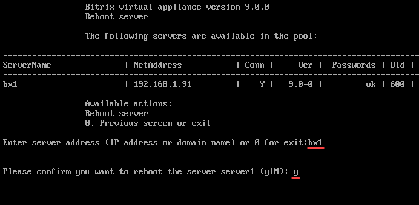

# 1. Перезапуск хоста (1. Reboot host)

**Навигация**
- [← Оглавление курса](index.md)
- [← Предыдущий: 29248 — Типовые ошибки при установке](lesson_29248.md)
- [Следующий: 29258 — 2. Обновление пакетов на хосте (2. Update packages on host) →](lesson_29258.md)

Официальная страница урока: https://dev.1c-bitrix.ru/learning/course/index.php?COURSE_ID=37&LESSON_ID=29256

Перезагрузка хоста, находящегося в пуле, осуществляется с помощью меню 1. Manage servers in the pool &gt; 1. Reboot host.

Задайте имя хоста (в данном примере — **bx1**) и согласитесь на перезапуск сервера:

