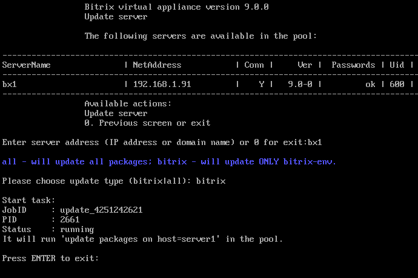

# 2. Обновление пакетов на хосте (2. Update packages on host)

**Навигация**
- [← Оглавление курса](index.md)
- [← Предыдущий: 29256 — 1. Перезапуск хоста (1. Reboot host)](lesson_29256.md)
- [Следующий: 29260 — 3. Смена пароля пользователя bitrix (3. Change 'bitrix' user password on host) →](lesson_29260.md)

Официальная страница урока: https://dev.1c-bitrix.ru/learning/course/index.php?COURSE_ID=37&LESSON_ID=29258

С помощью менеджера пула можно удаленно обновлять Веб-окружение и компоненты системы на хосте.

- Выбираем пункт меню 1. Manage servers in the pool &gt; 2. Update packages on host. Система спросит **имя хоста** для обновления и выбор, что обновлять – только окружение (**bitrix**) или полностью систему и окружение (**all**):
  
- Менеджер пула запустит задачу обновления Веб-окружения и через некоторое время система обновится до последней версии.
  **Важно!** В процессе обновления версии PHP и MySQL автоматически не обновляются. Обновить их можно в ручном режиме с помощью пункта меню виртуальной машины [1. Manage hosts in the pool - 6. Update PHP and MySQL](lesson_8831.md).

**Примечание.** Задачи могут выполняться длительное время. Время зависит от сложности задачи, объема данных, используемых в этих задачах, мощности и загруженности сервера.
Проверить текущие выполняемые задачи можно с помощью меню 10. Background pool tasks &gt; 1. View running tasks. Лог-файлы выполнения задач находятся в директории `/opt/webdir/temp`.
