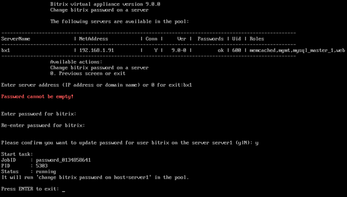

# 3. Смена пароля пользователя bitrix (3. Change 'bitrix' user password on host)

**Навигация**
- [← Оглавление курса](index.md)
- [← Предыдущий: 29258 — 2. Обновление пакетов на хосте (2. Update packages on host)](lesson_29258.md)
- [Следующий: 29262 — 4. Настройка таймзоны в пуле (4. Configure pool timezone) →](lesson_29262.md)

Официальная страница урока: https://dev.1c-bitrix.ru/learning/course/index.php?COURSE_ID=37&LESSON_ID=29260

Смена пароля для пользователя **bitrix** осуществляется через пункт меню 1. Manage servers in the pool &gt; 3. Change 'bitrix' user password on host.

Будет выдан запрос имени хоста, на котором нужно сменить старый пароль пользователя **bitrix**, указать новый и дать согласие на смену:

**Внимание!** Сменить пароль пользователя **root** через меню виртуальной машины нельзя. Для этого необходимо воспользоваться системными командами ОС. Например, для CentOS консольная команда смены пароля пользователя **root**: `passwd`.
