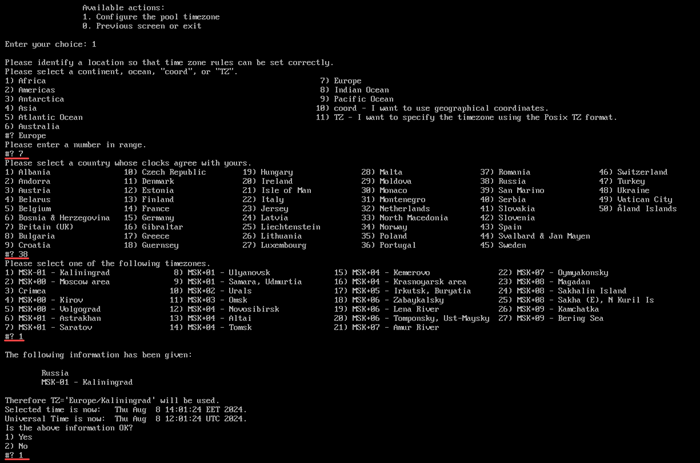
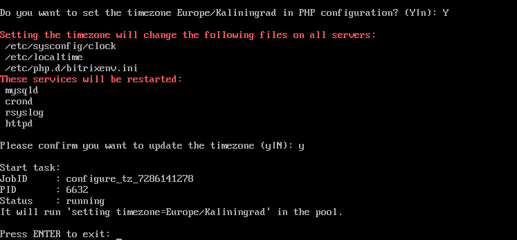

# 4. Настройка таймзоны в пуле (4. Configure pool timezone)

**Навигация**
- [← Оглавление курса](index.md)
- [← Предыдущий: 29260 — 3. Смена пароля пользователя bitrix (3. Change 'bitrix' user password on host)](lesson_29260.md)
- [Следующий: 29264 — 5. Удаление конфигурации пула (5. Remove pool configuration) →](lesson_29264.md)

Официальная страница урока: https://dev.1c-bitrix.ru/learning/course/index.php?COURSE_ID=37&LESSON_ID=29262

Настройка таймзоны – очень важный параметр, который обязательно нужно проверить и при необходимости настроить правильно. Параметр влияет на синхронизацию с 1С, календари, заказы и многое другое, где требуется дата и время.

Дата и время на сервере – это не одна конкретная дата и время, а фактически три различных времени:

- сервера
- PHP
- MySQL

Каждое из них – со своим часовым поясом.

**Примечание**: По умолчанию в *BitrixVM* выставлена зона `Europe/Moscow (MSK, UTC+03)`.

Смена таймзоны происходит через пункт меню веб-окружения 1. Manage servers in the pool &gt; 4. Configure pool timezone, и меняет дату и время в трёх местах сразу. Это очень важный момент, чтобы все три места работали с одинаковыми параметрами.

- После выбора **континента**, **страны** и **города** будет выведен запрос на согласие применения данной таймзоны:
  
- После этого будет предложено также изменить таймзону для PHP. И в заключение нужно подтвердить изменение таймзоны:
  

**Примечание**: Корректность установки времени у PHP и MySQL можно проверить также через административный веб интерфейс продуктов «1C-битрикс»: Настройки &gt; Инструменты &gt; Проверка системы.
