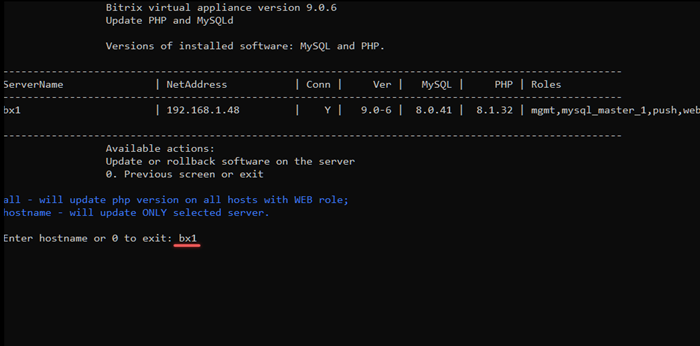
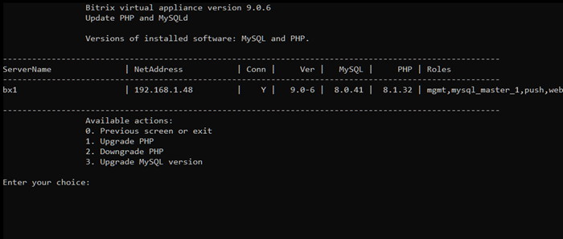
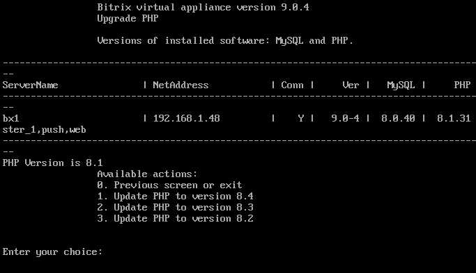
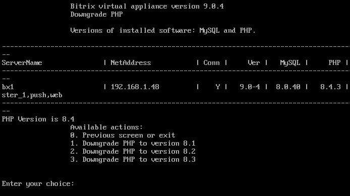
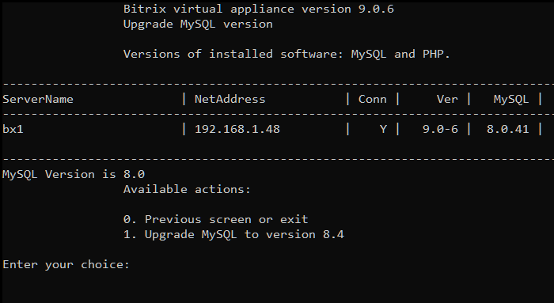
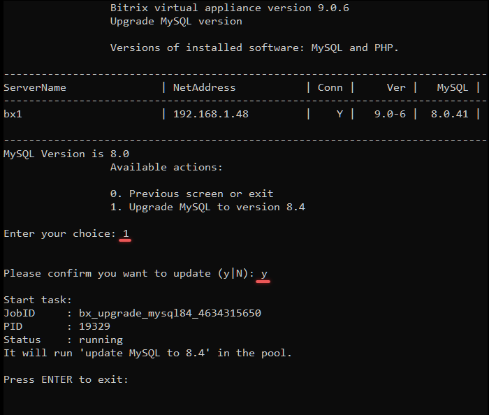

# 6. Обновление PHP и MySQL (6. Update PHP and MySQL)

**Навигация**
- [← Оглавление курса](index.md)
- [← Предыдущий: 29264 — 5. Удаление конфигурации пула (5. Remove pool configuration)](lesson_29264.md)
- [Следующий: 29274 — 1. Изменение имени хоста (1. Configure hostname) →](lesson_29274.md)

Официальная страница урока: https://dev.1c-bitrix.ru/learning/course/index.php?COURSE_ID=37&LESSON_ID=29266

Обновлять версии PHP и MySQL необходимо, исходя из рекомендуемых системных требований продуктов «1С-Битрикс».

В процессе [обновления VMBitrix](lesson_29258.md) они автоматически не обновляются. Обновить их нужно в ручном режиме с помощью соответствующего пункта меню виртуальной машины 1. Manage servers in the pool - 6. Update PHP and MySQL.

Укажите для обновления машину с конкретным именем хоста **hostname**:

Выберите, что обновить: PHP или MySQL.

#### 1. Upgrade PHP

Для обновления версии выберите подходящий пункт Update PHP to version х.х:

> В BitrixVM 9.0.4 по умолчанию установлена версия PHP — 8.2
>
> Доступно обновление до версий — 8.3, 8.4
>
> Минимальная версия PHP для работы продуктов «1С-Битрикс» — 8.1

#### 2. Downgrade PHP

Аналогичным способом можно и понизить версию PHP, выбрав нужную с помощью пункта меню Downgrade PHP to version х.х.

#### 3. Upgrade MySQL version

С версии BitrixVM 9.0.6 можно обновить MySQL до версии 8.4.

Подтвердите обновление `y` и дождитесь выполнения задачи.

**Примечание.** Задачи могут выполняться длительное время. Время зависит от сложности задачи, объема данных, используемых в этих задачах, мощности и загруженности сервера.
Проверить текущие выполняемые задачи можно с помощью меню 10. Background pool tasks &gt; 1. View running tasks. Лог-файлы выполнения задач находятся в директории `/opt/webdir/temp`.
