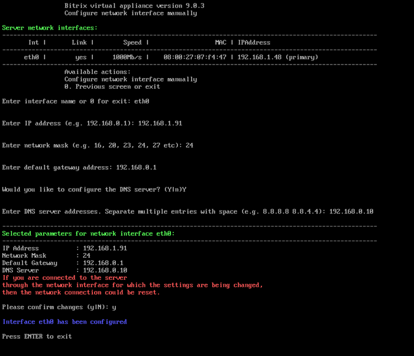

# 3. Настройка IP-адреса сервера вручную (3. Configure network inteface manually)

**Навигация**
- [← Оглавление курса](index.md)
- [← Предыдущий: 29276 — 2. Настройка IP-адреса сервера через DHCP (2. Configure network interface via DHCP)](lesson_29276.md)
- [Следующий: 29280 — 4. Перезагрузка сервера (4. Reboot server) →](lesson_29280.md)

Официальная страница урока: https://dev.1c-bitrix.ru/learning/course/index.php?COURSE_ID=37&LESSON_ID=29278

Для задания IP-адреса в ручном режиме необходимо:

- Перейти в главном меню 2. Configure localhost settings - 3. Configure network interface manually.
- Выбрать сетевой интерфейс (в данном примере — **eth0**).
- Ввести данные:
  

  - **Enter IP address** — новый IP-адрес сервера
  - **Enter network mask** — маска подсети в виде числа. Например 16, 20, 23, 24, 27 и так далее
  - **Enter default gateway address** — шлюз по умолчанию
  - **Enter DNS server addresses** — адрес DNS-сервера
- Проверить введенные данные и дать согласие на изменение параметров сети сервера (Please confirm changes).
