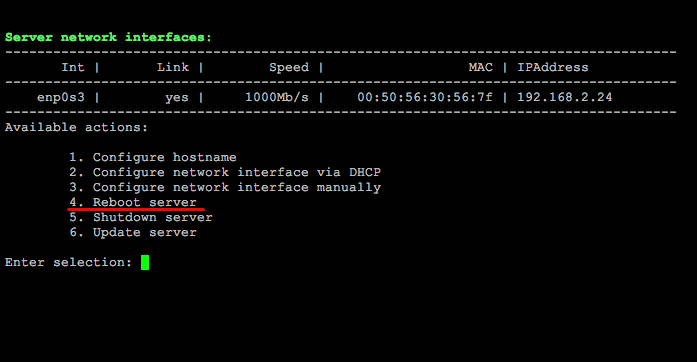

# 4. Перезагрузка сервера (4. Reboot server)

**Навигация**
- [← Оглавление курса](index.md)
- [← Предыдущий: 29278 — 3. Настройка IP-адреса сервера вручную (3. Configure network inteface manually)](lesson_29278.md)
- [Следующий: 29282 — 5. Выключение сервера (5. Shutdown server) →](lesson_29282.md)

Официальная страница урока: https://dev.1c-bitrix.ru/learning/course/index.php?COURSE_ID=37&LESSON_ID=29280

Чтобы перезапустить сервер виртуальной машины *BitrixVM*, нужно перейти в главном меню 2. Configure localhost settings - 4. Reboot server.

Далее согласиться на перезапуск сервера:

