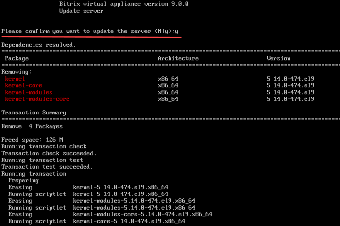
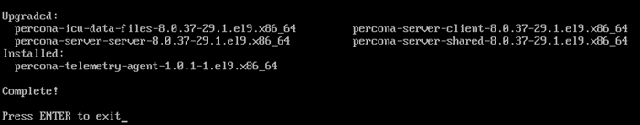

# 6. Обновление локального сервера (6. Update server)

**Навигация**
- [← Оглавление курса](index.md)
- [← Предыдущий: 29282 — 5. Выключение сервера (5. Shutdown server)](lesson_29282.md)
- [Следующий: 29290 — 1. Обновить настройки для всех MySQL-серверов (1. Update settings for all MySQL servers) →](lesson_29290.md)

Официальная страница урока: https://dev.1c-bitrix.ru/learning/course/index.php?COURSE_ID=37&LESSON_ID=29284

**Внимание!** Обновление продукта *«1C-Битрикс: Виртуальная машина»* — сложная операция, в процессе которой происходит обновление системных файлов операционной системы виртуальной машины, и для этого необходимы соответствующие знания администрирования *nix-систем. Перед запуском обновления рекомендуется сделать полный бекап «Виртуальной машины».

Для обновления локальной виртуальной машины необходимо выбрать в административном меню пункт 2. Configure localhost settings - 6. Update server и согласиться на обновление.

Скрипт автоматически проверит обновления компонентов и произведет их установку:

Этот пункт меню запускает обновление компонентов BitrixVM/BitrixEnv и CentOS. Если вы хотите обновить только пакеты BitrixVM/BitrixEnv, то целесообразно производить [обновление пакетов на хосте](lesson_29258.md).

**Примечание.** Задачи могут выполняться длительное время. Время зависит от сложности задачи, объема данных, используемых в этих задачах, мощности и загруженности сервера.
Проверить текущие выполняемые задачи можно с помощью меню 10. Background pool tasks &gt; 1. View running tasks. Лог-файлы выполнения задач находятся в директории `/opt/webdir/temp`.
