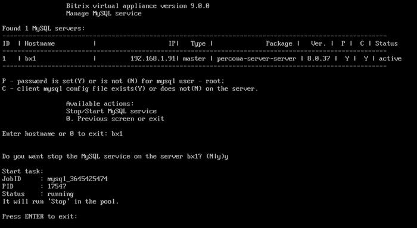

# 3. Остановить/Запустить службу MySQL на сервере (3. Stop/Start MySQL service on the server)

**Навигация**
- [← Оглавление курса](index.md)
- [← Предыдущий: 29292 — 2. Изменить пароль пользователя root для MySQL (2. Change password for MySQL root user)](lesson_29292.md)
- [Следующий: 29304 — 1. Настройка службы memcached (1.Configure memcached service) →](lesson_29304.md)

Официальная страница урока: https://dev.1c-bitrix.ru/learning/course/index.php?COURSE_ID=37&LESSON_ID=29294

Остановить или запустить MySQL-сервер можно в главном меню 3. Configure MySQL service for the pool - 3. Stop/Start MySQL service on the server
.

Далее выбрать нужный сервер (имя хоста), согласиться на остановку или старт:

