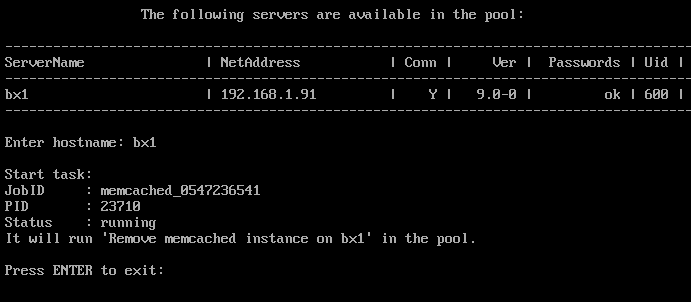

# 3. Удаление memcached сервера (3. Remove memcached server)

**Навигация**
- [← Оглавление курса](index.md)
- [← Предыдущий: 29306 — 2. Обновить настройки memcached сервера (2. Update settings for all memcached servers)](lesson_29306.md)
- [Следующий: 30256 — 1. Создать инстанс sphinx на сервере (1. Create sphinx instance on server) →](lesson_30256.md)

Официальная страница урока: https://dev.1c-bitrix.ru/learning/course/index.php?COURSE_ID=37&LESSON_ID=29308

**Примечание**: Данный пункт меню появится только тогда, когда будет создан memcached-сервер с помощью меню 4. Configure memcached servers for the pool &gt; 1. Configure memcached server.

Для удаления memcached сервера необходимо:

- Выбрать пункт меню 4. Configure memcached servers for the pool &gt; 3. Remove memcached server.
- Ввести имя хоста удаляемого сервера (например **server1**):
  
- Подождать, пока задача по удалению будет закончена.

**Примечание.** Задачи могут выполняться длительное время. Время зависит от сложности задачи, объема данных, используемых в этих задачах, мощности и загруженности сервера.
Проверить текущие выполняемые задачи можно с помощью меню 10. Background pool tasks &gt; 1. View running tasks. Лог-файлы выполнения задач находятся в директории `/opt/webdir/temp`.
