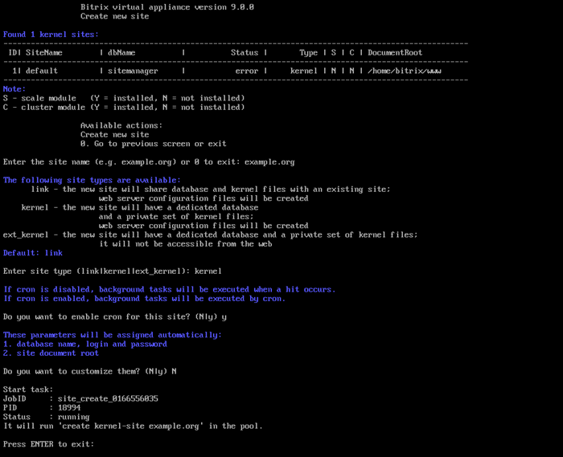

# 1. Создание сайта (1. Create a site)

**Навигация**
- [← Оглавление курса](index.md)
- [← Предыдущий: 30270 — 2. Удалить сервис «Конвертер файлов» (2. Remove Transformer service)](lesson_30270.md)
- [Следующий: 29322 — 2. Удалить сайт (2. Delete a site) →](lesson_29322.md)

Официальная страница урока: https://dev.1c-bitrix.ru/learning/course/index.php?COURSE_ID=37&LESSON_ID=29320

**Внимание!** После создания дополнительного сайта необходимо обязательно удалить созданный при установке дефолтный сайт, если он не используется.

Мастер создания дополнительных сайтов, позволяет развернуть на одной виртуальной машине несколько сайтов, как на независимых установках «1С-Битрикс», так и в рамках многосайтовости.

Для добавления дополнительного сайта необходимо:

- Предварительно настроить DNS-записи в управлении доменами или в случае локальной установки указать доменное имя в `/etc/hosts` на виртуальной машине, а также на всех компьютерах, с которых будет осуществляться доступ к данному сайту.
- Далее из административного меню запустить мастер 8. Configure pool sites &gt; 1. Create a site:
  
  	 и указать:

  1. **Enter the site name** — доменное имя дополнительного сайта без www;
    **Внимание!** Если у вас домен в национальной кодировке (например, кириллический домен), то в данное поле нужно вводить имя домена в Punycode-формате, воспользовавшись любым Unicode-Punycode конвертером.
  2. **Enter site type** — тип установки ядра «1С-Битрикс»:

    - **link** — в случае создания дополнительного сайта в рамках многосайтовости — общее ядро и данные в общей базе с уже установленным продуктом «1С-Битрикс» (работает в паре с ядром **ext_kernel**).
    - **kernel** — в случае создания дополнительного сайта в рамках отдельной установки — отдельное ядро продукта «1С-Битрикс» в новой директории сайта.
    - **ext_kernel** — отдельное ядро продукта «1С-Битрикс» в новой директории сайта для создания линков на это ядро в рамках многосайтовости, ядро будет недоступно напрямую, а только через дополнительные сайты (работает в паре с сайтами типа **link**).
  3. **Enter the document root path of the Bitrix kernel or ext_kernel site** — указать путь до ядра продукта *«1С-Битрикс»*, на которые будут сделаны симлинки (для ядра типа **link**).
  4. **Do you want to enable cron for this site** — включить ли выполнение заданий на cron для будущего сайта (для ядра типа **kernel** и **ext_kernel**).
  5. **Do you want to customize them** — по умолчанию название, логин и пароль базы данных и root-директория сайта создаются автоматически в файле **.settings.php** (до версии 20.900.0 в двух файлах: dbconn.php и .settings.php), но с помощью данной опции можно указать свои, выбрав ответ `y` (для ядра типа **kernel** и **ext_kernel**).
- В процессе работы мастера будет создана директория на сервере: `/home/bitrix/ext_www/{название_хоста}`, в которой будут:

  - символические ссылки на директорию ядра, которую выбрали ранее (если был выбран вариант **link**).
  - директории для установки или восстановления продукта (если был выбран вариант **kernel**).
  - директории для восстановления продукта (если был выбран вариант **ext_kernel**).
- После завершения задачи по добавлению сайта он будет готов к использованию.

Для установки или восстановления сайта необходимо скачать соответствующий скрипт, положить в корневую папку созданного сайта и запустить:

- [Установка дистрибутива сайта (скрипт BitrixSetup.php)](lesson_29244.md)
- [Перенос сайта (скрипт Restore.php)](lesson_29246.md)

Если был выбран вариант ядра **ext_kernel** и установлено ядро в `/home/bitrix/ext_www/{название_хоста}`, то в списке сайтов виртуальной машины данное ядро не появится до тех пор, пока не будет создан хотя бы один сайт (link) на это ядро.

**Примечание.** Задачи могут выполняться длительное время. Время зависит от сложности задачи, объема данных, используемых в этих задачах, мощности и загруженности сервера.

	Проверить текущие выполняемые задачи можно с помощью меню 10. Background pool tasks &gt; 1. View running tasks. Лог-файлы выполнения задач находятся в директории `/opt/webdir/temp`.
