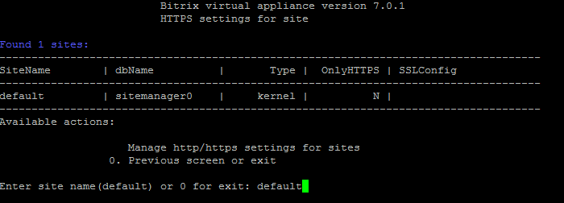
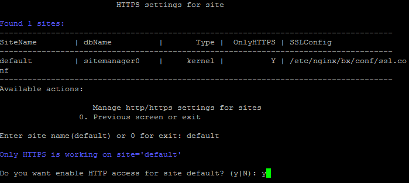

# 5. Настройка https на сайте (5. Change a site's https settings)

**Навигация**
- [← Оглавление курса](index.md)
- [← Предыдущий: 29328 — Настройки для почтовых сервисов](lesson_29328.md)
- [Следующий: 29340 — Условия работы композитного кеша →](lesson_29340.md)

Официальная страница урока: https://dev.1c-bitrix.ru/learning/course/index.php?COURSE_ID=37&LESSON_ID=29330

### Доступ по HTTPS

По умолчанию в виртуальной машине включена поддержка доступа к сайтам через протоколы HTTP и HTTPS.

Если необходимо оставить доступ к сайту только по защищенному протоколу HTTPS, то для этого нужно:

- Перейти в главном меню в 8. Configure pool sites &gt; 5. Change a site's https settings и ввести имя хоста, для которого нужно настроить протокол доступа:
  
- Согласиться на отключение HTTP доступа и дождаться пока задача будет закончена:
  
  **Внимание!** Для доступа к сайту только по протоколу HTTPS необходим SSL-сертификат от доверенного центра сертификации, иначе браузеры будут выдавать ошибку, что сертификат безопасности сайта не является доверенным.

### Доступ по HTTP

Аналогичным способом осуществляется возврат доступа к сайту по протоколу HTTP:

**Примечание.** Задачи могут выполняться длительное время. Время зависит от сложности задачи, объема данных, используемых в этих задачах, мощности и загруженности сервера.
Проверить текущие выполняемые задачи можно с помощью меню 10. Background pool tasks &gt; 1. View running tasks. Лог-файлы выполнения задач находятся в директории `/opt/webdir/temp`.

2

[Описание курса](/learning/course/index.php?COURSE_ID=37&INDEX=Y)

[назад Настройки для почтовых сервисов](lesson_29328.md)
		                                        [6. Настройка nginx для работы с композитом (6. Configure nginx to use composite cache) вперед](/learning/course/index.php?COURSE_ID=37&CHAPTER_ID=029338&LESSON_PATH=3908.29228.29318.29338)

Новинки документации в соцсетях:

[https://vk.com/1c_bitrix_doc](https://vk.com/1c_bitrix_doc)

[https://www.youtube.com/channel/UCtugDnALPdpOISTVfA8Hmjw](https://www.youtube.com/channel/UCtugDnALPdpOISTVfA8Hmjw)

[https://rutube.ru/channel/23487950/](https://rutube.ru/channel/23487950/)

[https://t.me/bitrixdoc](https://t.me/bitrixdoc)

Курсы разработаны в компании [«1С-Битрикс»](https://dev.1c-bitrix.ru)
