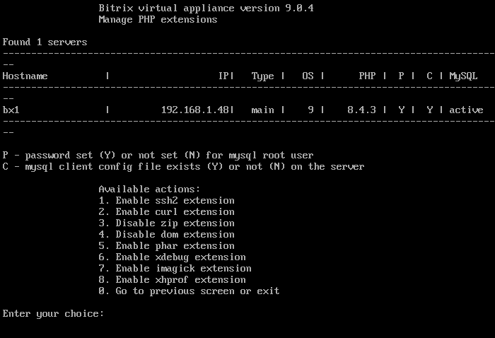

# 1. Настроить модули PHP (1. Manage PHP extensions)

**Навигация**
- [← Оглавление курса](index.md)
- [← Предыдущий: 29348 — 8. Показать сайты с ошибками (8. Show sites with errors)](lesson_29348.md)
- [Следующий: 29366 — 1. Настройка сертификата Let's encrypt (1. Configure "Let's encrypt" certificate) →](lesson_29366.md)

Официальная страница урока: https://dev.1c-bitrix.ru/learning/course/index.php?COURSE_ID=37&LESSON_ID=29362

В разделе  9.  Manage pool web servers &gt; 1. Manage PHP extensions можно включить дополнительные модули PHP, которые могут понадобится в продуктах «1C-Битрикс».

На данный момент можно включить или выключить:

- ssh2
- curl
- zip
- dom
- phar
- xdebug
- imagick
- xhprof, c версии BitrixVM 9.0.4

После выбора расширения, запускается задача на его включение или отключение.

**Примечание.** Задачи могут выполняться длительное время. Время зависит от сложности задачи, объема данных, используемых в этих задачах, мощности и загруженности сервера.
Проверить текущие выполняемые задачи можно с помощью меню 10. Background pool tasks &gt; 1. View running tasks. Лог-файлы выполнения задач находятся в директории `/opt/webdir/temp`.
