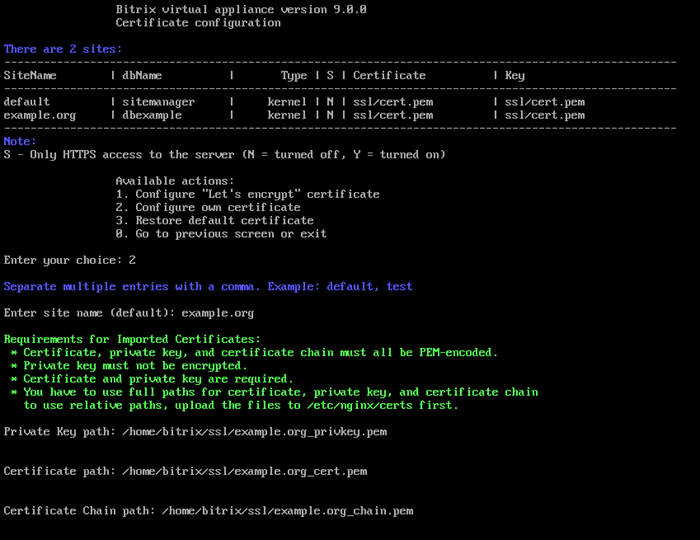
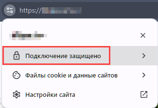

# 2. Настройка собственного сертификата (2. Configure own certificate)

**Навигация**
- [← Оглавление курса](index.md)
- [← Предыдущий: 29366 — 1. Настройка сертификата Let's encrypt (1. Configure "Let's encrypt" certificate)](lesson_29366.md)
- [Следующий: 29370 — 3. Восстановление сертификата по умолчанию (3. Restore default certificate) →](lesson_29370.md)

Официальная страница урока: https://dev.1c-bitrix.ru/learning/course/index.php?COURSE_ID=37&LESSON_ID=29368

### Свой SSL-сертификат

Если у вас есть свой сертификат, выпущенный любым авторизованным центром, то можно также его подключить к сайту в BitrixVM.

Перед выпуском сертификата:

- убедитесь, что сайт на целевом хосте уже [создан](lesson_29320.md) и доступен из интернета,
- проверьте, что у вашего регистратора или DNS-хостера указаны правильные настройки DNS для этого домена.

У вас должны быть следующие файлы: приватный ключ (private key), цепочка сертификатов (certificate chain) и сам сертификат (certificate). Цепочка сертификатов может быть указана внутри файла сертификата, а не отдельным файлом.

Требования к импортируемым сертификатам:

- Все перечисленные файлы должны быть в PEM-кодировке.
- У всех сертификатов должно быть расширение .pem.
- Приватный ключ не должен быть зашифрован.
- Файлы сертификата и приватного ключа — обязательные. Файл с цепочкой можно не указывать, если цепочка добавлена в файл сертификата.
- Если вы используете свои пути для загрузки, то нужно указывать при импорте полные пути. Если хотите использовать относительные пути, то файлы сертификатов должны быть загружены в директорию `/etc/nginx/certs`.

### Подключение

Для подключения своего SSL-сертификата нужно:

- Скопировать файлы сертификата в любую директорию на сервере с помощью любого клиента SFTP. В нашем примере мы создали директорию **/home/bitrix/ssl/** и скопировали файлы в неё.
  Пути получились такие:
  1. **приватный ключ** – `/home/bitrix/ssl/example.org_privkey.pem`
  2. **сам сертификат** – `/home/bitrix/ssl/example.org_cert.pem`
  3. **цепочка сертификатов** – `/home/bitrix/ssl/example.org_chain.pem`
- Далее перейти в меню 9. Manage pool web servers &gt; 2. Configure certificates.
- Выбрать пункт меню 2. Configure own certificate и ввести **имя домена** (Sitename) или несколько доменов, для которых нужно импортировать сертификат(ы) (в данном примере: **example.org**), **путь для приватного ключа (Private Key path)**, **путь для сертификата (Certificate path)**, **путь для цепочки сертификатов (Certificate Chain path)** и подтвердить установку для этого домена:
  
- Мастер самостоятельно установит сертификат. Пути будут указаны в этом же разделе.

Проверить выпущенный сертификат можно в браузере. Перейдите на ваш сайт по протоколу https. У валидного сертификата будет замочек:

Поддерживается ввод нескольких сайтов, через запятую. Следить за сроком действия своего сертификата вы должны сами. Перевыпуск осуществляется также владельцем сайта. После перевыпуска нового сертификата нужно будет заново его импортировать.

**Примечание**: Если вы использовали свою директорию сервера для копирования исходных файлов, то после импорта сертификата в целях безопасности эти файлы желательно удалить (в примере - **/home/bitrix/ssl/**). Если вы копировали файлы в **/etc/nginx/certs**, то удалять их не нужно.
