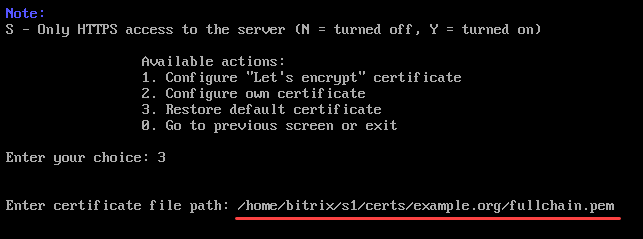
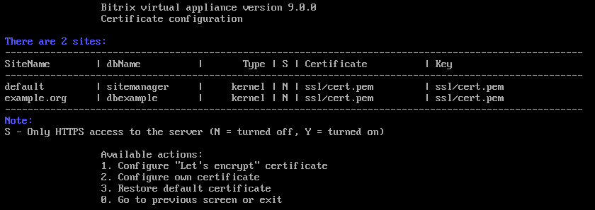

# 3. Восстановление сертификата по умолчанию (3. Restore default certificate)

**Навигация**
- [← Оглавление курса](index.md)
- [← Предыдущий: 29368 — 2. Настройка собственного сертификата (2. Configure own certificate)](lesson_29368.md)
- [Следующий: 29380 — 10. Фоновые задачи (10. Background pool tasks) →](lesson_29380.md)

Официальная страница урока: https://dev.1c-bitrix.ru/learning/course/index.php?COURSE_ID=37&LESSON_ID=29370

Если что-то пошло не так или вы хотите восстановить самоподписанный сертификат, который создается при первом запуске *BitrixVM*, то для этого нужно:

- Перейти в меню 9. Manage pool web servers &gt; 2. Configure certificates.
- Выбрать пункт меню 3. Restore default certificate и ввести **certificate file path** — путь к сертификату, который указан в таблице с сайтами в поле **Certificate** и подтвердить действие:
  
- Мастер самостоятельно восстановит SSL-сертификат по умолчанию в **ssl/cert.pem**:
  
